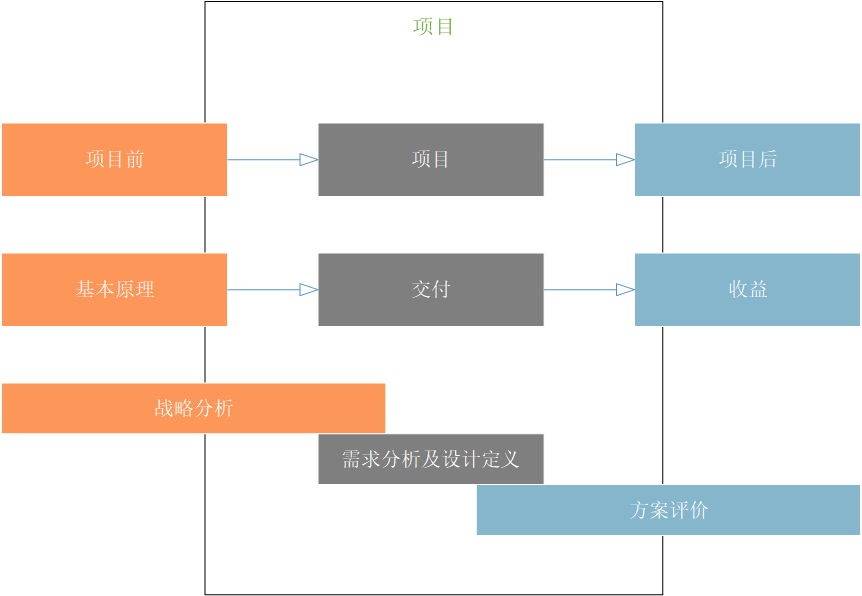
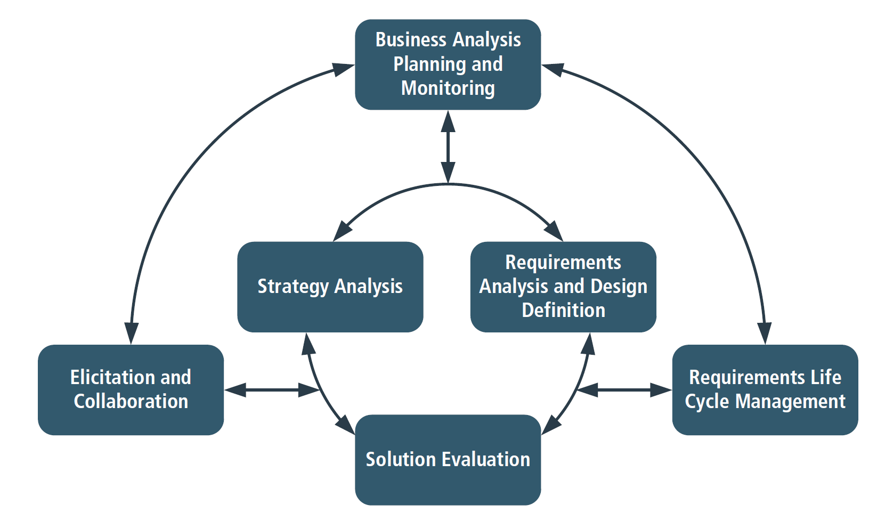

# 介绍
> 《商业分析知识体系指南》(BABOK®指南)是全球公认的商业分析实践标准。BABOK®指南描述了利用业务分析知识领域、任务、潜在能力、技术和观点进行商业分析的方法。

## 1.1 BABOK®指南的目的

BABOK®指南的主要目的是定义商业分析中存在的业务，并提供一套普遍认可的实践方案。它帮助从业者讨论和定义有效执行业务分析工作所需的技能。BABOK®指南还帮助那些与业务分析师一起工作和雇佣业务分析师的人了解他们可以从熟练从业者那里获得的技能和知识有哪些。

商业分析是一种边际广泛的专业，商业分析师可能在企业中为许多不同类型的计划执行工作。从业者在执行业务分析任务时可能会使用不同的能力、知识、技能、术语和态度。BABOK®指南是一个适用于所有视角的通用框架，描述了为正确分析变更或评估变更必要性而执行的业务分析任务。在商业分析人员进行各种活动时，任务的形式、顺序或重要性可能有所不同。

BABOK®指南通过六个知识领域(业务分析计划和监控，启发和协作，需求生命周期管理，策略分析，需求分析和设计定义(RADD)，以及解决方案评估)描述业务分析的实践方案，它将被应用于项目所包含范围内或整个企业发展和持续改进中。

## 1.2 什么是商业分析

商业分析是通过定义需求和为业务相关角色推荐价值来支持企业变更的工作内容（实践）。通过商业分析能够令企业清楚地表达需求，找到改变的理由，同时设计和描述一份有交付价值的解决方案。

商业分析是基于企业中的各种计划上执行的。计划可以是战略的、战术的或操作的。商业分析可以在项目范围内执行，也可以在整个企业发展和持续改进过程中执行。它可以用来理解当前状态，定义未来状态，并确定从当前状态移动到未来状态所需的活动。

商业分析可以从不同的角度执行，BABOK®指南描述了几个角度:敏捷、商业智能、信息技术、业务架构和业务流程管理。一各角度可以看作是一个镜头，商业分析从事人员通过它查看基于当前上下文的工作活动。一个计划中可能应用到一个或多个角度进行分析，BABOK®指南中概述的视角并不代表商业分析的所有上下文或完整的商业分析专业领域。

## 1.3 谁是商业分析师

商业分析师是指执行BABOK®指南中描述的商业分析任务的任何人员，无论他们的职位或在组织中的角色。商业分析师负责发现、整合和分析来自企业中各种来源的信息，包括工具、流程、文档和涉众。商业分析师负责引导业务相关角色的真实需求——这经常涉及需要调查和澄清他们缩表达的意向——以确定潜在的问题和原因。

商业分析师在设计和交付解决方案时发挥着使其与业务关系人的需求保持一只长作用。商业分析师执行的活动包括：
* 理解企业问题和目标，
* 分析需求和解决方案，
* 设计战略，
* 驱动改变，
* 促进业务关系人合作，
  
常见的商业分析师的职位包含：
* 业务设计师，
* 商业系统分析师，
* 数据分析师，
* 企业分析师，
* 管理顾问，
* 流程分析师，
* 产品经理，
* 产品负责人，
* 需求工程师，
* 系统分析师，

## 1.4 BABOK®指南的结构

BABOK®指南的核心内容是将商业分析实例组成为知识领域。知识领域是通过任务关联的逻辑上的集合（而非顺序）。这些实例描述了需要完成其相关知识领域的目的而执行的特定活动。

商业分析的关键概念、基础能力、技术和视角部分构成了BABOK®指南中的扩展内容，帮助指导商业分析师更好地执行商业分析任务。

* **商业分析的关键概念**：定义关键术语以理解所有其他内容、概念和想法在BABOK®指南。
* **基础能力**：提供支持有效商业分析实例的行为、特征、和个人素质的描述。
* **技术**：提供执行商业分析任务的方法。BABOK®指南中描述的技术旨在涵盖业务分析社区中最常见和广泛使用的技术。
* **视角**：描述商业分析中的各种视角。视角帮助商业分析师从不同的角度进行工作，以便更好的依据给定计划的前后关系执行商业分析任务。

### 1.4.1 关键概念

商业分析关键概念章节提供了理解BABOK®指南所需的中心思想的基本概念。

这个章节由以下组成：
* 商业分析核心概念模型™(BACCM™)
* 关键术语
* 需求分类模式
* 业务关系人
* 需求与设计

### 1.4.2 知识领域

知识领域表示包含对多个特定任务今夕专业知识分析所涵盖的知识的领域。

六个知识领域分别是：
* **商业分析规划及监管**：描述商业分析师为组织和协调商业分析师与业务关系人所执行的任务。这个任务产生的输出被用于整个BABOK®指南中，作为其他任务的关键输入和指南。
* **需求导出及协同合作**：描述了商业分析师为准备和执行启发活动并确认所获得的结果而执行的任务。它还描述了从业务关系人中获取的商业分析信息，将在整个商业分析活动中被组装起来，并与业务关系人进行持续的协作。
* **需求生命周期管理**：描述了商业分析师从开始到结束为了管理和维护需求所执行的任务。这些任务描述了为需求和设置建立有意义的关系，以及获得对评估与分析需求和设计中存在可能变更的内容的共识。
* **战略分析**：描述了与业务关系人协作中必须执行的商业分析工作，这些工作可以确定战略或具有战略意义的需求(业务需求)，使企业能够定位需求。同时，可以修订结果策略使其与更高级别和更低级别的策略保持一致。
* **需求分析与设计定义**：描述了商业分析人员结构化和组织在提取活动中发现的需求，列举和模块化需求与设计，确认和验证已有信息，明确满足业务需求的解决方案，并估计每个解决方案可能实现的潜在价值所执行的任务。该只是领域涵盖了增量和迭代的活动，范围从最初的概念和需求探索到将这些需求转换为特定推荐的解决方案。
* **解决方案评估**：描述商业分析师评估企业所使用的解决方案的性能和交付价值，并给出消除阻碍价值完全实现的障碍或约束的建议所执行的任务。

下图展示了知识领域质检的一般关系

### 1.4.3 任务
