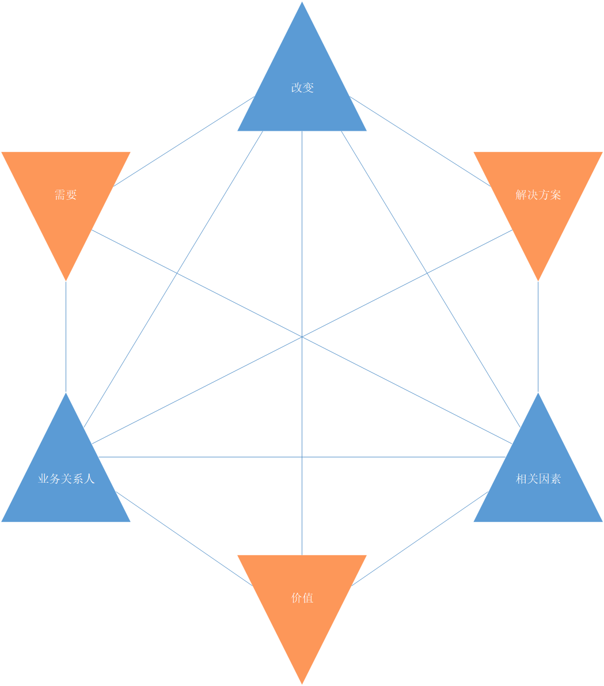

# 商业分析核心概念

商业分析核心概念章节包含的信息为BABOK®指南中的所有其他内容、概念和想法提供了基础。它为商业分析师提供了理解和在日常业务分析实践中使用BABOK®指南所需的中心思想的基本理解。

本章节由以下概念构成：
* 商业分析核心概念模型™(BACCM™):定义了商业分析专业的概念框架。
* 关键术语:提供基本概念的定义，因为它们对BABOK®指南的重要性而被突出。
* 需求分类模式：识别需求的级别或类型，以帮助商业分析师和其他涉众对需求进行分类。
* 业务关系人：定义参与变更中的商业分析活动或受其影响的组及个人的角色和特征。
* 需求和设计:描述与商业分析相关的需求和设计的重要性之间的区别。

商业分析核心概念模型™(BACCM™)是一个商业分析的概念框架。它包含了什么是商业分析。以及在不考虑视角、行业、方法或组织中的级别时，它对那些执行商业分析任务的人意味着什么。商业分析核心概念模型™(BACCM™)由六个对所有商业分析师来说都有相同的含义的术语组成，通过这些有相同含义的术语有助于讨论商业分析行为及术语见的关系。每个术语都被认为是一个核心概念。

BACCM的六个核心概念是：改变、需要（Needs）、相关因素、解决方案、业务关系人、价值。每个核心概念都是商业分析时间的基础，所有的核心概念都是平等和必要的。每个核心概念都是由其他五个核心概念定义的，只有理解了所有概念才能完全理解其中某一个概念。没有任何一个概念比其它概念更重要或更有意义，这些概念有助于理解在商业分析任务中获取、分析或管理的信息类型。

BACCM可以在以下情况中使用：
* 描述商业分析的专业和领域，
* 使用一般术语沟通商业分析，
* 评估商业分析中核心概念间的关系，
* 通过全面评估六个概念之间的关系以更好的进行商业分析，
* 评估这些概念和关系在工作过程中的任意节点的影响，以便建立基础找到前进的道路。

> Table 2.1.1 ：商业分析核心概念模型
> | 核心概念 | 描述 |
> |-------|-------|
> |改变|为了满足某种需要而进行的转变行为。改变有助于提高企业的绩效。这些提高是经过深思熟虑并通过商业分析活动加以控制的。|
> |需要|需要解决的问题或机会。需要可以通过激励业务关系人采取行动来引起变化。变更还可以通过削弱或增强现有解决方案交付的价值来引起需要。|
> |解决方案|满足一种或多种需要的特定方式。解决方案通过解决业务关系人所面料的问题，或者使其能够利用机会满足需要。|
> |业务关系人|与改变、需要或者解决方案相关的团体或个人。业务关系人通常根据感兴趣的环节、影响的方向和对改变的影响来定义。业务关系人根据需要、改变和解决方案进行分组。|
> |价值|在上下文中某物对于业务关系人的价值、重要性或者有用性。价值可以看做是潜在的或者现实的回报、收益和改进。它也可能是对损失、风险程度和支出的降低形式。价值可以是有形的或者无形的，有形价值是可以直接衡量的。有形价值通常有一个重要的货币成分。无形价值是间接测量的。无形价值通常具有重要的激励成分，如公司的声誉或员工士气。在某些情况中，价值是可以绝对的评估的，但是在许多情况中只能进行相对评估：从给定涉众的角度来看，一个解决方案比另一个更有价值。|
> |相关因素|相关因素影响或者被改变所影响，同时提供对改变的理解。改变发生在相关因素中。相关因素是环境中任何与改变相关的事情。相关因素可能包含态度、行为、信仰、竞争对手、文化、人口统计、目标、政府、基础设施、语言、损失、流程、产品、项目、销售、季节、术语、技术、天气，以及满足定义的任何其他元素。|

 商业分析师可以适用核心概念来考虑所完成工作的质量和完整性。在每个知识领域描述中都有一些例子，说明如何在知识领域的任务中使用或应用核心概念。在计划或执行一项任务或技术的时候，商业分析师可以通过以下问题来考虑如何处理每个核心概念：
 * 我们正在做什么样的改变？
 * 我们试图满足什么需要？
 * 我们正在创造或改变的解决方案是什么？
 * 涉及的业务关系人有哪些？
 * 业务关系人认为什么是最有价值的？
 * 我们和解决方案所处的环境是什么？

如果有核心概念产生了变化，它会导致我们重新评估这些核心概念及他们交付的价值的关系。

> Figure 2.1.1 商业分析核心概念模型
> 