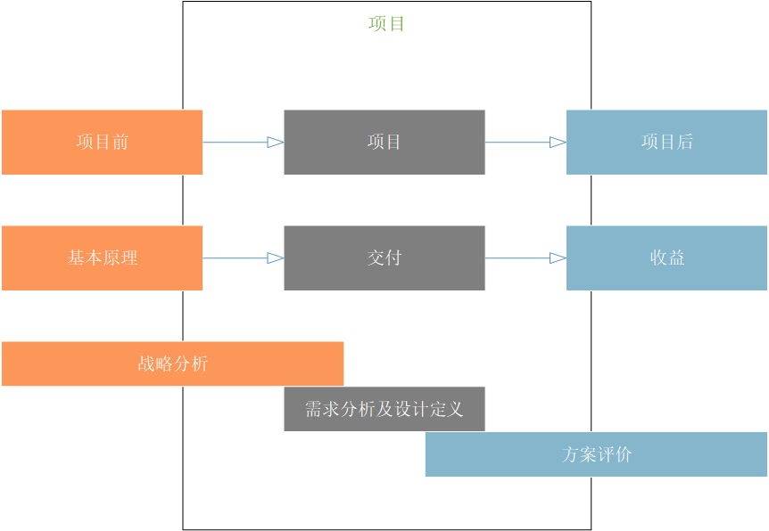
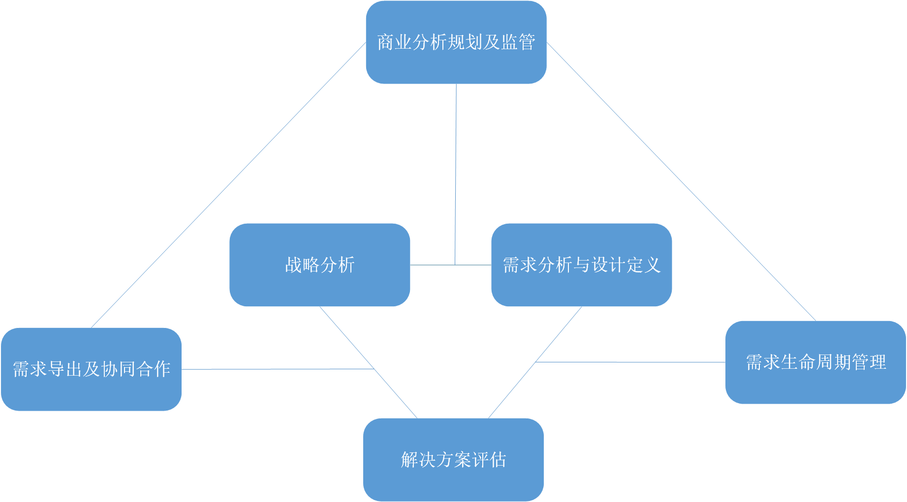

# 介绍
> 《商业分析知识体系指南》(BABOK®指南)是全球公认的商业分析实践标准。BABOK®指南描述了利用业务分析知识领域、任务、潜在能力、技术和观点进行商业分析的方法。

## 1.1 BABOK®指南的目的

BABOK®指南的主要目的是定义商业分析中存在的业务，并提供一套普遍认可的实践方案。它帮助从业者讨论和定义有效执行业务分析工作所需的技能。BABOK®指南还帮助那些与业务分析师一起工作和雇佣业务分析师的人了解他们可以从熟练从业者那里获得的技能和知识有哪些。

商业分析是一种边际广泛的专业，商业分析师可能在企业中为许多不同类型的计划执行工作。从业者在执行业务分析任务时可能会使用不同的能力、知识、技能、术语和态度。BABOK®指南是一个适用于所有视角的通用框架，描述了为正确分析变更或评估变更必要性而执行的业务分析任务。在商业分析人员进行各种活动时，任务的形式、顺序或重要性可能有所不同。

BABOK®指南通过六个知识领域(业务分析计划和监控，启发和协作，需求生命周期管理，策略分析，需求分析和设计定义(RADD)，以及解决方案评估)描述业务分析的实践方案，它将被应用于项目所包含范围内或整个企业发展和持续改进中。

> 图片 1.1.1 项目之外的商业分析
> 

## 1.2 什么是商业分析

商业分析是通过定义需求和为业务相关角色推荐价值来支持企业变更的工作内容（实践）。通过商业分析能够令企业清楚地表达需求，找到改变的理由，同时设计和描述一份有交付价值的解决方案。

商业分析是基于企业中的各种计划上执行的。计划可以是战略的、战术的或操作的。商业分析可以在项目范围内执行，也可以在整个企业发展和持续改进过程中执行。它可以用来理解当前状态，定义未来状态，并确定从当前状态移动到未来状态所需的活动。

商业分析可以从不同的角度执行，BABOK®指南描述了几个角度:敏捷、商业智能、信息技术、业务架构和业务流程管理。一各角度可以看作是一个镜头，商业分析从事人员通过它查看基于当前上下文的工作活动。一个计划中可能应用到一个或多个角度进行分析，BABOK®指南中概述的视角并不代表商业分析的所有上下文或完整的商业分析专业领域。

## 1.3 谁是商业分析师

商业分析师是指执行BABOK®指南中描述的商业分析任务的任何人员，无论他们的职位或在组织中的角色。商业分析师负责发现、整合和分析来自企业中各种来源的信息，包括工具、流程、文档和涉众。商业分析师负责引导业务相关角色的真实需求——这经常涉及需要调查和澄清他们缩表达的意向——以确定潜在的问题和原因。

商业分析师在设计和交付解决方案时发挥着使其与业务关系人的需求保持一只长作用。商业分析师执行的活动包括：
* 理解企业问题和目标，
* 分析需求和解决方案，
* 设计战略，
* 驱动改变，
* 促进业务关系人合作，
  
常见的商业分析师的职位包含：
* 业务设计师，
* 商业系统分析师，
* 数据分析师，
* 企业分析师，
* 管理顾问，
* 流程分析师，
* 产品经理，
* 产品负责人，
* 需求工程师，
* 系统分析师，

## 1.4 BABOK®指南的结构

BABOK®指南的核心内容是将商业分析实例组成为知识领域。知识领域是通过任务关联的逻辑上的集合（而非顺序）。这些实例描述了需要完成其相关知识领域的目的而执行的特定活动。

商业分析的关键概念、基础能力、技术和视角部分构成了BABOK®指南中的扩展内容，帮助指导商业分析师更好地执行商业分析任务。

* **商业分析的关键概念**：定义关键术语以理解所有其他内容、概念和想法在BABOK®指南。
* **基础能力**：提供支持有效商业分析实例的行为、特征、和个人素质的描述。
* **技术**：提供执行商业分析任务的方法。BABOK®指南中描述的技术旨在涵盖业务分析社区中最常见和广泛使用的技术。
* **视角**：描述商业分析中的各种视角。视角帮助商业分析师从不同的角度进行工作，以便更好的依据给定计划的前后关系执行商业分析任务。

### 1.4.1 关键概念

商业分析关键概念章节提供了理解BABOK®指南所需的中心思想的基本概念。

这个章节由以下组成：
* 商业分析核心概念模型™(BACCM™)
* 关键术语
* 需求分类模式
* 业务关系人
* 需求与设计

### 1.4.2 知识领域

知识领域表示包含对多个特定任务今夕专业知识分析所涵盖的知识的领域。

六个知识领域分别是：
* **商业分析规划及监管**：描述商业分析师为组织和协调商业分析师与业务关系人所执行的任务。这个任务产生的输出被用于整个BABOK®指南中，作为其他任务的关键输入和指南。
* **需求导出及协同合作**：描述了商业分析师为准备和执行启发活动并确认所获得的结果而执行的任务。它还描述了从业务关系人中获取的商业分析信息，将在整个商业分析活动中被组装起来，并与业务关系人进行持续的协作。
* **需求生命周期管理**：描述了商业分析师从开始到结束为了管理和维护需求所执行的任务。这些任务描述了为需求和设置建立有意义的关系，以及获得对评估与分析需求和设计中存在可能变更的内容的共识。
* **战略分析**：描述了与业务关系人协作中必须执行的商业分析工作，这些工作可以确定战略或具有战略意义的需求(业务需求)，使企业能够定位需求。同时，可以修订结果策略使其与更高级别和更低级别的策略保持一致。
* **需求分析与设计定义**：描述了商业分析人员结构化和组织在提取活动中发现的需求，列举和模块化需求与设计，确认和验证已有信息，明确满足业务需求的解决方案，并估计每个解决方案可能实现的潜在价值所执行的任务。该只是领域涵盖了增量和迭代的活动，范围从最初的概念和需求探索到将这些需求转换为特定推荐的解决方案。
* **解决方案评估**：描述商业分析师评估企业所使用的解决方案的性能和交付价值，并给出消除阻碍价值完全实现的障碍或约束的建议所执行的任务。

下图展示了知识领域质检的一般关系

> 图片 1.4.1 知识领域之间的关系
> 

### 1.4.3 任务

任务是可以作为商业分析中一部分，它可以以正式或者非正式的离散形式进行工作。BABOK®指南定义了商业分析需要的任务列表。给定任务的定义普遍适用于商业分析工作，独立于计划类型。商业分析师可以执行其组织分配的其他活动，但这些附加活动不被认为是商业分析专业的一部分。

任务被分组到知识领域。商业分析师顺序地、迭代地、或者同步地执行来自所有知识领域的任务。BABOK®指南没有规定任务执行的流程或顺序。任务可以以任何顺序执行，只要有必要的任务输入。业务分析活动可以从任何任务开始，尽管可能的候选任务是分析当前状态(第103页)或测量解决方案性能(第166页)。

BABOK®指南中的每个任务以以下格式呈现:
* 目的
* 描述
* 输入
* 元素
* 指南/工具
* 技术
* 业务关系人
* 输出

#### .1 目的

目的部分对了商业分析师执行任务的原因以及通过执行任务所创造的价值做了简短的描述。

#### .2 描述

描述部分更详细的解释了任务是什么，为什么要执行它，以及它应该完成什么。

#### .3 输入

输入部分列出了任务所需要的输入。输入是信息，通过消化或转化的方式产出输出，它也是任务开始时的必须信息。他们可能在商业分析范围之外明确的产生或者在商业分析任务重产生。在商业分析工作之外产生的输入用限定符号'(external)'表示在输入列表。

输入的存在并不意味着相关的可交付成果已经完成或处于最终的状态。输入只需要足够完整以支持后续的工作开展即可。在方案的生命周期中一个输出可能包含任意数量的实体。

输入部分包括：输入与输出的可视化表示，使用输出的其他任务，以及任务重列出的指导方针和工具。

#### .4 元素
元素部分描述了理解如何执行任务所需要的的关键概念。作为执行任务的一部分，元素不是强制性的，它们的使用一般取决于商业分析的方法。

#### .5 指南/工具
指南和工具部分列出了需要将输入转化为输出所使用的资源。指南提供了关于为什么或如何承担一项任务的提示或描述。工具是某种用以承担一项任务的东西。

指南与工具可以包括其他任务的输出。

#### .6 技术
技术部分罗列可以用以执行商业分析任务所用的技术。

#### .7 业务关系人
业务关系人部分由可能参与执行该任务或将收到其影响的业务关系人的通用列表组成。BABOK®指南并不要求列表中存在的角色都需要被存在。

#### .8 输出
输出部分描述了执行任务产生的结果。输出的创建、转换或更改状态是任务成功完成的结果。一个输出可以是一个可交付物，或者是一个大型可交付物的一部分。输出的形式取决于正在执行的计划类型，组织采用的标准，以及商业分析师对解决业务关系人需求的关键信息最恰当方式的判断。

与输入一样，任务的实例可以在没有输出处于最终状况的情况下完成。不必等待特定的任务输出完成后再开始任务中的工作。

### 1.4.4 潜在能力
潜在能力反映了知识、技能、行为、特征和个人素质，这些都有助于履行地完成商业分析师的责任。这些潜在能力并不是商业分析专业所特有的。然而，任务或者技术的成功能应用往往依赖于一个或多个潜在能力的熟练程度。

潜在能力由以下内容构造：
* 目的
* 定义
* 效果评定

#### .1 目的
目的部分解释了为什么拥有这种潜在能力对商业分析师是有益的。

#### .2 定义
定义部分描述了应用此能力所涉及的技能和专业知识。

#### .3 效果评定
效果评定部分描述了如何评估一个人的潜在能力中是否拥有该技能。

#### 1.4.5 技术
技术提供了任务执行方式的额外的路径。
BABOK®指南中包含的技术列表并不详尽。为了完成一项任务，可以使用多种技术或与其他技术结合使用。我们鼓励商业分析师修改现有的技术或设计新的技术，以最适合他们的情况和他们执行的任务的目标。

技术有如下的结构：
* 目的
* 描述
* 元素
* 使用注意事项

#### .1 目的
目的部分描述了该技术的用途及其最可能适用的情况。

#### .2 描述
描述部分介绍了应该适用的技术及其如何使用。

#### .3 元素
元素部分描述了理解如何使用技术需要了解的关键概念。

#### .4 使用注意事项
使用注意事项部分描述了技术在哪些条件下使用可能更有效或更不有效。

### 1.4.6 视角
视角在商业分析的工作中使用，以提供对特定于划前后的任务和技术的关注。大多数计划都可能设计一个或多个视角。BABOK®指南中所包含的视角有：
* 敏捷
* 商业智能
* 信息技术
* 业务架构
* 业务流程管理

商业分析时所应用的视角不代表所有可能存在的视角。BABOK®指南中所讨论的视角代表撰写本书时的一些最常见的商业分析视角。

视角并非相互排斥的，一个给定的主动性工作可能使用多个视角进行分析。

视角有如下结构：
* 变化范围
* 商业分析范围
* 方法论、方案和技术
* 潜在的能力
* 对知识领域影响

#### .1 变化范围
变化范围部分描述了在特定视角下来看改变包含了企业的哪些部分，在何种程度上影响了企业的目标和操作。变化范围定义了所解决问题的类型，所寻找的解决方案的性质，以及如何交付这些解决方案及度量其价值的方法。

#### .2 商业分析范围
商业分析范围部分描述了关键的业务关系人，包括发起者类型的画像，目标业务关系人，以及在方案中商业分析师所扮演的角色。它还定义了在该视角下商业分析工作可能输出的结果。

#### .3 方法论、方案和技术
该部分的构成对于每个视角都是独特的。每种情况下（具体到商业分析的应用角度。），这部分所描述的方法论、方案及技术是通用的。方法论和方案是从事商业分析工作的专门路径。本部分中所涉及的技术并不包含在BABOK®指南的技术章节中，它仅仅与视角相关。
在商业体系的视角中，列出的是参考模型，而非方法论或方案。在业务流程管理的视角中，列出的框架而非方案。

#### .4 潜在的能力
潜在的能力部分描述了视角中最普遍的能力。

#### .5 对知识领域影响
“对知识领域的影响”部分描述了如何应用或修改知识领域。它还解释了如何将一个视角中的特定活动映射到BABOK®指南中的任务。