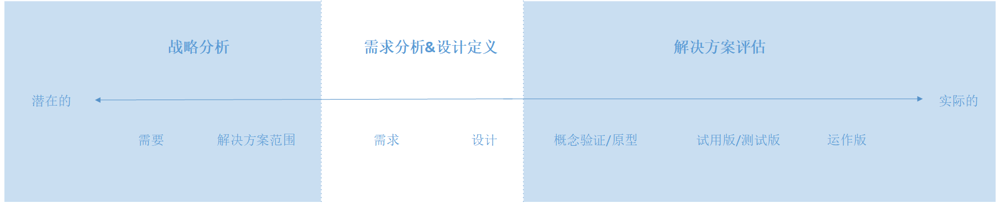
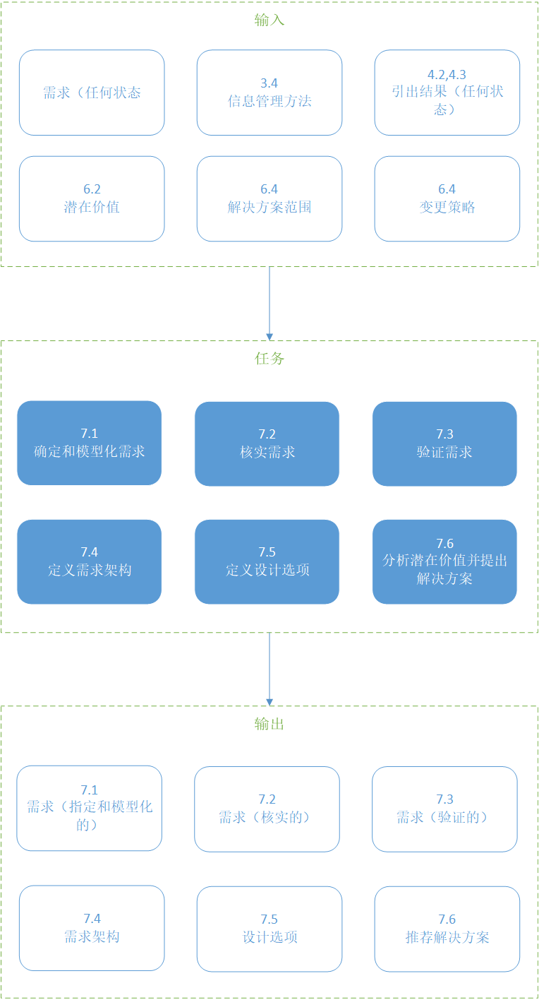
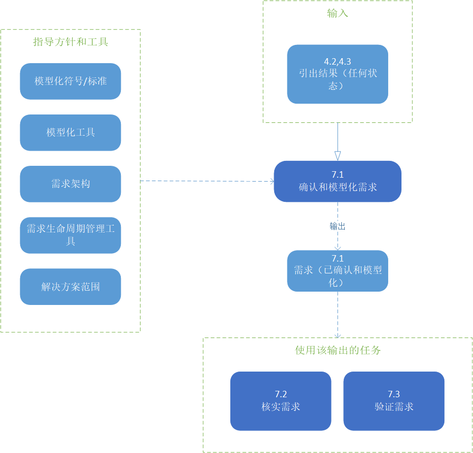
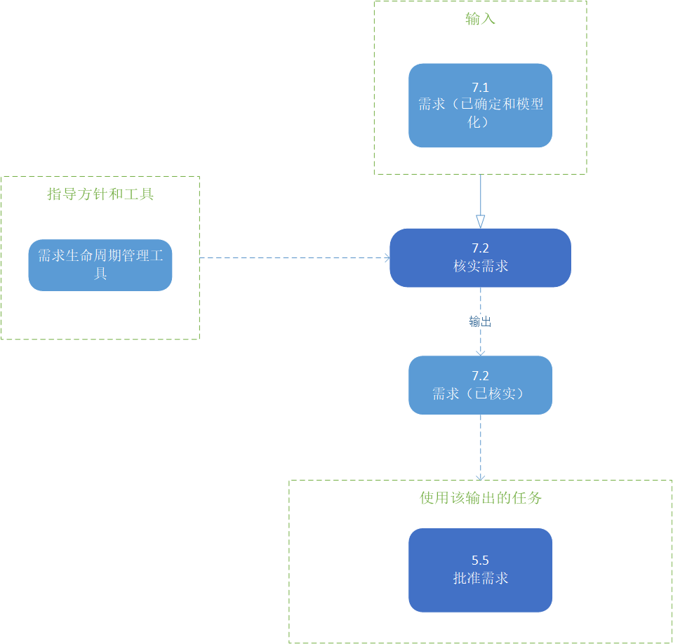
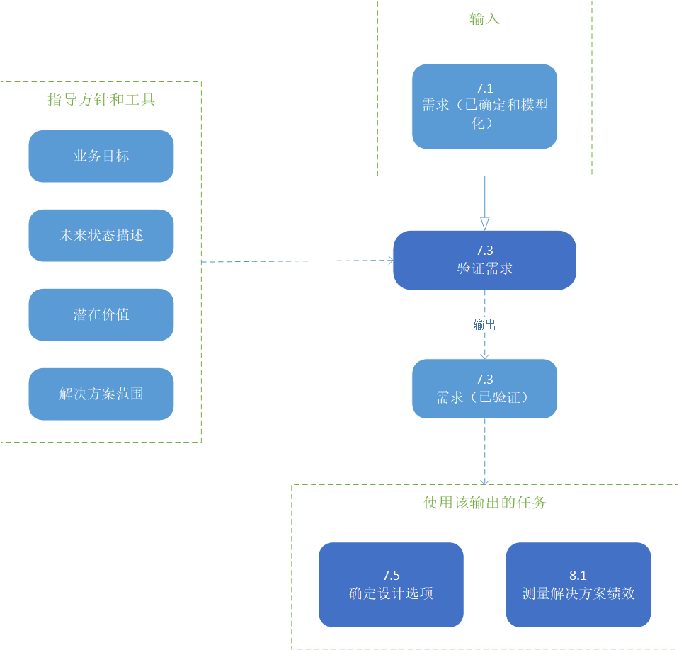
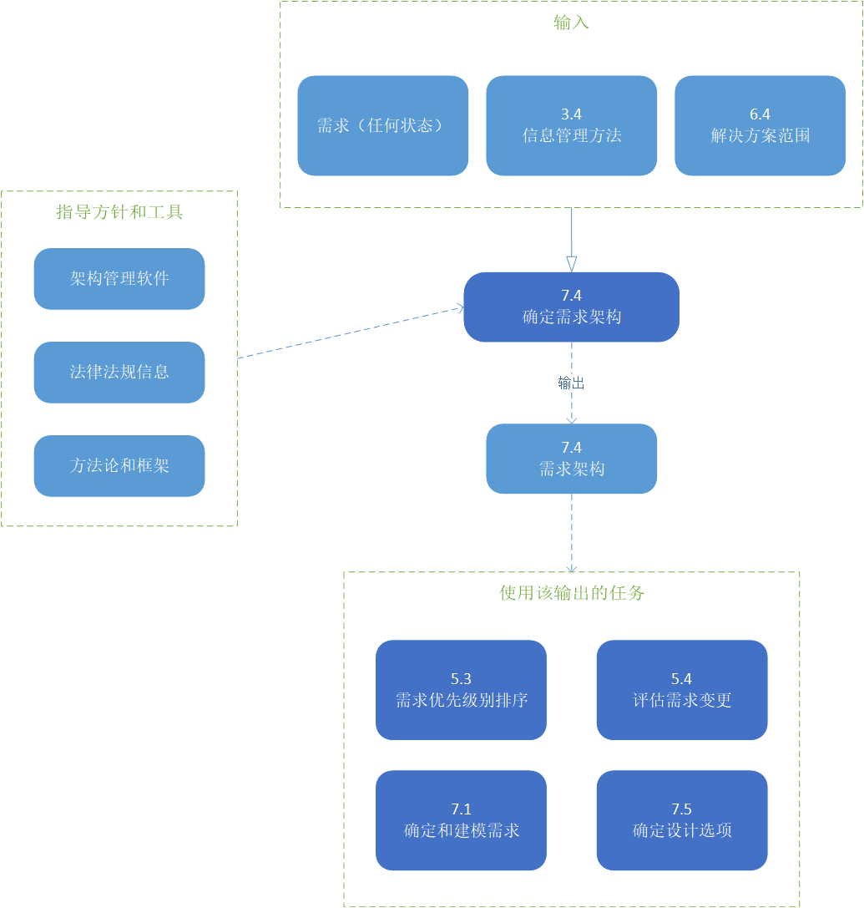
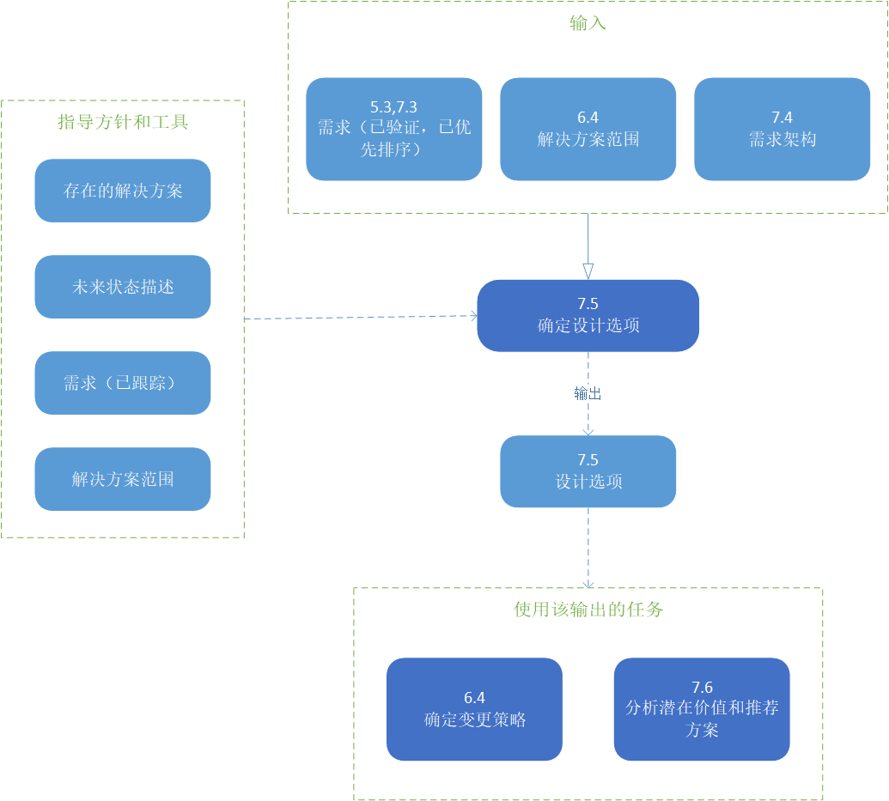

# 需求分析与设计定义

需求分析和设计定义知识区域描述了商业分析人员执行的任务，这些任务用于构造和组织在引出活动中发现的需求，指定和建模需求和设计，验证和核实信息，确定满足业务需求的解决方案选项，评估每个解决方案可能实现的潜在价值。该知识领域涵盖了增量和迭代活动，范围从最初的概念到需求的探索，通过将这些需求转换为特定的推荐解决方案。

需求和设计都是商业分析人员用来定义和指导变更的重要工具。需求和设计之间的主要区别在于它们如何被使用以及被谁使用。一个人的设计可能是另一个人的需求。需求和设计可以是高级的，也可以是非常基础的，这取决于什么是适合那些使用信息的人的。

商业分析师在建模需求、需求、设计和解决方案方面的角色有助于进行彻底的分析并与其他业务关系人进行沟通。形式、细节级别以及建模的内容都取决于上下文、受众和目的。

商业分析师分析需求和设计的潜在价值。商业分析人员与实现主题专家协作，定义可评估的解决方案选项，以推荐满足需求并带来最大价值的最佳解决方案选项。

下图展示了商业分析活动从交付潜在价值到实际价值的过程中的价值范围。

> 图片 7.0.1：商业分析价值层次
> 

需求分析和设计定义知识领域包括以下任务：

* **确定和模型化需求**：使用分析技术详细描述一组需求或设计。
* **核实需求**：确保一组需求或设计已经足够详细地开发出来，以供特定的业务关系人使用，在内部是一致的，并且是高质量的。
* **验证需求**：确保一组需求或设计交付业务价值并支持组织的目标和目的。
* **定义需求架构**：构建所有需求和设计，以便它们支持变更的整体业务目的，并作为一个内聚的整体有效地工作。
* **定义解决方案选项**：识别、探索和描述满足需要的不同可能方法。
* **分析潜在价值并提出解决方案**：评估与潜在解决方案相关的业务价值，并比较不同的选项(包括权衡)，以确定并推荐提供最大整体价值的解决方案选项。

# 需求分析与设计定义中的核心概念模型

商业分析核心概念模型™(BACCM™)描述了六个核心概念之间的关系。下表描述了每个核心概念在上下文中的用法和应用需求分析和设计定义。

> 表 7.0.1：需求分析与设计定义中的核心概念模型
> |核心概念|在需求分析和设计定义期间，商业分析师……|
> |----|----|
> |**变更**：根据需要而转变的行为。|将引出结果转化为需求和设计，以定义变更。|
> |**需要**：需要解决的问题或机会。|分析需要以推荐满足需要的解决方案。|
> |**解决方案**：在一定的环境中满足一种或多种需要的特定方法。|定义解决方案选项，并推荐最有可能满足需求和最有价值的方案。|
> |**业务关系人**：与改变、需要或解决方案有关系的团体或个人。|调整需求和设计，以便每个业务关系组都能理解和使用它们。|
> |**价值**：在一个环境中某物对业务关系人的价值、重要性或有用性。|分析和量化解决方案的潜在价值。|
> |**上下文**：环境影响、被影响，并提供对变化的理解。|以所有业务关系人都能理解和使用的格式对上下文进行建模和描述。|

> 图片 7.0.2：需求分析和设计选项输入/输出图解
> 

## 7.1 确定和模型化需求

### 7.1.1 目的

需求指定和建模的目的是分析、综合并将提取结果提炼为需求和设计。

### 7.1.2 描述

需求说明和模型描述了分析引出结果和创建这些结果的表示的实践。当指定和建模活动的重点是理解需要时，输出被称为需求。当指定和建模活动的重点是解决方案时，输出被称为设计。

在许多IT环境中，“设计”一词专门用于软件开发人员、数据架构师和其他实现主题专家创建的技术设计所有业务可交付成果被称为“需求”。

除了用于表示需求的模型之外，该任务还包括捕获关于需求的属性或元数据的信息。指定和建模活动与所有需求类型相关。

### 7.1.3 输入

* **引出结果（任何状态）**：建模可以从任何引出结果开始，并可能导致需要更多的引出来阐明或扩展需求。引出和建模可以顺序地、迭代地或并发地发生。

> 图片 7.1.1：确定和模型化需求输入/输出图解
> 

### 7.1.4 元素

#### .1 模型化需求

模型是一种描述性和可视化的方式，用于向特定的受众传达信息，以支持分析、沟通和理解。型还可以用于确认知识、识别商业分析师可能拥有的信息差距，以及识别重复的信息。

商业分析师可以从以下一种或多种建模格式中选择：

* **矩阵**：当商业分析师对一个或一组具有复杂但统一结构的需求建模时，会使用矩阵，这些需求可以分解为应用于表中每个条目的元素。矩阵可以用于数据字典、需求跟踪或差距分析。矩阵还用于划分需求的优先级，并记录其他需求属性和元数据。
* **图表**：图表是一个需求或一组需求的可视化的，通常是图形化的表示。在用文字难以描述的方式描述复杂性时，图表特别有用。图还可以用于定义业务领域的边界、对项目进行分类并创建层次结构，以及显示对象的组件(如数据及其关系)。

通过使用一种或多种模型格式，商业分析人员确定要使用的特定类别和类别中的特定模型。模型类别包括：

* **人和角色**：模型表示企业和解决方案中的组织、人员组、角色以及它们之间的关系。用于表示人员及其角色的技术包括组织建模、角色和权限矩阵以及业务关系人列表、地图或角色。
* **基本原理**：模型代表了变化的“原因”。用于表示基本原理的技术包括决策建模、范围建模、业务模型画布、根本原因分析和业务规则分析。
* **活动流程**：模型表示可能采取的一系列操作、事件或过程。用于表示活动流的技术包括过程建模，用例和场景，以及用户故事。
* **能力**：模型关注于企业或解决方案的特性或功能。用于表示功能的技术包括业务功能分析、功能分解和原型。
* **数据和信息**：模型表示企业或解决方案中的特征和信息交换。用于表示数据和信息的技术包括数据字典、数据流程图、数据建模、术语表、状态建模和接口分析。

商业分析师应该使用最适合满足业务关系人在给定上下文中需求的任何模型组合。每种建模技术都有优缺点，并提供了对业务领域的独特见解。

#### .2 需求分析

商业分析信息被分解为组件，以进一步检查：

* 任何必须更改以满足业务需要的内容；
* 任何应该保持不变以满足业务需要的东西；
* 缺失部分；
* 不必要的部分；
* 影响组件的任何约束或假设；

需要的分解级别和需要指定的细节级别取决于业务关系人的知识和理解、误解或沟通错误的可能性、组织标准、合同或法规义务，以及其他因素。

分析为讨论提供了一个基础，以得出关于解决方案的结论。

#### .3 表示需求和属性

商业分析师将需求信息及其属性标识为引出结果的一部分。需求应该被明确地表示出来，并且应该包括足够的细节，以便它们能够显示出需求和设计质量的特征(参见验证需求(第141页))。可以为每个需求或一组需求指定各种属性。在规划信息管理时选择这些属性(请参阅计划商业分析信息管理(第42页))。

作为指定需求的一部分，它们也可以根据任务需求分类模式(第16页)中描述的模式进行分类。通常，引出结果包含不同类型的信息，因此很自然地期望同时指定不同类型的需求。对需求进行分类可以帮助确保需求被完全理解，任何类型的集合都是完整的，并且类型之间有适当的可跟踪性。

#### .4 实现适当的抽象级别

需求的抽象级别根据需求的类型和需求的受众而变化。并不是所有的业务关系人都需要或者发现完整的需求和模型集合中的价值。产生不同的需求观点来代表不同业务关系人的相同需求可能是合适的。商业分析师特别注意维护对所有表示形式的需求的意义和意图。

商业分析方法还可能影响定义需求时使用的抽象级别和模型选择。

### 7.1.5 指导和工具

* **模型化符号/标准**：允许精确地指定需求和设计，以适合于观众和模型的目的。标准模板和排序有助于确保提供有关需求的正确信息。
* **模型化工具**：便于绘制和存储矩阵和图表以表示需求的软件产品。该功能可能是需求生命周期管理工具的一部分，也可能不是。
* **需求体系结构**：需求和它们之间的相互关系可以用来确保模型是完整和一致的。
* **需求生命周期管理工具**：便于记录、组织、存储和共享需求和设计的软件产品。
* **方案范围**：解决方案的边界为需求和设计模型提供了边界。

### 7.1.6 技术

* **验收和评估标准**：用于表示需求的验收和评估标准属性。
* **业务能力分析**：用于表示企业的特性或功能。
* **业务模型画布**：用于描述需求的基本原理。
* **业务规则分析**：用于分析业务规则，以便它们可以与需求一起被指定和建模。
* **概念建模**：用于定义与变更和企业相关的术语和关系。
* **数据字典**：用于记录变更所涉及数据的详细信息。详细信息可能包括定义、与其他数据的关系、起源、格式和用法。
* **数据流程图**：用于可视化数据流需求。
* **数据建模**：用于对需求进行建模，以显示数据将如何用于满足业务关系人信息需求。
* **决策建模**：用于在模型中表示决策，以显示所需的决策要素。
* **功能分解**：用于对需求建模，以确定整个复杂业务功能的组成部分。
* **术语表**：用于在分析需求时记录相关业务术语的含义。
* **交互分析**：用于对需求进行建模，以识别和验证它们所建模的解决方案的输入和输出。
* **非功能需求分析**：用于定义和分析服务质量属性。
* **组织建模**：用于允许商业分析人员对组织中的角色、职责和沟通进行建模。
* **过程建模**：用于显示组织中执行的步骤或活动，或者必须执行以满足所需的更改。
* **原型**：用于帮助业务关系人可视化计划解决方案的外观和功能。
* **角色和权限矩阵**：在使用解决方案时，用于指定和建模与用户和外部接口之间的职责分离有关的需求。
* **根本原因分析**：用于模拟问题的根本原因作为基本原理的一部分。
* **范围建模**：用于可视化地显示范围边界。
* **序列图**：用于指定和建模需求，以显示流程如何操作和相互之间的交互，以及按照什么顺序。
* **涉众列表、映射或角色**：用于识别业务关系人及其特征。
* **状态建模**：用于根据发生的事件，在整个生命周期中指定解决方案的一部分的不同状态。
* **用户用例和场景**：用于模拟解决方案的期望行为，通过显示用户与解决方案的交互，以实现特定的目标或完成特定的任务。
* **用户故事**：用于指定需求，作为关于人们在使用解决方案时做什么或需要做什么的简短陈述。

### 7.1.7 业务关系人

* **任何业务关系人**：商业分析师可以选择自己执行此任务，然后分别将需求打包并与业务关系人沟通，以供其审查和批准，或者他们可以选择邀请部分或所有业务关系人参与此任务。

### 7.1.8 输出

* **需求（已确认和模型化）**：以文本、矩阵和图表的形式对需求和/或设计的任何组合。

## 7.2 核实需求

### 7.2.1 目的

核实需求的目的是确保需求、设计规范和模型符合质量标准，并可用于它们所服务的目的。

### 7.2.2 描述

核实需求可以确保正确定义需求和设计。需求核实由业务分析人员和关键业务关系人进行检查，以确定需求和设计已经准备好进行验证，并提供需要执行的进一步工作所需的信息。

高质量的规范应该编写得很好，并且容易被目标用户理解。高质量的模型遵循正式或非正式的符号标准，并有效地表示现实。

质量要求和设计最重要的特征是适合使用。它们必须满足将为特定目的使用它们的业务关系人的需求。质量最终是由利益相关者决定的。

### 7.2.3 输入

* **需求（已确定和模型化）**：任何需求、设计或这些要求的集合都可以被验证，以确保文本是良好的结构，并且矩阵和建模符号被正确使用。

> 图片 7.2.1：核实需求输入/输出图解
> 

### 7.2.4 元素

#### .1 需求的特点和设计质量

虽然质量最终是由使用需求或设计的业务关系人的需求决定的，可接受的质量需求表现出以下许多特征：

* **原子性**：独立的，独立于其他需求或设计的。
* **完整的**：足够指导进一步的工作，并在适当的细节水平上继续工作。需要的完整性级别根据视角或方法，以及在生命周期中检查或表示需求的点而不同。
* **持续的**：与业务关系人确定的需求保持一致，不与其他需求相冲突。
* **简明的**：包含任何无关和不必要的内容。
* **可行的**：在商定的风险、进度和预算范围内是合理和可能的，或者认为足够可行，可以通过实验或原型进行进一步的研究。
* **明确性**：必须以这样一种方式清楚地说明需求，以明确解决方案是否满足相关的需求。
* **可测试**：能够验证需求或设计已经完成。可接受的验证实现级别取决于需求或设计的抽象级别。
* **区分优先级**：根据重要性和价值对所有其他要求进行排序、分组或协商。
* **可以理解的**：用观众常用的术语表示。

#### .2 核实活动

核实活动通常在需求分析过程中迭代地执行。

核实活动包括：

* 检查商业分析是否符合组织性能标准，例如使用正确的工具和方法。
* 检查建模符号、模板或表单的正确使用。
* 检查每个模型中的完整性。
* 将每个模型与其他相关模型进行比较，检查在一个模型中提到但在其他模型中缺失的元素，并验证这些元素是否被一致引用。
* 确保用于表达需求的术语对涉众来说是可以理解的，并且与组织中这些术语的使用一致。
* 在适当的地方添加例子以便澄清。

#### .3 核对表

核对表用于检验要求和设计时的质量控制。核对列表可能包括一组标准的质量元素，商业分析人员使用这些元素来验证需求，或者它们可能被专门开发来捕获关注的问题。核对表的目的是确保被确定为重要的项目包含在最终需求可交付物中，或者确保验证过程所需的步骤被遵循。

### 7.2.5 指导和工具

* **需求生命周期管理工具**：有些工具具有检查与许多特征相关的问题的功能，如原子性、明确性和优先级。

### 7.2.6 技术

* **验收和评估标准**：用于确保足够清楚地陈述需求，以设计一组测试，以证明需求已经被满足。
* **项目跟踪**：用于确保在验证过程中发现的任何问题得到管理和解决。
* **指标和关键绩效指标（KPIs）**：用于确定如何评估需求的质量。
* **评审**：用于检查需求文档，以识别质量不合格的需求。

### 7.2.7 业务关系人

* **任何业务关系人**：商业分析人员与领域和实现主题问题专家一起，对确定该任务是否已完成负有主要责任。其他业务关系人可能会在需求沟通期间发现问题需求。因此，所有业务关系人都可以参与到这项任务中。

### 7.2.8 输出

* **需求（已验证）**：一套质量足够的要求或设计，可作为进一步工作的基础。

## 7.3 验证需求

### 7.3.1 目的

验证需求的目的是确保所有需求和设计与业务需求一致，并支持所需价值的交付。

### 7.3.2 描述

需求验证是一个持续进行的过程，以确保涉众、解决方案和转换需求与业务需求保持一致，并且设计满足需求。

在满足业务关系人的需求之后，了解他们期望的未来状态是什么样子，对商业分析师在验证需求时很有价值。实现需求的总体目标是实现业务关系人期望的未来状态。在许多情况下，业务关系人有不同的、相互冲突的需求和期望，这些需求和期望可能会在验证过程中暴露出来。

### 7.3.3 输入

* **需求（已确定和模型化）**：任何类型的需求和设计都可以被验证。验证活动可能在需求被完全验证之前就开始了。然而，验证活动不能在需求被完全验证之前完成。

> 图片 7.3.1：验证需求输入/输出图解
> 

### 7.3.4 

#### .1 确定假设

如果一个组织正在推出一个前所未有的产品或服务，可能有必要对客户或业务关系人的反应做出假设，因为之前没有类似的经验可以依赖。在其他情况下，可能很难或不可能证明某个特定问题是由确定的根本原因引起的。业务关系人可能已经假定某些利益将从需求的实现中产生。确定和定义这些假设，以便管理相关的风险。

#### .2 定义可衡量的评价标准

当预期的利益被定义为未来状态的一部分时，具体的度量标准和评估过程可能没有被包括在内。商业分析人员定义评估标准，用于评估实现解决方案后变更的成功程度。基线度量可以基于当前状态建立。可以开发目标指标来反映业务目标的实现或其他一些成功的度量。

#### .3 评估与解决方案范围的一致性

需求可能对业务关系人有益，但仍然不是解决方案的理想组成部分。不能为业务关系人提供利益的需求是一个强有力的被消除的候选需求。当需求不一致时，必须重新评估未来的状态并更改解决方案范围，或者将需求从解决方案范围中删除。

如果设计不能被验证以支持需求，那么可能存在缺失或误解的需求，或者设计必须更改。

### 7.3.5 指导和工具

* **业务目标**：确保需求交付所需的业务利益。
* **未来状态描述**：有助于确保作为解决方案范围一部分的需求确实有助于实现期望的未来状态。
* **潜在价值**：可以作为一个基准来评估需求所交付的价值。
* **解决方案范围**：确保提供效益的需求在所需解决方案的范围内。

### 7.3.6 技术

* **验收和评估标准**：用于定义必须满足的质量度量标准，以获得业务关系人的认可。
* **文档分析**：用于识别先前记录的业务需求，以验证需求。
* **财务分析**：用于定义与需求相关的财务利益。
* **项目跟踪**：用于确保在验证期间发现的任何问题都得到了管理和解决。
* **度量和关键性能指标(KPIs)**：用于为解决方案、解决方案组件或需求选择适当的性能度量。
* **评审**：用于确认业务关系人是否同意他们的需求得到满足。
* **风险分析和管理**：用于识别可能改变需求交付的利益的场景。

### 7.3.7 业务关系人

* **任何业务关系人**：商业分析人员与客户、最终用户和发起人一起，对确定需求是否得到验证负有主要责任。其他业务关系人可能会在需求沟通期间发现问题需求。因此，几乎所有的项目业务关系人都参与到这项任务中。

### 7.3.8 输出

* **需求（已验证）**：经过验证的需求和设计是那些可以被演示为向业务关系人交付利益并与变更的业务目标和目标保持一致的需求和设计。如果一个需求或设计不能得到验证，那么它要么对组织没有好处，要么不在解决方案范围内，或者两者都没有。

## 7.4 确定需求架构

### 7.4.1 目的

定义需求体系结构的目的是确保需求集体地相互支持，以完全实现目标。

### 7.4.2 描述

需求架构是一个变更的所有需求的结构。需求架构将各个模型和规范组合在一起，以确保所有需求形成一个单一的整体，支持整个业务目标，并为业务关系人产生有用的结果。

商业分析师用需求架构以：

* 解哪些模型适合于领域、解决方案范围和受众。
* 将需求组织成与不同业务关系人相关的结构。
* 说明需求和模型如何相互作用和关联，并说明各部分如何组合成一个有意义的整体。
* 确保需求协同工作以实现总体目标。
* 在考虑总体目标的同时做出关于需求的权衡决定。

需求架构并不是要演示可跟踪性，而是要展示元素如何彼此协调工作以支持业务需求，并以各种方式构建它们以使不同业务关系人的观点保持一致。可跟踪性经常被用作表示和管理这些关系的机制(参见跟踪需求(第79页))。可追溯性证明了每个需求都链接回一个目标，并显示了目标是如何被满足的。可跟踪性并不能证明解决方案是一个可以工作的有结合力整体。

### 7.4.3 输入

* **信息管理方法**：定义如何存储和访问商业分析信息(包括需求和模型)。
* **需求(任何状态)**：每一个需求都应该陈述一次，并且只陈述一次，并将其合并到需求体系结构中，以便可以对整个集合的完整性进行评估。
* **解决方案范围**：必须考虑以确保需求体系结构与所需解决方案的边界保持一致。

> 图片 7.4.1：确定需求架构输入/输出图解
> 

### 7.4.4 元素

#### .1 需求观点和视图

观点是一组约定，定义了需求将如何表示，这些表示将如何组织，以及它们将如何关联。观点为处理特定业务关系人组的关注点提供了模板。

需求观点通常包括以下方面的标准和指导方针：

* 用于需求的模型类型。
* 在不同的模型中包含并一致使用的属性。
* 所使用的模型符号。
* 用于识别和维护模型之间的相关关系的分析方法。

有一个单独的观点可以形成一个完整的架构。每个观点对于需求的某些方面来说都更强，而对于其他方面来说则更弱，因为不同的业务关系人组有不同的关注点。试图在任何一个观点中放入过多的信息会使其过于复杂并降低其目的。观点的例子包括：

* 业务流程模型。
* 数据模型和信息。
* 用户交互，包括用例和/或用户体验。
* 审计和安全。
* 业务模型。

这些观点中的每一个都有不同的模型符号和技术，对于确保最终解决方案的一致性都很重要。如果商业分析师只从业务流程的角度看问题，那么解决方案可能不会成功。类似地，试图将来自多个观点的约定放在一个观点中，将使分析和包含与特定利益相关者群体无关的信息变得难以承受。

从选定的观点来看，特定解决方案的实际需求和设计称为视图。视图的集合组成了特定解决方案的需求体系结构。商业分析人员对需求进行对齐、协调，并为各种业务关系人构建有意义的视图。这一组协调的、互补的观点为评估需求的完整性和一致性提供了基础。

简而言之，视点告诉商业分析师他们应该为每个业务关系人组提供什么信息来处理他们的关注点，而视图则描述产生的实际需求和设计。

#### .2 模板架构

架构框架是跨行业、部门或组织的标准观点的集合。商业分析师可以将框架视为预定义的模板，从定义其体系结构开始。类似地，可以用特定于领域的信息填充框架，以形成一个视图集合，如果它是准确的，那么它是构建体系结构的更有用的模板，因为信息已经在其中填充了。

#### .3 完整

体系结构有助于确保一组需求是完整的。整个需求集应该能够被观众理解，并且可以确定它是有凝聚力的，并且讲述了一个完整的故事。集合中不应缺少任何要求，不应与其他要求不一致，或相互矛盾。需求体系结构应该考虑需求之间可能阻碍目标实现的任何依赖关系。

根据不同的观点构造需求有助于确保完整性。引出、规范和分析活动的迭代可以帮助识别差距。

#### .4 关联和验证需求关系

在定义需求体系结构时，需求可能以几种方式相互关联。商业分析人员检查和分析需求，以定义需求之间的关系。这些关系的表示是由跟踪需求提供的(参见跟踪需求(p。79))。

商业分析人员检查每个关系，以确保这些关系满足以下质量标准：

* **清晰的**：存在一种关系，并且描述了这种关系的类型。
* **必要的**：这种关系对于全面理解需求是必要的。
* **正确的**：这些元素确实具有所描述的关系。
* **不含糊的**：不存在以两种不同而又相互冲突的方式将元素联系起来的关系。
* **始终如一的**：使用视点中定义的同一组标准描述，以相同的方式描述关系。

#### .5 商业分析信息体系结构

商业分析信息的结构也是一个信息体系结构。这种类型的架构被定义为任务计划、业务分析和信息管理(第42页)的一部分。信息体系结构是需求体系结构的一个组件，因为它描述了与变更相关的所有商业分析信息。它定义了信息类型的关系，如需求、设计、模型类型和引出结果。理解这种类型的信息结构有助于通过验证关系的完整性来确保完整的需求集。在建立基础设施(如需求生命周期管理工具、体系结构管理软件或文档存储库)之前开始定义这个体系结构是很有用的。

### 7.4.5 指导和工具

* **架构管理软件**：建模软件可以帮助管理需求体系结构中关系的数量、复杂性和版本。
* **法律法规信息**：描述必须遵守的立法规则或条例。它们可能会影响需求体系结构或其输出。此外，可能还需要考虑合同或基于标准的约束。
* **方法论和框架**：预定的一组模型，以及模型之间的关系，用来表示不同的观点。

### 7.4.6 技术

* **数据建模**：用于描述与数据相关的需求结构。
* **功能拆解**：用于将组织单元、产品范围或其他元素分解为其组成部分。
* **访谈**：用于协同定义需求结构。
* **组织模型**：用于理解不同的组织单位、涉众及其关系，这些关系可能有助于定义相关的观点。
* **范围模型**：用于识别需求体系结构的元素和边界。
* **研讨会**：用于协同定义需求结构。

### 7.4.7 业务关系人

* **领域主题专家，实施主题专家，项目经理、发起人、测试人员**：可以协助定义和确认需求架构。
* **任何业务关系人**：也可以使用需求体系结构来评估需求的完整性。

### 7.4.8 输出

* **需求架构**：需求和它们之间的相互关系，以及任何被记录的上下文信息。

## 7.5 确定设计选项

### 7.5.1 目的

定义设计选项的目的是定义解决方案方法，确定改进业务的机会，跨解决方案组件分配需求，并表示实现期望的未来状态的设计选项。

### 7.5.2 描述

在设计解决方案时，可能会确定一个或多个设计选项。每个设计选项代表一种满足一组需求的方法。设计选项存在于比变更策略更低的层次，是战术而不是战略。在开发解决方案时，可能需要在设计方案中进行战术权衡。商业分析师必须评估这些权衡对向业务关系人交付价值的影响。随着计划的进展和需求的发展，设计选项也在发展。

### 7.5.3 输入

* **变更策略**：描述转换到未来状态时将遵循的方法。这可能会对设计决策产生一些影响，比如什么是可行的或可能的。
* **需求(验证,优先)**：在设计选项中只考虑经过验证的需求。了解需求优先级有助于建议合理的设计方案。与优先级较低的需求相比，优先级最高的需求在选择解决方案组件以最好地满足它们时可能需要更多的权重。
* **需求架构**：完整的需求集及其关系对于定义能够处理整体需求集的设计选项非常重要。

> 图片 7.5.1：确定设计选项输入/输出图解
> 

### 7.5.4 元素

#### .1 确定解决方案方法

解决方案方法描述是创建还是购买解决方案组件，还是两者的某种组合。商业分析人员评估每个设计选项的解决方案方法的优点。

解决方案的方法包括：

* **创造**：解决方案组件由专家组装、构造或开发，作为对一组需求的直接响应。需求和设计选项有足够的细节来决定构建哪个解决方案。此选项包括修改现有解决方案。
* **购买**：从满足需求的一组产品中选择解决方案组件。需求和设计选项有足够的细节来建议购买哪个解决方案。这些产品通常是由第三方拥有和维护的产品或服务。
* **二者合一**：并非所有的设计选项都严格地属于上述类别之一。设计方案可能包括创建和购买组件的组合。

在所有这些类型的方法中，建议的组件集成也在设计选项中考虑。

#### .2 确定改进机会

在提出设计选项时，可能会出现一些改进业务运作的机会，并进行比较。

一些常见的机会例子包括：

* **效率增加**：通过重新设计或共享过程、改变责任或外包，使人们执行的工作自动化或简化。自动化还可能增加行为的一致性，减少不同业务关系人以明显不同的方式执行相同功能的可能性。
* **改善获取信息的途径**：为直接或间接与客户打交道的员工提供更多的信息，从而减少对专家的需求。
* **确定额外的功能**：突出显示有潜力提供未来价值并可由解决方案支持的功能。这些功能不一定对组织有直接的价值(例如，具有组织预期将来使用的功能的软件应用程序)。

#### .3 需求分配

需求分配是将需求分配给解决方案组件和发布以最好地实现目标的过程。分配是通过评估可选方案之间的权衡来支持的，以便实现利益最大化和成本最小化。解决方案的价值可能取决于需求如何实现，以及业务关系人何时可以使用解决方案。分配的目标是使价值最大化。

需求可以在组织单元、工作职能、解决方案组件或解决方案发布版之间进行分配。需求分配通常在确定了解决方案方法后开始，并一直持续到分配了所有有效的需求。分配通常贯穿于解决方案的设计和实现。

#### .4 描述设计选项

在考虑期望的未来状态时，研究和开发设计选项，以确保设计选项是有效的。为每个设计选项定义了解决方案性能度量。

一个设计选项通常由许多设计组件组成，每个设计组件由一个设计元素描述。设计要素可以描述：

* 业务策略和业务规则。
* 要执行和管理的业务流程。
* 操作和维护解决方案的人员，包括他们的工作职能和职责。
* 要做出的运营业务决策。
* 解决方案中使用的软件应用和应用组件。
* 组织结构，包括组织、客户和供应商之间的交互。

### 7.5.5 指导和工具

* **现有的解决方案**：现有的产品或服务，通常是第三方的，被认为是设计选项的组成部分。
* **未来状态描述**：确定设计选项将成为企业的一部分的期望状态，并帮助确保设计选项是可行的。
* **需求（已跟踪）**：定义最能满足已知需求的设计选项。
* **解决方案范围**：在选择可行的设计选项时定义边界。

### 7.5.6 技术

* **基准和市场分析**：用于识别和分析现有的解决方案和市场趋势。
* **头脑风暴**：用于帮助确定改进机会和设计选项。
* **文档分析**：用于提供描述设计选项和设计元素所需的信息。
* **访谈**：用于帮助确定改进机会和设计选项。
* **经验教训**：用来帮助确定改进机会。
* **思维导图**：用于识别和探索可能的设计选项。
* **根本原因分析**：用于理解变更中所处理的问题的潜在原因，从而提出解决方案来解决这些问题。
* **调查和问卷调查**：用于帮助确定改进机会和设计选项。
* **供应商评估**：用于将对第三方解决方案的评估与对供应商的评估结合起来，以确保解决方案是可行的，所有各方都能够发展和维护健康的工作关系。
* **研讨会**：用于帮助确定改进机会和设计选项。

### 7.5.7 业务关系人

* **领域主题专家**：在业务中提供专业知识，以在评估解决方案替代方案时提供输入和反馈，特别是针对解决方案的潜在好处。
* **实施主题专家**：利用他们在考虑的设计选项方面的专业知识，提供关于解决方案的约束条件及其成本所需的输入。
* **运营支持**：可以帮助评估将提议的解决方案与现有流程和系统集成的难度和成本。
* **项目经理**：计划和管理解决方案定义过程，包括解决方案范围和与所建议的解决方案相关的任何风险。
* **供应商**：提供有关与特定设计选项相关联的功能的信息。

### 7.5.8 输出

* **设计选项**：描述在上下文中满足一种或多种需求的各种方法。它们可能包括解决方案方法、选项提供的潜在改进机会以及定义选项的组件。