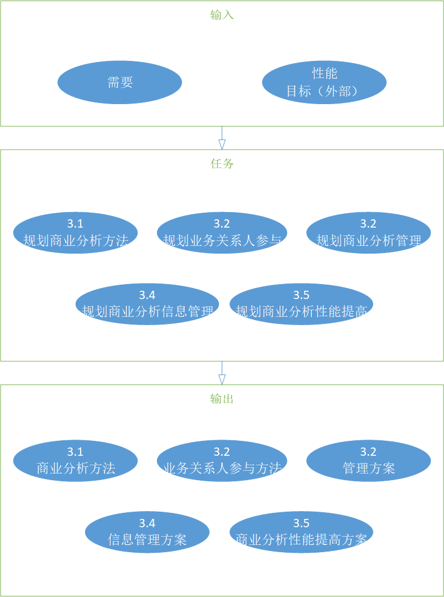
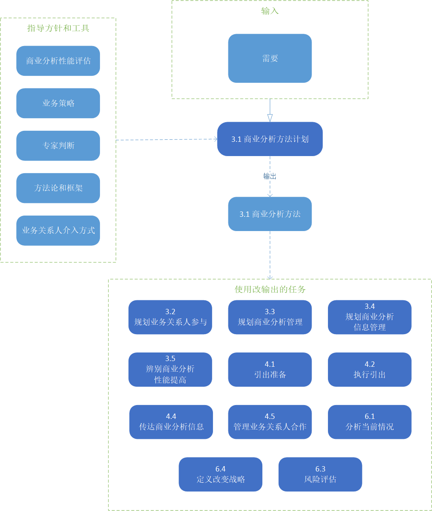
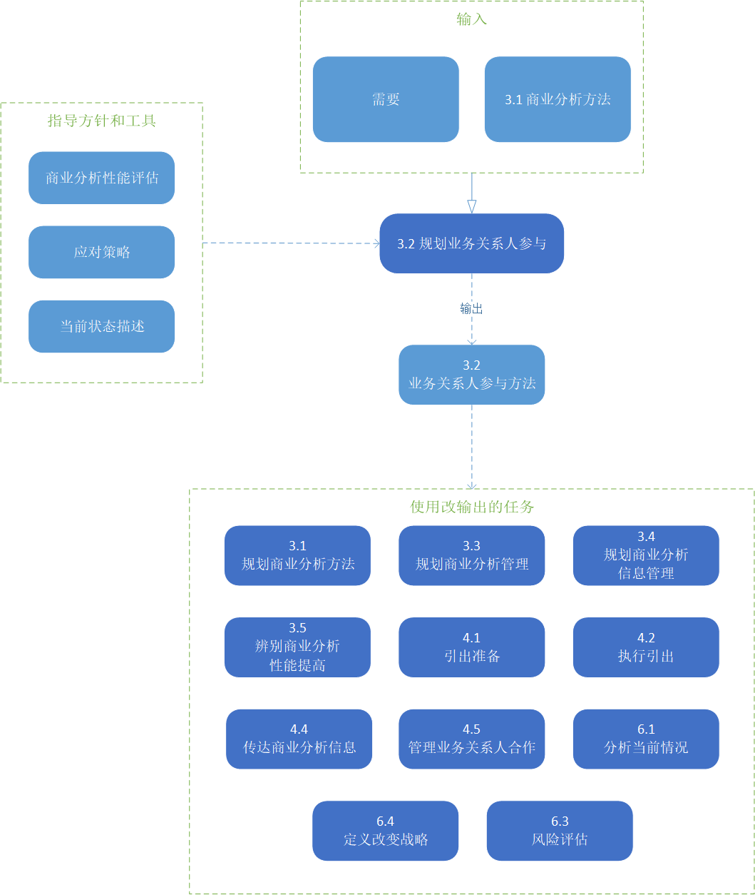
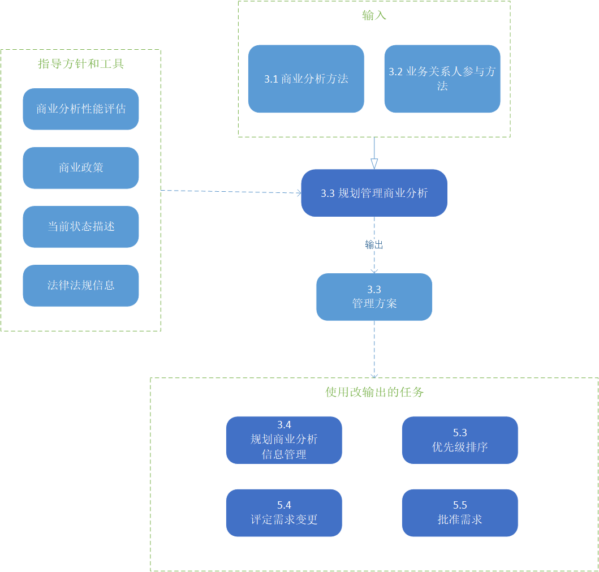

# 商业分析规划及监管

商业分析人员规划和监管知识领域任务组织和协调商业分析师和业务关系人的工作。这些任务产生的输出被用作整个BABOK®指南中其他任务的关键指导方针。

商业分析规划及监管的知识领域包含以下的任务：
* **规划商业分析的方法**：描述商业分析工作的规划，创建或者选择方法论以规划个体活动、任务和可交付成果。
* **规划业务关系人参与**：描述了理解哪些业务关系人和改变有关，有哪些业务关系人的需要，他们需要商业分析师处得到什么，以及一种最好的方式合作。
* **规划商业分析管理**：定义用于支持组织的管理功能的商业分析的组件。它有助于确保正确和一致地做出决策，并遵循确保决策者获得他们需要的信息的过程。这方面的例子包括需求管理、商业分析风险管理和商业分析资源的分配。
* **规划商业分析信息管理**：定义如何捕获、存储商业分析师开发的信息(包括需求和设计)，并与其他信息集成以供长期使用。
* **辨别商业分析性能提高**：描述规划及监管商业分析工作如何执行，以确保满足承诺，并实现持续学习和改进的机会。

**商业分析核心概念的规划和监管**

商业分析核心概念模型™(BACCM™)描述了六个核心概念之间的关系。下表描述了商业分析计划和监控上下文中每个核心概念的用法和应用。

> 表格 3.0.1 ：商业分析核心概念的规划和监管
> |核心概念|商业分析规划及监控，商业分析师……|
> |----|----|
> |**改变**：为满足某种需要而进行的转变行为。|负责决定如何请求和授权对商业分析结果的改变。|
> |**需要**：需要解决的问题或机会。|选择为改变提供充足分析的商业分析方法。|
> |**解决方案**：满足上下文中的一种或者多种需要的特定方式。|评估商业分析性能是否是成功实现解决方案的关键因素。|
> |**业务关系人**：和改变、需要或者解决方案有关的个人或群组。|执行业务关系人分析，以确保计划和监管活动所反映的业务关系人的需要和说明业务关系人的特征。|
> |**价值**：在上下文中某物对业务关系人的价值、重要性或有用性。|执行性能分析以确保商业分析活动继续为业务关系人产生足够的价值。|
> |**上下文**：影响、被影响的环节，并提供对改变的理解。|确保分析中对上下文的充分理解，以便开发有效的商业分析方法。|

> 图片 3.0.1 商业分析规划及监管图解
> 

## 3.1 规划商业分析的方法

### 3.1.1 目的

规划商业分析的方法是为了定义一个恰当的方式去引导商业分析活动。

### 3.1.2 描述

商业分析方法描述了在给定计划上执行商业分析工作时将遵循的总体方法，任务将如何以及何时执行，以及将产生的可交付成果。

商业分析师需要确定一套初始的可用技术。这个列表可能在执行开始时发生改变，通过改变，商业分析师可以获得对改变及其业务关系人有更深层次的理解。

商业分析方法可以由方法论或者组织标准定义。在某些组织中，商业分析方法的元素可能被标准化和形式化为可重复的商业分析过程，可以为每项工作都可以使用它。即使存在标准方法，也可以根据特定活动的需要进行定制。定制可以由标准进行管理，这些标准定义了哪些方法是允许的，哪些过程的哪些元素是可以定制的，以及选择过程的一般指导方针。

如果组织标准不存在，商业分析师将与适当的业务关系人一起合作，以确定如何完成工作。例如，，如果改变是通过项目进行交付的，标准和方法可能会在项目计划阶段开发出来。

商业分析方法应当：
* 与改变的总体目标保持一致，
* 将商业分析任务与整体改变的活动和交付物协调起来，
* 包括管理任何可能降低商业分析结果质量或阻碍任务效率风险的任务，
* 利用方法、选择技术和工具在历史上一致很有效。

### 3.1.3 输入

* **需要**：商业分析方法取决于组织面临的问题或机会。同时有必要考虑到在计划时所知道的需求内容，同时承认理解这件事在商业分析活动中不断的发展。

> 图片 3.1.1：商业分析方法规划输入/输出图解
> 

### 3.1.4 元素

#### .1 规划方法

在不同的视角、行业和企业中会使用到各式各样的规划方法。许多规划方法适合在预测和自适应方法之间的某个连续状态中。

预测方法侧重于最大限度地减少前期的不确定性，并确保在实施开始前就确定解决方案，以最大限度地控制和最小化风险。在以下情况下，这些方法通常是首选的:需求可以在实现之前有效地定义，不正确实现的风险是不可接受的高，或者当涉众提出重大挑战时。

自适应方法关注于在短迭代中快速交付业务价值，以换取对解决方案的整体交付的更高程度的不确定性的接受。当采用探索性方法寻找最佳解决方案或对现有解决方案进行增量改进时，这些方法往往是首选的。

不同的方法可用在同一案例中进行使用。在其他因素中，商业分析师可以考虑组织的标准、对不确定性的容错能力，以及在计划商业分析活动时使用不同方法的经验。

无论采用何种方法，计划都是确保价值交付给企业的基本任务。当计划被更新以处理不断变化的业务条件和新提出的问题时，计划通常会在给定的计划上发生多次。商业分析方法应该描述在需要更改时如何更改计划。

#### .2 商业分析交付物的形式和细节级别

在定义商业分析方式时，考虑适合于接近和计划主动性工作的正式级别。

预测性方法通常需要正式的文档和表示。商业分析信息可以在一个正式的文档或者一组遵循标准化模板表示形式中获得。信息在不同的细节级别上被获得。商业分析信息的具体内容和格式可能因使用的组织方法、流程和模板而异。

适应性方法倾向于通过团队间的沟通来定义需求和设计，并收集工作解决方案的反馈。强制性需求的结果通常局限于需求的优先级列表。额外的商业分析文档可以由团队自行创建，并且通常包括为了增强团队对特定问题的理解而开发的模型。正式的文档通常在解决方案实施后生成，以方便知识的转移。

其它可能影响该方法的考虑因素包括：
* 变化复杂且存在高风险，
* 该组织处于有着严格管制的行业，或者和其有合作，
* 合同或协议需要形式，
* 业务关系人在地理上存在分布（参与者不在一起），
* 资源外包，
* 员工的流动率高，或者团队成员可能缺乏经验，
* 需求必须正式的签署确定，
* 商业分析信息必须长期维护，以便移交至未来计划中进行使用。

> 表格3.1.2：商业分析交付成果的形式和详细程度
> ||方法|方法|
> |----|----|----|
> ||预测性|适应性|
> |解决方案定义|在实施前定义，以最大限度地控制和最小化风险|在迭代中定义，以达到最佳解决方案或改进现有解决方案|
> |正式化水平|正式——信息是在标准化模板中获取的|非正式——信息是通过团队的沟通反馈收集的|
> |行动|首先确定完成可交付成果所需的行动，然后将其划分为任务|行动首先被划分为具有可交付成果的迭代，然后识别相关的任务|
> |排期|任务在特定的阶段执行|任务是迭代执行的|

#### .3 商业分析活动

商业分析方法对商业分析人员将要执行的活动类型进行了描述。组织所采用的放阿飞尝尝影响所选择的活动。

将商业分析活动整合至商业分析方法中包括：

* 明确完成每个可交付成果所需要的活动，然后将每个活动分解为任务，
* 将工作划分为迭代，确定每个迭代的可交付成果，然后确定相关的活动和任务，
* 使用以前的类似计划作为大纲，并应用当前计划特有的详细任务和活动。

#### .4 商业分析工作的时间安排

商业分析人员确定何时需要执行商业分析任务，以及商业分析工作的级别是否需要随时间变化。
这种类型的计划包括确定在其他只是领域中执行商业分析任务是主要在特定阶段执行还是在计划过程中迭代执行。

商业分析活动的时间也会收到以下因素的影响：

* 资源的可用性；
* 新方案的优先级和/或紧迫性；
* 其他并发的方案；
* 例如合同条款或监管期限的约束条件；

#### .5 复杂性和风险

在确定商业而分析方法时，需要考虑变更的复杂性和规模，以及对组织工作的总体风险。随着复杂性和风险的增加或减少，商业分析工作的性质和范围可以改变并反映在方法中。

该方法也可以根据项目中涉及的业务关系人或商业分析资源的体量进行更改。随着业务关系人的梳理的增加，该方法可能会进行调整，以包括额外的过程步骤，以更好地管理商业分析工作。

其他影响复杂性的因素包括：

* 改变的体量；
* 受影响的业务领域或系统的数目；
* 地理和文化因素；
* 技术复杂性；
* 任何可能阻碍商业分析工作的风险；

影响商业分析工作的风险级别的因素包括：

* 商业分析师的经验水平；
* 商业分析师所掌握的知识领域和范围；
* 业务关系人在沟通其需求方面的经验水平；
* 业务关系人对变化和商业分析的总体态度；
* 业务关系人分配给商业分析活动的时间量；
* 任何之前所选择的框架、方法、工具以及或者组织的政策和实践的技术；
* 组织的文化规范；

#### .6 接受

商业分析方法由业务关系人评审并达成一致的意见。在某些组织中，商业分析的过程可能更加结构化，并要求业务关系人签署方法，以确保所有的商业分析活动都已确定，评估是现实的，以及所建议的角色和职责是正确的。业务关系人在审查方法时提出的任何问题都由商业分析师记录下来，并寻求解决方案。业务关系人还在评审和接受对方法的变更时发挥作用。

### 3.1.5 准则及工具

* **商业分析绩效评估**：应该在提供评估结果之前审查纳入规划中的所有方案。
* **商业政策**：定义了一个决定必须要遵守的范围。它们可以通过法规、合同、协议、交易、保证、证明或其他法律义务来描述。这些政策会影响业务分析方法。
* **专家评估**：用于确定最佳的商业分析方法。专业知识的来源很广泛，包括项目的业务关系人、组织的人才中心、顾问、协会和行业团体。
* **方法和框架**：通过提供方法、技术、过程、工作概念和规则来塑造将要使用的方法。它们可能需要进行调整，以更好地满足特定业务挑战的需求。
* **业务关系人参与方法**：在确定商业分析方法时，需要了解业务关系人及其关注的问题和他们的利益，这些信息可能会影响所做的决策。

### 3.1.6 技术

* **头脑风暴**：用于识别可能的商业分析活动、技术、风险和其他相关项目，以帮助构建商业分析方法。
* **企业实例**：用于理解问题或者机会的要素是否对时间特别敏感，是否价值特别高。或者可能的需求或解决方案的关键因素是否有任何存在的特定不确定因素。
* **文档分析**：用于复盘企业现有材料，这可能对计划方法有帮助。
* **评估**：用于确定执行业务分析活动可能需要多长时间。
* **财务分析**：用于评估不同的方法(以及支持的交付选项)如何影响交付的价值。
* **功能拆解**：用于将复杂的业务分析流程或方法分解为更可行的组件。
* **访谈**：用于帮助个人或小组制定计划。
* **项目跟踪**：用于跟踪与利益相关者在计划活动期间提出的任何问题。还可以跟踪在构建方法时讨论中提出的风险相关项目。
* **经验总结**：用于确定企业以前的经验(成功和挑战)与规划商业分析方法。
* **流程模型化**：用于定义和记录商业分析方法。
* **复盘**：用于与业务关系人验证所选的商业分析方法。
* **风险分析和管理**：用于评估风险，以选择合适的商业分析方法。
* **范围模型化**：用于确定解决方案的边界，作为计划和估计的输入。
* **调查或问卷调查**：用于识别可能存在的商业分析活动、技术、风险和其他相关项目，以帮助构建商业分析方法。
* **研习会**：用于在团队设置中帮助构建计划。

### 3.1.7 业务关系人

* **领域主题专家**：当需要他们的参与而又缺乏可用性时，可能会成为一个风险来源。所采取的方法可能取决于他们对新方案的参与程度和可用性。
* **项目经理**：确定该方法对于总体进度和时间表是现实的。商业分析方法必须与其他活动兼容。
* **监管机构**：可能需要对商业分析方法的各个方面或在调整过程中所做的决策提供批准，特别是在审核商业分析过程的组织。
* **主办者**：能够提供方法的需求和目标，并确保组织的政策得到遵循。所选择的方法可能取决于可用性和对计划的参与。

### 3.1.8 输出

* **商业分析方法**：确定将在计划中执行的商业分析方法和活动，包括谁将执行活动、工作的时间和顺序、将产生的可交付成果以及可能使用的商业分析技术。商业分析计划和监控知识领域的剩余输出可以集成到一个整体的方法中，或者基于方法、组织和视角而独立。

## 3.2 规划业务关系人的参与

### 3.2.1 目的

业务关系人参与的目的是计划一种方式，以建立和维护与业务关系人的有效工作关系。

### 3.2.2 描述

规划业务关系人的参与包括进行全面的业务关系人的分析，以确定所有设计的业务关系人，并分析他们的特征。然后利用分析的结果为规划定义最佳的写作和沟通方法，并为业务关系人的风险进行适当的计划。

在计划业务关系人的参与时，复杂度会随着商业分析中业务关系人的数量的增加而不成比例的增加。这是很重要的。因为当从少数业务关系人的参与发展到数十人、数百人甚至数千人的合作时，可能需要新的或者不同的技术来管理业务关系人。

### 3.2.3 输入

* **需求**：了解业务需求及其影响企业的部分有助于确定业务关系人。需求可能会随着业务关系人分析的执行而增加；
* **商业分析方法**：将整个商业分析方法合并到业务关系人分析、协作和沟通方法中是必要的，以确保方法之间的一致性。

> 图片 3.2.1：规划业务关系人参与输入/输出图解
> 

### 3.2.4 元素

#### .1 执行业务关系人分析

业务关系人分析包括确定业务关系人（将会被直接或间接受到变更影响的人）及其特征，以及分析收集到的信息。随着商业分析活动的开展，业务关系人将会反复进行分析。

一个全面而详细的业务关系人列表确保了业务关系人不会被忽视。了解业务关系人是谁，提议的变更对他们的营销，以及他们可能对变更产生的营销，对于理解什么是需要、想要和期望必须的一个方案。如果没有确定业务关系人，商业分析师可能会错过关键需求的发现。业务关系人的需求在后期被发现，通常需要对正在进行或者已经完成的商业分析任务进行修订。这可能导致成本增加和业务关系人的满意度降低。

商业分析师在进行业务关系人分析时使用的方式因项目、方法和组织而异。公司的组织结构图和业务流程可以作为确定内部业务关系人的初始来源。发起人还可以确定业务关系人。组织外部的业务关系人可以通过理解任何可能到位的现有合同、可能基于与组织的现有关系发挥作用的预期供应商，以及可能影响工作的法规和治理机构来确定和发现。在寻找外部业务关系人时，也要考虑股东、客户和供应商。

##### 角色

商业分析师识别业务关系人角色，以便了解业务关系人在何处以及如何对计划做出贡献。商业分析师必须了解业务关系人在组织中负责的各种角色，这一点很重要。

##### 看法

业务关系人的态度可以对改变产生积极或者消极的影响。商业分析师辨别业务关系人的态度，一遍完全理解什么可能影响业务关系人的行动和行为。了解业务关系人对计划的抗法可以让商业分析师有机会专门规划他们与业务关系人的写作和参与。

商业分析师分析业务关系人的态度：

* 业务目标、计划目标和任何建议的解决方案；
* 一般商业分析；
* 对变化的兴趣程度；
* 赞助人；
* 团队成员和其他业务关系人；
* 合作和以团队为基础的方法；

持有积极态度的业务关系人可能是强有力的支持者和强大的贡献者。其他业务关系人可能看不到工作中的价值，可能误解所提供的价值，或者可能关心变更对他们的影响。期望在关键角色中服务并大量参与商业分析的业务关系人，同时他们也更消极的看待变更，可能需要增加与他们的合作。

##### 权限范围

商业分析师确定业务关系人对商业分析活动、交付物和商业分析工作的变更所拥有的权限级别。预先了解权限级别可以消除工作期间的混乱，并确保商业分析师在寻找决策或寻求批准时与合适的业务关系人进行写作。

##### 权力或影响的程度

在寻求建立关系和信任时，了解影响的本质以及组织内结构的影响和渠道是非常有价值的。了解每个业务关系人的影响和态度可以帮助制定战略，以获得支持和合作。商业分析师评估实现变更所需的影响程度，以及关键的业务关系人所能带来的影响程度。如果所需的影响与业务关系人拥有或者被认为拥有的影响量之间不匹配，商业分析师将制定风险计划、响应和其他可能需要的策略，以获得所需的支持级别。

#### .2 定义业务关系人的合作

确保与业务关系人的有效写作对于维持他们参与商业分析活动直观重要。协作可以是自发的。然而，许多合作是经过深思熟虑和计划的，具体的活动和结果会在活动开展前进行确定。

商业分析师可能为内部和外部业务关系人计划不同的协作方法，而方法可能因商业分析活动而不同。目标是选择最合适满足每个业务关系人群体需求的方法，并确保他们的利益在参与整个计划中时可以得到维护。在规划协作时需要考虑的一些因素包括：

* 合作的时间和频率；
* 位置；
* 可用的工具，如维基和在线社区；
* 交付方式，如面对面或者虚拟；
* 业务关系人的偏好；

计划考虑的内容可以在与业务关系恶人写作计划时格式化的记录下来。在因素变化时，可以重新审视计划，并进行调整以确保业务关系人持续参与。

#### .3 业务关系人的沟通需求

商业分析师评估：

* 需要沟通什么内容；
* 合适的表达方式是什么（书面或口头）；
* 合适的受众是谁；
* 什么时候需要沟通；
* 沟通的频次；
* 接收沟通信息的业务关系人的地理位置；
* 适合业务关系人沟通的细节水平；
* 沟通的正式程度；

沟通考虑事项可以以与业务关系人沟通计划的形式记录下来。商业分析师与业务关系人简历并审查沟通计划，以确保他们的沟通需求和期望得到满足。

### 3.2.5 准则与工具

* **商业分析绩效评估**：之前的评估应该提供结果以便复盘及整合在所有的规划中；
* **更替策略**：用于提高对业务关系人影响的评估结果，并制定更有效的业务关系人参与策略；
* **当前状态描述**：提供需要在工作中需要完成的上下文内容。这些信息将会带来更有效的业务关系人分析结果，并更好的理解所需变更带来的影响；

### 3.2.6 技术

* **头脑风暴**：用于产出业务关系人列表并确定业务关系人的角色和职责；
* **业务角色分析**：用于标识业务规则的来源业务关系人；
* **文档分析**：用于复盘已存在的组织资源，这有利于规划业务关系人的参与；
* **访谈**：用于与特定的业务关系人进行交互，以获得更多关于业务关系人群体的信息与知识；
* **课程学习**：用于识别企业在规划业务关系人参与方面的以往经验（包括成功或挑战）；
* **思维导图**：用于识别潜在的业务关系人并且帮助理解他们之间的关系；
* **组织的模型化**：用于确定列出的组织单位或人员是否有任何需要考虑到的独特需求和兴趣。组织模型描述了组织中的角色和功能，以及业务关系人交互的方式，这有助于确定哪些业务关系人将受到变更的影响；
* **流程的模型化**：用于根据支持业务流程的系统对业务关系人进行分类；
* **风险分析和管理**：用于定义业务关系人的态度或业务关系人无法参与新方案的风险；
* **范围模型化**：用于开发范围模型，以显示不在解决方案范围内但仍以某种方式与之交互的业务关系人；
* **业务关系人列表、地图或人物**：用户描述业务关系人与解决方案以及彼此之间的关系；
* **调查和调查问卷**：用于识别业务关系人群体的相同特征；
* **研习会**：用于与业务关系人群体进行交互，以获得更多的业务关系人群体的信息；

### 3.2.7 业务关系人

* **消费者**：一种外部业务关系人的来源；
* **领域主题专家**：可以帮助确定业务关系人，也可以在新方案中规划他们自己来完成一个或多个角色；
* **最终用户**：一种内部业务关系人的来源；
* **项目经理**：可能可以识别和推荐业务关系人。业务关系人的识别和管理责任可以和商业分析师共同承担；
* **监管者**：可能需要特定的业务关系人代表或者团队参与商业分析活动；
* **主办人**：可能要求特定的业务关系人参与商业分析活动；
* **供应商**：一种外部的业务关系人；

### 3.2.8 输出

* **业务关系人参与方法**：包含业务关系人列表，已分析过的业务关系人特征，以及变更的角色及其责任列表。它还确定了商业分析师在计划期间将使用的写作和沟通方法。

## 3.3 规划管理商业分析

### 3.3.1 目的

规划管理商业分析是为了定义如何对需求和设计做出决策，包括复盘、变更控制、审批和优先级划分。

### 3.3.2 描述

商业分析应当确保流程的管理到位，并澄清其中任何的歧义。一个良好管理的流程应该定义决策所需要的决策者、过程和信息。过程管理描述了如何为需求和设计做出批准和优先级决策。

在规划管理方法时，商业分析师需要确定：

* 如何定义商业分析的优先级和完成商业分析工作；
* 对商业分析信息提出更改的流程应该是怎样的；
* 谁有全力和责任提出变更，谁应当参与变更的讨论；
* 谁有责任分析请求的变更；
* 谁有权力批准变更；
* 变更如何记录和传达；

### 3.3.3 输入

* **商业分析方法**：将所有的商业分析的方法整合进管理方法中是必要的，这可以确保方法之间的一致性；
* **业务关系人参与方法**：确定业务关系人并了解他们的沟通和写作需求有助于确定他们对管理方案的参与。参与方法会随着管理方法的完成而更新；

> 图片 3.3.1：规划管理商业分析输入/输出图解
> 

### 3.3.4 元素

#### .1 决策

决策会在新方案的制定中做出。业务关系人可以在决策过程中担任不同的角色，例如：

* 参与决策的讨论；
* 主题专家(SME)为决策过程提供经验和知识；
* 复盘信息；
* 赞同决策；

决策过程通过确定升级路径和拥有最终决定权的关键业务关系人，定义了当团队无法达成共识时需要做的内容。

#### .2 控制改变流程

当商业分析师开发了一个控制改变的流程时，他们需要：

* **确定请求更改的流程**：指定哪些需求并设计变更控制过程，并确定它是否适用于所有变更，还是仅适用于特定规模、成本或工作水平的变更。这个过程详细说明了提出更改的步骤、何时可以提出更改、谁可以提出更改以及如何沟通更改请求。
* **确定变更请求的元素**：确定在变更提案获得批准后，为支持决策制定和实施所应包括的信息。变更请求可能考虑的元素有:
  * **时间及成本评估**：评估每个受计划变更影响的区域，估计变更的预期成本；
  * **收益**：说明变更如何与计划和业务目标保持一致，以体现变更带来的价值。考虑的收益包含财务收益和战术收益，例如对规模、时间、成本、质量和资源的影响；
  * **风险**：对计划、解决方案或业务目标的风险分析；
  * **优先级**：变更相对其他因素（例如组织目标、法规遵从性要求、业务关系人需求）的重要性级别；
  * **行动的过程**：变更的行动过程包括对变更请求所包含的组成部分（成本、时间、收益、风险和优先级）的评估。通常需要确定几个可选的过程，包括哪些由发起者或者其他业务关系人推荐的过程，以便决策者能够做出最好地服务于新方案的选择。
* **确定变更的优先级**：计划变更的内容的优先级是相对当前计划中的其他竞争收益而确定的。
* **确定变更如何记录**：配置管理和可追溯性标准建立产品基线和版本控制规则，确定哪些底线受到变更的影响。
* **确定变更将如何传达**：如何向业务关系人传达计划的变更、审核中的变更以及批准、拒绝或推迟的变更。
* **确定谁来执行影响分析**：指定谁负责对提议的变更将对整个计划产生的影响进行分析。
* **确定谁来授权变更**：包括制定谁可以批准变更，以及其权限涵盖哪些商业分析信息。

#### .3 计划优先级方法

时间线、期望值、依赖关系、资源约束、采用的方法以及其他因素都会影响需求和设计的优先级。

在规划优先级划分过程时，商业分析师需要确定：

* 设定优先级过程的形式和严谨性；
* 哪些参与者会参与到优先级设置中；
* 决定优先级的过程，包括使用哪些决定优先级的技术；
* 用于确定优先级的标准。例如，可以根据成本、风险和价值对需求进行优先排序。

该方法还应该确定哪些业务关系人将在优先级划分中发挥作用。

#### .4 审批计划

审批行为正式确定了所有业务关系人之间的协议，即需求和设计的内容和表示是准确的、充分的，并且包含足够的细节，以允许继续推进。

审批的时间和频率取决于变更的规模和复杂性以及之前存在的风险或未批准的审批。

商业分析师必须确定需求的类型和设计的批准、时间的批准、获得批准所遵循的流程以及谁来批准这些要求和设计。

在规划合适的审批流程时，商业分析师需要考虑组织的文化和被批准的信息类型。例如，对于金融、制药或医疗等监管严格的行业，新的系统或流程可能需要对非常详细的规范进行频繁和严格的审查和批准。对于其他类型的方案，不那么密集的批准过程可能更合适，并导致更快的实现。

审批计划还包括事项的计划表、何处进行审批以及如何跟踪它们。业务关系人的可用性，态度和参与意愿决定了审批过程的效率，并可能显著影响交付时间。

### 3.3.5 准则与工具

* **商业分析绩效评估**：提供应该复盘的以前的评估结果，并纳入整体的规划方法中。
* **商业政策**：定义必须做出决定的范围。它们可以通过法规、合同、协议、保证、证明或其它法律义务来描述。
* **当前状态描述**：提供工作需要完成的上下文信息。这些信息可以帮助驱动做出更好的决定。
* **法律法规信息**：描述必须遵循的立法规则或法规，并可用于帮助开发确保可靠的业务决策制定的框架。

### 3.3.6 技术

* **头脑风暴**：用于生成在已定义的审批流程中可能需要审批的潜在业务关系人的角色名称的初始列表。
* **文档分析**：用于评估已经存在的管理流程或模板。
* **访谈**：用于识别可能的决策、变更控制、批准或优先次序的方法和个人或小组的参与者。
* **项目跟踪**：用于跟踪在规划管理方法时出现的任何问题。
* **经验教训**：用于发现如果过去的方案在管理上有有价值的经验是否可以在当前或未来的计划中加以利用。
* **组织模型**：用于理解组织中的角色/职责，以定义包含正确的业务关系人的管理方法。
* **流程模型**：用于记录管理商业分析的过程或方法。
* **复盘**：用于与关键业务关系人复盘提出的管理方案。
* **调查或问卷调查**：用于识别可能的决策、变更控制、批准或优先级划分方法和参与者。
* **研习会**：用于确定可能的决策、变更控制、批准或优先级划分方法和团队设置中的参与者。

### 3.3.7 业务关系人

* **领域主题专家**：可能是一个变更请求的来源，也可能被确定为需要参与变更讨论的人。
* **项目经理**：与商业分析师合作，确保整个项目的管理与商业分析管理方法一致。
* **监管者**：在确定商业分析管理计划时，可能需要考虑一些法律或法规。这些法律法规也可能是请求变更的一个来源。
* **主办人**：他们能对如何管理商业分析信息时强行加入自己的需求。参与变更讨论并批准变更建议。

### 3.3.8 输出

* **管理方法**：定义业务关系人谁有责任和权力做决定关于商业分析工作包含：谁负责确定事项的优先级、谁将批准商业分析信息的更改。它还定义了跨计划管理需求和设计的变更过程。