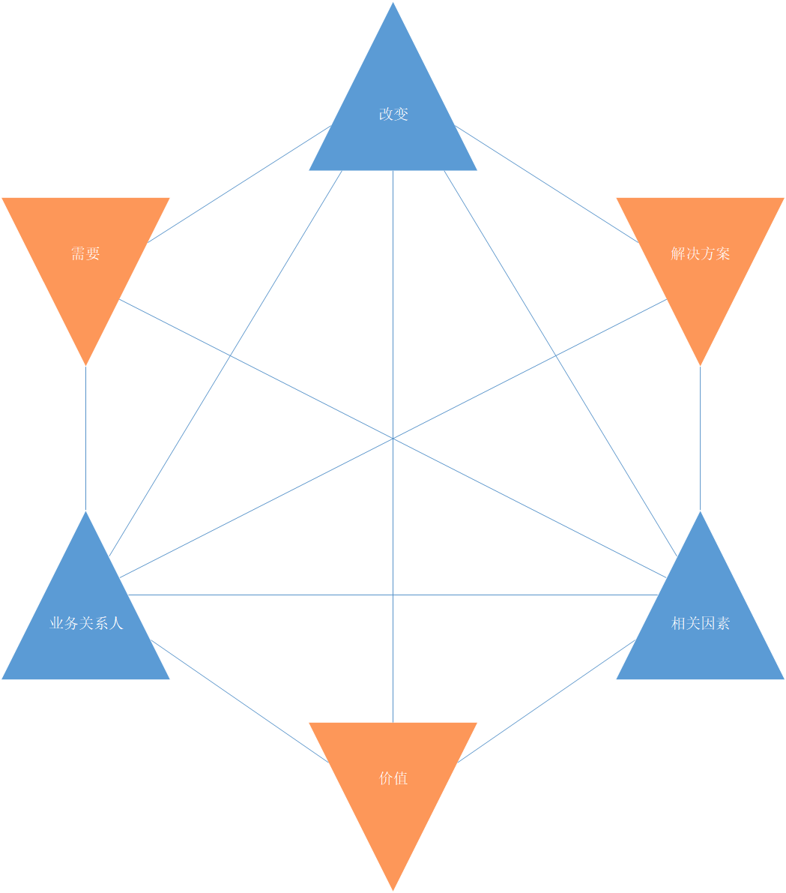
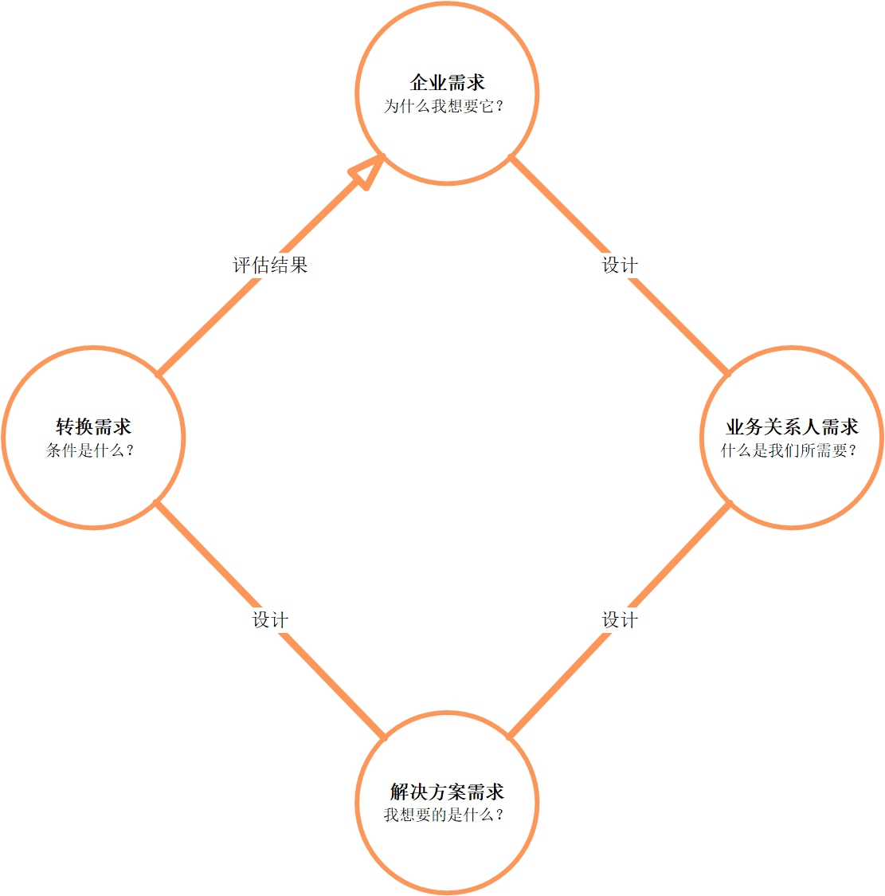

# 商业分析核心概念

商业分析核心概念章节包含的信息为BABOK®指南中的所有其他内容、概念和想法提供了基础。它为商业分析师提供了理解和在日常业务分析实践中使用BABOK®指南所需的中心思想的基本理解。

本章节由以下概念构成：
* 商业分析核心概念模型™(BACCM™):定义了商业分析专业的概念框架。
* 关键术语:提供基本概念的定义，因为它们对BABOK®指南的重要性而被突出。
* 需求分类模式：识别需求的级别或类型，以帮助商业分析师和其他涉众对需求进行分类。
* 业务关系人：定义参与变更中的商业分析活动或受其影响的组及个人的角色和特征。
* 需求和设计:描述与商业分析相关的需求和设计的重要性之间的区别。

## 2.1 商业分析核心概念模型™

商业分析核心概念模型™(BACCM™)是一个商业分析的概念框架。它包含了什么是商业分析。以及在不考虑视角、行业、方法或组织中的级别时，它对那些执行商业分析任务的人意味着什么。商业分析核心概念模型™(BACCM™)由六个对所有商业分析师来说都有相同的含义的术语组成，通过这些有相同含义的术语有助于讨论商业分析行为及术语见的关系。每个术语都被认为是一个核心概念。

BACCM的六个核心概念是：改变、需要（Needs）、上下文、解决方案、业务关系人、价值。每个核心概念都是商业分析时间的基础，所有的核心概念都是平等和必要的。每个核心概念都是由其他五个核心概念定义的，只有理解了所有概念才能完全理解其中某一个概念。没有任何一个概念比其它概念更重要或更有意义，这些概念有助于理解在商业分析任务中获取、分析或管理的信息类型。

BACCM可以在以下情况中使用：
* 描述商业分析的专业和领域，
* 使用一般术语沟通商业分析，
* 评估商业分析中核心概念间的关系，
* 通过全面评估六个概念之间的关系以更好的进行商业分析，
* 评估这些概念和关系在工作过程中的任意节点的影响，以便建立基础找到前进的道路。

> 表格 2.1.1 ：商业分析核心概念模型
> | 核心概念 | 描述 |
> |-------|-------|
> |改变|为了满足某种需要而进行的转变行为。改变有助于提高企业的绩效。这些提高是经过深思熟虑并通过商业分析活动加以控制的。|
> |需要|需要解决的问题或机会。需要可以通过激励业务关系人采取行动来引起变化。变更还可以通过削弱或增强现有解决方案交付的价值来引起需要。|
> |解决方案|满足一种或多种需要的特定方式。解决方案通过解决业务关系人所面料的问题，或者使其能够利用机会满足需要。|
> |业务关系人|与改变、需要或者解决方案相关的团体或个人。业务关系人通常根据感兴趣的环节、影响的方向和对改变的影响来定义。业务关系人根据需要、改变和解决方案进行分组。|
> |价值|在上下文中某物对于业务关系人的价值、重要性或者有用性。价值可以看做是潜在的或者现实的回报、收益和改进。它也可能是对损失、风险程度和支出的降低形式。价值可以是有形的或者无形的，有形价值是可以直接衡量的。有形价值通常有一个重要的货币成分。无形价值是间接测量的。无形价值通常具有重要的激励成分，如公司的声誉或员工士气。在某些情况中，价值是可以绝对的评估的，但是在许多情况中只能进行相对评估：从给定涉众的角度来看，一个解决方案比另一个更有价值。|
> |上下文|上下文影响或者被改变所影响，同时提供对改变的理解。改变发生在上下文中。上下文是环境中任何与改变相关的事情。上下文可能包含态度、行为、信仰、竞争对手、文化、人口统计、目标、政府、基础设施、语言、损失、流程、产品、项目、销售、季节、术语、技术、天气，以及满足定义的任何其他元素。|

 商业分析师可以适用核心概念来考虑所完成工作的质量和完整性。在每个知识领域描述中都有一些例子，说明如何在知识领域的任务中使用或应用核心概念。在计划或执行一项任务或技术的时候，商业分析师可以通过以下问题来考虑如何处理每个核心概念：
 * 我们正在做什么样的改变？
 * 我们试图满足什么需要？
 * 我们正在创造或改变的解决方案是什么？
 * 涉及的业务关系人有哪些？
 * 业务关系人认为什么是最有价值的？
 * 我们和解决方案所处的环境是什么？

如果有核心概念产生了变化，它会导致我们重新评估这些核心概念及他们交付的价值的关系。

> 图片 2.1.1 商业分析核心概念模型
> 

## 2.2 关键术语

**商业分析**

BABOK®指南描述和定义了商业分析行为，将其定义为企业中应用改变的实例。商业分析通过定义需要和推荐解决方案为业务关系人传递价值。

**商业分析信息**

商业分析信息指的是商业分析师分析、转换和报告的广泛而多样的信息集。它是商业分析工作中输入或输出的任何类型的信息（包含所有级别的细节）。商业分析信息的例子有：引出结果、需求、设计、方案选项、解决方案范围和策略变更。

在商业分析的活动中，无论对于“需求”还是“信息”，拓展许多的对象是必不可少的，这可以确保商业分析的所有输入和输出都符合BABOK指南中的描述任务和活动。

**设计**

设计是解决方案的一种有效的表现形式。设计的重点是理解如何通过一个解决方案实现价值。表现出来的内容可能是一份文档（或者一些文档），具体可以根据情况有很大的不同。

**企业**

企业是一个或多个组织构成的系统，他们所用的解决方案都是为了追求一个共同的目标。这些解决方案（也成为组织能力）可以是过程、工具或信息。为了进行商业分析，可以根据改变修改企业边界的定义，不必收法律规定的实体、组织或组织中的单位所限制。一个企业可以包含任何数量的公司、政府或者其他类型的组织。

**计划**

需求是要的一种可用表示。需求关注于理解如果需求被满足了，可以交付什么样的价值。
表示的形式可能是一个文档(或一组文档)，但根据情况可能有很大的不同。

**风险**

风险是对改变的机制、解决方案或企业的不确定性的影响。商业分析师通过与业务关系人的协作以识别、评估和区分风险的优先级，并通过改变导致不确定性的条件或事项的可能性来处理这些风险：减轻后果，消除风险来源，通过决定不开始或继续导致风险的活动来完全避免风险，与其他各方分担风险，或者接受甚至增加风险来处理一个机会。

## 2.3 需求分类模式

对于BABOK®指南，以下分类模式描述了需求：
* **企业需求**：对目标、目的和结果的陈述，描述了为什么要开始做一项改变。它们可以应用于整个企业、业务领域或特定计划。
* **业务关系人需求**：描述了为了实现业务需求而必须满足的业务关系人的需求。它们可以为业务和解决方案之间的桥梁。
* **解决方案需求**：描述了满足业务关系人需求的解决方案的功能和质量。它们提供了更细级别的需求，以支持解决方案的开发和实现。解决方案需求可以分为两个子类：
  * **功能要求**：描述了一个解决方案的功能所必须要管理的行为和信息，
  * **非功能性需求或服务质量要求**：解决方案不直接和功能行为相关，而是描述解决方案所必须保持的影响和质量的条件。
* **转换需求**：描述为了满足从当前状况到未来状况的转换，一个解决方案所必须的能力，以及解决方案所必须要满足的条件。一旦完成，需求就不再需要了。它们与其他的需求类型不同，它们具有临时性。转换需求涉及数据转换、培训和业务连续性等主题。

## 2.4 业务关系人

每个任务都包含可能参与该任务执行或受其影响的业务关系人列表。业务关系人是商业分析师直接或间接沟通的个人或群组。BABOK®指南没有强制给定任何业务关系人必须要做的事情。任何涉众都可能是需求、假设或约束的来源。

此列表并不是所有可能的业务关系人的详尽列表。下面的定义中列出了适合这些业务关系人的一些通用角色的例子。在大多数情况下，在每个类别中会发现多个涉众角色。同样，一个人可以担任多个角色。

就BABOK®指南而言，业务关系人的一般名单包括以下角色:
* 商业分析师
* 消费者
* 领域主题专家（SME：主题专家）
* 终端用户
* 执行领域专家（SME：主题专家）
* 运营支持
* 项目经理
* 监管者
* 赞助人
* 供应商
* 测试

### 2.4.1 商业分析师

商业分析师本身在商业分析活动中属于固有的业务关系人。BABOK®指南假定商业分析师需要对这些活动的执行负责。在某些情况下，商业分析师还可能为另一个业务关系人角色的活动执行负责。

### 2.4.2 消费者

消费者使用或者可能使用企业提供的产品或服务，并可能有企业有义务满足的合同或道德权力。

### 2.4.3 领域主题专家（SME：主题专家）

领域主题专家是指对与业务需求或解决方案范围相关的主题具有深入知识的任何个人。这个角色通常由终端用户或对解决方案有深入了解的人担任，如经理、流程所有者、法律人员、顾问和其他人。

### 2.4.4 终端用户

终端用户是直接与解决方案交互的业务关系人。终端用户业务流程中所有的参与者，或者使用产品或解决方案的人。

### 2.4.5 执行领域专家（SME：主题专家）

执行领域专家是拥有一个或多个部分的解决方案的专业领域知识的任何业务关系人。

虽然不可能定义出一个适合所有方案的执行领域专家的列表，一些最常见的角色有：项目管理员、变更管理员、配置管理员、解决方案架构师、开发人员、数据库管理员、信息架构师、可用性分析师、培训师和组织变更顾问。

### 2.4.6 运营支持

运营支持负责系统或产品的日常管理和维护。

虽然不可能定义出一个适合所有方案的运营支持的列表，一些最常见的角色有：操作分析师、产品分析师、帮助台和发布经理。

### 2.4.7 项目经理

项目经理负责管理交付满足业务需求的解决方案所需的工作，并确保满足项目目标，同时平衡项目因素，包括范围、预算、进度、资源、质量和风险。

虽然不可能定义出一个适合所有方案的项目经理的列表，一些最常见的角色有：项目领导，技术领导，产品经理和团队领导。

### 2.4.8 监管者

监管者负责标准的定义和执行。标准可以由监管者通过立法、公司治理标准、审计标准或组织能力中心定义的标准强加到解决方案上。替代角色是政府、监管机构和审计师。

### 2.4.9 赞助者

赞助者负责定义开始时业务需求的工作，并为业务需求开发解决方案。他们授权需要执行的工作，并控制计划的预算和范围。替代角色是执行人员和项目发起人。

### 2.4.10 供应商

供应商是给定组织或组织单元边界之外的业务关系人。供应商为组织提供产品或服务，他们有可能有合同或道德上的权利和义务，必须要考虑他们的关系。替代角色是提供者、供应商和顾问。

### 2.4.11 测试

测试人员负责确定如何验证解决方案满足商业分析师所定义的需求，以及执行验证过程。测试人员还寻求如何确保解决方案的可用性的质量标准，使缺陷或失败的风险被理解并最小化。另一个角色是质量保证分析师。

## 2.5 需求及设计

提取、分析、确认和管理需求一直被认为是商业分析的关键活动。然而，重要的是我们需要认识到商业分析师在某些层级上也需要负责设计的定义。设计的负责层级根据商业分析师的视角而变化。

需求聚焦于需要；设计聚焦于解决方案。需求和设计质检的区别并不是完全清晰的。采用相同的技术来引出、建模和分析这两者。需求导致设计，而设计反过来又可能推动更多需求的发现和分析。焦点的转移往往是微妙的。

对需求和设计的分类可能会随着商业分析师的工作进展而变得不那么重要，因为它们对于需要由了更深入的理解并最终满足了需要。BABOK®指南中的任务，如需求跟踪（第79页）或规格和模型的需求（第136页）可能值得是需求，但其包含设计的意图。

商业分析是复杂的也是递归的。一个需求（或者一组需求）可能用以定义一个设计。这个设计可能用来引出额外的需求，而这些额外的需求又被用以定义设计的细节。商业分析师可能会将需求与设计传递给其他业务关系人，这些业务关系人可能会对设计进行更详细的进一步说明。无论是商业分析师或者其他角色完成设计，商业分析师都会进行最终设计的检查，以确保这些设计与需求保持一致。

下表提供了一些基本的示例，说明如何将信息视为需求或设计。

> 表格 2.5.1：需求和设计
> | 需求 | 设计 |
> | --- | --- |
> |在一个视图中查看跨多个组织单元的六个月销售数据。|一个仪表盘的草图。|
> |减少挑选和包装客户订单所需的时间。|业务流程模型。|
> |记录并访问一个病人的历史。|屏幕实体模型展示特定数据字段。|
> |为新业务制定业务策略、目标和目标。|业务能力模型。|
> |提供英语和法语的信息。|原型用英语和法语展示文本。|

业务关系人可能提出一种需要或者提出一个解决方案来假定需要。商业分析师使用启发性和协作(第53页)中的活动，需求分析和设计定义(第133页)，以及解决方案评估(第163页)将该请求转换为需求或设计。无论业务关系人关注的是什么，商业分析师角色的重要性在于不断地问“为什么？”。例如，“为什么需求或设计是为企业提供价值和促进企业目标和目标的实现所必需的?”

> 图片 2.5.1：需求与设计循环
> 