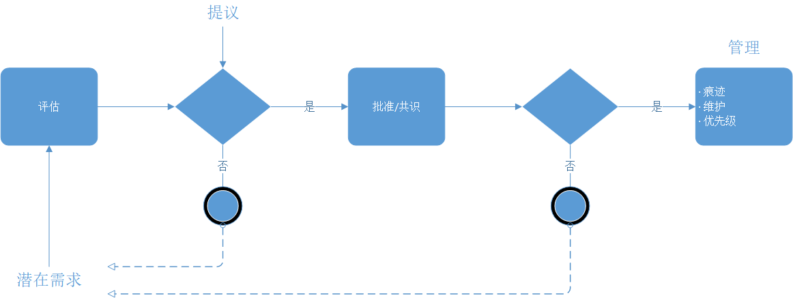
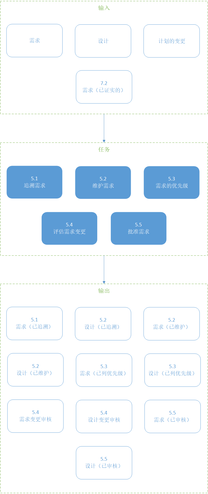
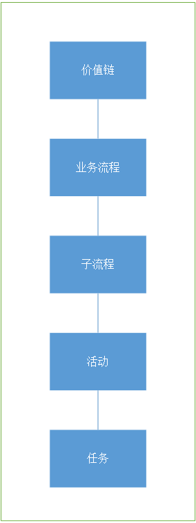
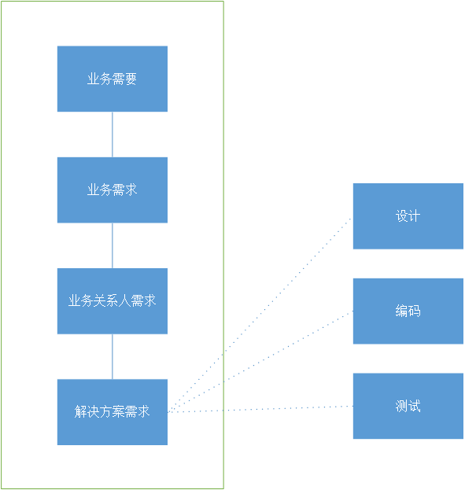
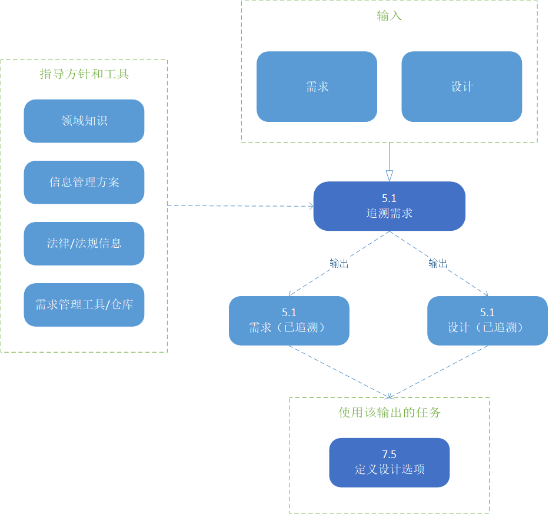
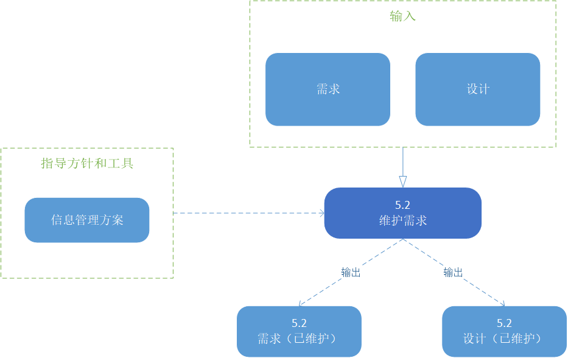
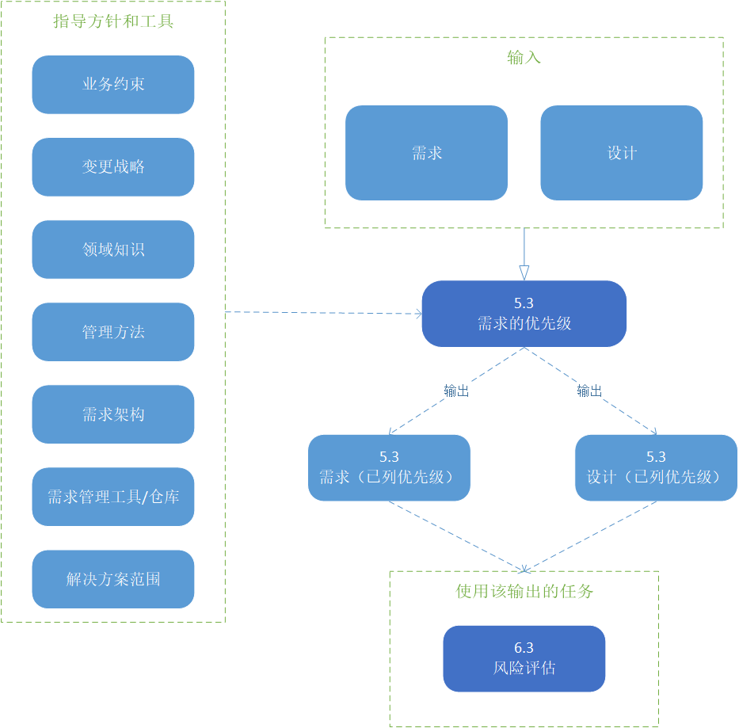
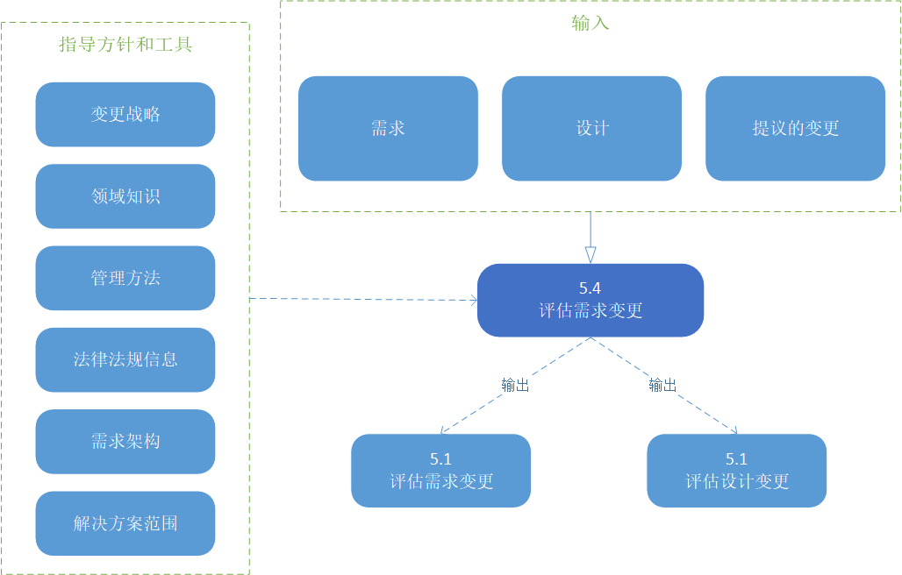
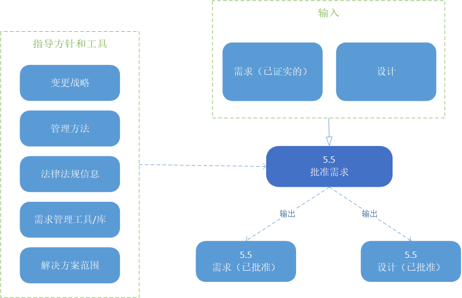

# 需求生命周期管理

需求生命周期管理知识领域描述了商业分析师从开始到结束为了管理和维护需求和设计信息而执行的任务。这些任务描述了在相关需求和设计质检简历有意义的关系，在提出吧变更时评估对需求和设计的变更，分析和获得变更的一致意见。

需求生命周期的管理的目的是确保商业、业务关系人和解决方案的需求和设计彼此一致，并确保解决方案实现他们。它涉及到对需求以及需求如何在实际解决方案中的构造和交付被实现的控制。它同样帮助确保商业分析信息可以在未来的使用中依然可用。

需求生命周期：

* 从将业务的需要表示为需求开始。
* 在解决方案的开发中持续。
* 当解决方案和代表它的需求被撤销时，结束。

对需求的管理不是解决方案实施后就停止的。在解决方案的整个生命周期中，当对需求进行合适的管理后，需求会持续提供价值。

在需求生命周期管理知识领域，生命周期的核心概念用于管理商业分析工作的方法或流程是分离的。生命周期指的是需求作为任何变更的一部分经过的各种阶段或状态的存在。需求可能在同一时间处于多个状态。

> 图片 5.0.1：需求生命周期管理
>  

需求声明周期管理知识领域包括以下任务：

* **追溯需求**：分析和维护需求，设计，解决方案部件和其他工作产出之间的关系，以进行影响分析，覆盖和分配。
* **维护需求**：确保需求和设计在整个生命周期中是准确和适时的，并在合适的地方促进复用。
* **需求的优先级**：评估与特定需求和设计相关的价值、紧迫性和风险，以确保在任何给定时间对最重要的需求和设计进行分析和/或交付工作。
* **评估需求变更**：评估新的和不断变化的业务关系人需求，以确定是否需要在变更的范围内对它们采取行动。
* **批准需求**：与参与管理流程的业务关系人合作，以达成对需求和设计的批准和协议。

# 需求生命周期管理核心概念模型

需求生命周期核管理核心概念模型（BACCM）描述了六大核心概念模型之间的关系。

下表描述了每个核心概念在需求生命周期管理上下文中的用法和应用。

> 表 5.0.1：需求生命周期管理的核心概念模型
> |核心概念|在需求生命周期管理，商业分析师……|
> |----|----|
> |**变更**：根据需要而转变的行为。|管理在新方案中如何对提出的需求和设计的变更进行评估。|
> |**需要**：需要解决的问题或机会。|跟踪、划分和维护需求，确保需要得到满足。|
> |**解决方案**：在上下文中满足一个或多个需要的特定的方式。|跟踪解决方案组件的需求和设计，以确保解决方案满足需求。|
> |**业务关系人**：和变更、需要或者解决方案有关系的组或者个人。|
> |**价值**：在上下文中对业务关系人的价值，重要的，有用的一些内容。|
> |**上下文**：影响或被影响的环境，并提供对变化的理解。|分析上下文以支持跟踪和优先排序活动。|

> 图片 5.0.2：需求生命周期管理输入/输出图解
>  

## 5.1 追溯需求

### 5.1.1 目的

追溯需求的目的是确保需求和设计在不同的层次上的需求和设计彼此一致，并管理对相关需求的一个层次造成的变更的影响。

### 5.1.2 描述

需求的可追述性识别并记录每个需求的沿袭，包括它向后的可追溯性，它向前的可追溯性，以及它和其他需求的关系。可追溯性用来帮助确保解决方案符合需求，并在范围、变更、风险、时间、成本和沟通管理方面提供帮助。它还用以鉴别缺少的功能，或识别是否有没有任何需求支持的已存在已实现功能。

可追溯性应用：

* 更快和更简单的影响分析。
* 更可靠地发现需求中的不一致和缺口。
* 对于变化的范围和复杂性有更深刻的见解。
* 对哪些需求已经被解决，哪些还没被解决的可靠评估。

兔哥不考虑需要和解决方案质检存在的关系，往往很难准确的需要和解决方案。尽管追溯性是有价值的，但是商业分析师要平衡关系数量和他们带来的好处。可追溯性还通过从提供需求到表达需要的线性视角来支持需求分配和发布计划。

下图展示了对过程和软件需求的可跟踪性的可视化表达示例。

> 图片 5.1.1：流程可追溯性
>  

> 图片 5.1.2：软件需求可追溯性
>  

### 5.1.3 输入

* **需求**：可以追溯到其他需求（包括目标，对象，业务需求，业务关系人需求，解决方案需求，以及转换需求），解决方案组件，可视化，业务规则，和其他工作产出。
* **设计**：可以追溯到其他需求，解决方案组件和其他工作产出。

> 图片 5.1.3：需求追溯输入/输出图解
> 

### 5.1.4 元素

#### .1 正式等级

当追溯需求时，商业分析师考虑每个链接应该交付的价值，以及正在创建的特定关系的性质和使用。

当需求的数量或正式化等级增加时，跟踪需求的工作显著增加。

#### .2 关系

在定义可追溯性方法时，商业分析师需要考虑以下几种关系：

* **来源**：当使用的需求来源于另一个需求时，两个需求之间的关系。这种类型的关系适合于链接不同抽象层级上的需求。例如，一个来源于业务或者业务关系人的解决方案需求。
* **依赖**：两个需求的关系，当一个需求依赖于另一个需求时使用。依赖关系的类型包括：
  * **必要**：只有当相关的需求也实现的情况下，实现特定需求才有意义。
  * **努力**：当一个需求实现时，另一个相关的需求更容易实现。
* **满足**：实现元素和它所满足的需求之间的关系。例如：功能需求和实现它的解决方案组件之间的关系。

#### .3 可追溯性仓库

需求的可追溯性根据商业分析方法确定的方法记录和维护。需求管理工具可以提供显著的好处，当需要跟踪大量需求时，这往往可能被认为无法用手工方法处理。

### 5.1.5 指导和工具

* **领域知识**：支持可跟踪性所需的商业领域的知识和专业知识。
* **信息管理方法**：提供与追溯方法有关的计划活动的决策。
* **法律/法规信息**：描述必须遵守的法律规则或规章。当定义追踪规则时需要考虑。
* **需求管理工具/仓库**：用于存储和管理商业分析信息。工具可能和文本文档一样简单或者和专用需求管理工具一样复杂。

### 5.1.6 技术

* **业务规则分析**：用于跟踪业务规则到它们支持的需求或支持需求的规则。
* **功能分解**：用于将解决方案范围分解为更小的组件进行分配，以及从高级概念到低级概念的跟进。
* **流程模型**：通过可视化显示未来状态流程，以及跟进未来状态流程的需求。
* **范围模型**：用于可视化描述范围，以及跟进需求到需求所支持的范围。

### 5.1.7 业务关系人

* **客户**：收到需求实现的方式和时间影响，并且可能需要咨询或同意可溯源的关系。
* **领域主题专家**：可能有一系列的关于从解决方案组件到发布连接上的需求的建议。
* **终端用户**：可能需要特定的以来关系，允许某些欲求在同一时间或者以特定的顺序实现。
* **实施主题专家**：可追溯性确保正在开发的解决方案满足业务需求，以及在实施中了解解决方案组件之间的依赖关系。
* **操作支持**：可追溯性文档提供了另一个参考的资源以帮助技术支持。
* **主办者**：需要批准各种关系。
* **供应商**：受到需求实现的方式和时间影响。
* **测试者**：当创建测试计划和测试用例的时候，需要理解需求如何和在哪实现的，并且可以跟踪测试用例到需求。

### 5.1.8 输出

* **需求（已追溯）**：在解决范围内与其它需求、解决方案组建或发布、阶段或迭代有清楚确定的关系，这样，变化的覆盖范围和影响就可以清楚地识别出来。
* **设计（已追溯）**：在解决方案范围内，与其他需求、解决方案组件、或发布、阶段或迭代的明确定义的关系，这样覆盖范围和变更的影响就可以清楚地识别出来。

## 5.2 维护需求

### 5.2.1 目的

维护需求的目的是在整个需求生命周期变化过程中保持需求准确性和一致性，并支持在其他解决方案中可以复用需求。

### 5.2.2 描述

表示持续的需要的一个需求必须维护以确保它随着时间依然保持有效。

为了维护和复用需求的好处最大化，需求应该是：

* 一致的描述。
* 使用定义适当访问权限的标准流程进行维护的复盘和审核，并确保质量。
* 易于进入和可理解的。

### 5.2.3 输入

* **需求**：包括目标，对象，业务需求，业务关系人需求，解决方案需求，以及转变需求。这些应该在他们的生命周期中被维护。
* **设计**：可以根据需要在整个生命周期中进行维护。

> 图片 5.2.1：维护需求输入/输出图解
> 

### 5.2.4 元素

#### .1 维护需求

维护需求以便在变更批准后需求可以保持正确和流通。商业分析师为执行维护负责，以确保保持这种准确程度。为了能正确的维护需求，需求必须清晰的命名和定义，并且容易被业务关系人使用。

商业分析师也需要维护需求、需求集合和相关的商业分析信息的关系，以确保上下文和需求的原始意图得到保留。具有公认分类方法的储存库有助于建立和维护被维护的需求之间的联系，并且促进需求和设计的可追溯性。

#### .2 维护属性

在引出需求时，商业分析师需要引出需求属性。诸如需求的来源、优先级和复杂性等信息，有助于在整个生命周期中管理每个需求。当商业分析师发现更多的信息并组织进一步的分析时，一些属性会发生变化。即使需求没有改变，属性也可能发生改变。

#### .3 复用需求

在某些情况下，需求可以被复用。

对组织中长期使用的候选需求进行标识，明确命名，定义，并以一种其他业务关系人易于复用的方式进行存储。根据抽象程度和被处理的预期需要，需求可以被复用：

* 在当前方案中。
* 在相似的方案中。
* 在相似的部门中。
* 在整个组织中。

高层次的抽象需求可能在有限的参考特定解决方案的情况下编写。以一般方式表示的需求，与特定的工具或组织结构没有直接的联系，往往更易于复用。这些需求同样在变更时受到版本的更少的影响。随着需求表达的越来越详细，它们与特定解决方案或解决方案选项的关联也变得越来越紧密。对应用程序或部门的特定引用，限制了需求和设计在组织中的复用。

用于复用的需求，反映了组织的当前状态。业务关系人可以在他们接受变更之前确认提出的需求。

### 5.2.5 指导和工具

* **信息管理方法**：表明需求如何为复用而管理。

### 5.2.6 技术

* **业务规则分析**：用于确认可能在整个企业中相似的业务规则，以促进复用。
* **数据流程图**：用于确认可能在整个企业中相似的业务规则，以促进复用。
* **数据模型**：用于定义可能在整个企业中相似的数据结构，以促进复用。
* **文档分析**：用于分析企业中存在的文档，这些可以作为维护和复用需求提供基础。
* **功能拆解**：用于识别与组件相关的、可复用的需求。
* **流程模型**：用于识别与可复用的流程相关的需求。
* **用例和场景**：用于识别可能被多个解决方案使用的解决方案组件。
* **用户故事**：用于识别与故事相关的可复用的需求。

### 5.2.7 业务关系人

* **领域主题专家**：定期维护需求的参考资料，以确保它们准确反映所述需求。
* **实施主题专家**：在为了开发回归测试和进行增强影响分析时利用维护的需求。
* **运营支持**：维护很可能被引用的需求，以确认当前状态。
* **监管者**：维护很可能被引用的需求，以确认符合标准。
* **测试者**：维护很可能被测试者使用的需求，以帮助测试计划和测试用例的创建。

### 5.2.8 输出

* **需求（已维护）**：定义组织一次或长期可用的需求。他们可能变成组织的过程资产或在未来的计划中使用。在某些情况下，未被批准或已实现的需求可能被维护成可能的未来计划。
* **设计（已维护）**：一旦定义可能被复用。例如，作为一个自包含组件，可以供未来使用。

## 5.3 需求的优先级

### 5.3.1 目的

管理需求的优先级的目的是为了通过需求相关的重要性排列需求。

### 5.3.2 描述

优先排序是对需求进行排序的行为，以确定它们对业务关系人的相对重要性。当需求被确定优先级时，它会被给到更多或更少的优先权。优先权可以参考需求的相对价值，或者以它将被实现的顺序。优先级排序是一项持续进行的流程，当上下文发送改变时，优先级也会改变。

需求之间的内部相互以来关系，可以作为优先级划分的基础。确定优先级是一项关键工作，它寻求确保实现的最大价值。

### 5.3.3 输入

* **需求**：任何格式的需求包括文本，矩阵，或者图表都可以进行优先排序。
* **设计**：任何格式的设计包括文本，矩阵，或者图表都可以进行优先排序。

> 图片 5.3.1：需求的优先级输入/输出图解
> 

### 5.3.4 元素

#### .1 优先排序的基础

按照商业分析计划和监控只是领域中定义的相关业务关系人对需求进行优先级排序的基础达成一致。

影响优先级的一般因素包括：

* **利益**：作为需求实现的目标，业务关系人获得的优势，与变更的目标和对象做比较。所提供的优势可以指的是：特定的功能、所需的质量、战略目标或业务目标。如果存在多种业务关系人，每个组可能收到的收益会不同。可以通过冲突解决和谈判来达成对整体利益的共识。
* **处罚**：由于没有实现给定的需求而导致的结果。包括对需求进行优先排序，以满足影响于组织的法规或正常需求，这些需求可能优先于其他业务关系人的利益。处罚也可以指没有实现改善用户体验要求而带来的负面后果。
* **成本**：执行需求所需要的精力和资源。成本的信息，一般来自于实施团队或供应商。在了解成本后，客户可能会改变需求的优先级。成本通常和其他标准一起使用，例如成本收益分析。
* **风险**：需求无法传递潜在的价值或者根本不能被满足的可能性。这可能包含许多因素，例如实现一个需求的难度、业务关系人不接受一个解决方案组件的可能性。如果存在一个解决方案有无法在技术上实现的风险，这个最难以实现的需求可能排在列表的最优先级别，以便在了解到可能的解决方案无法被交付之前，最小化消耗的资源。一个概念的验证，可能为高风险选择的存在是可能的进行建立。
* **依赖性**：需求之间的关系，一个需求不能够被满足除非另一个需求得到满足。在某些情况下，可能会通过同时完成相关需求来达成效果。依赖关系也可能发生在方案外部，包括但不限于其他队伍的决定，资金承诺和资源可用性。以来关系的识别是追溯需求任务的一部分。
* **时间敏感性**：需求的“最佳之前”日期，之后需求将失去重要价值。这包括上市时间场景，这种场景中，如果功能在有竞争之前交付，所获得的收益将成倍增加。
* **稳定性**：需求发生变化的可能性，因为它需要进一步的分析，或者因为业务关系人没有对需求达成一致意见。如果需求不稳定，它可能有一个较低的优先级，以最小化未预期的返工和浪费的努力。
* **管理或政策的合规**：为了满足强加于组织的法规或政策要求而必须实现的需求，这些需求可能优先于其他业务关系人的利益。

#### .2 优先级的挑战

优先级是一个关于价值的评价。每个业务关系人评价某些东西的价值都会不同。当这个情况发生时，业务关系人之间可能会发生冲突。业务关系人也可能难以将任何的需求描述为较低的优先级，这可能会影响做出必要权衡的能力。另外，业务关系人可能（有意或无意）地表明优先级，以达到其预期的结果。

不同类型的需求可能不会以相同的方式响应标准，并且可能出现冲突。业务关系人可能需要在优先级的划分中进行权衡。

#### .3 持续的优先级

优先级可能随着上下文的演变和更多信息变的有用而改变。最初，优先级是在更高的抽象级别上完成的。随着需求进一步的细化，优先级将在更细的层次上完成，并为优先级加入额外的基础以便他们变的更合适。在变更的不同阶段，优先级的基础可能是不同的。例如，业务关系人在最开始会基于利益进行优先排序。实现团队会根据技术限制而必须事先的顺序来重新划分需求优先级。一单实现团队提供了每个需求的成本，业务关系人可能会再一次的修订优先级。

### 5.3.5 指导和工具

* **业务限制**：法规、合同义务和业务政策可能定义优先级。
* **变更策略**：提供成本，时间线和价值体现的信息，这些信息用于确定需求的优先级。
* **领域知识**：用以支持优先级的业务领域的知识和经验。
* **管理方法**：概述了对需求进行优先级排序的方法。
* **需求结构**：用于理解与其他需求和工作产出的关系。
* **需求管理工具/仓库**：包括用于优先级划分的需求属性可以帮助商业分析师按优先级对需求进行排序和访问。
* **解决方案范围**：在确定需求优先级时考虑以去报范围得到管理。

### 5.3.6 技术

* **待办事项管理**：用于需要比较优先级排序的需求。当优先级是已维护的，待办事项可以被定位。
* **商业实例**：用于根据确定的业务目标和对象评估需求以确定重要性。
* **决策分析**：用于确定高价值的需求。
* **估算**：用于产出优先级基础的估算。
* **财务分析**：用于评估一组需求的财务价值，以及交付时间如何影响该价值。
* **访谈**：用于了解单个或者一小群业务关系人的优先级或优先级的基础。
* **项目跟踪**：用于业务关系人跟踪在制定优先级中抛出的问题。
* **优先排序**：用于促进优先排序的过程。
* **风险分析和管理**：用于了解风险，以确定优先级。
* **研讨会**：用于了解在促进小组环境中业务关系人的优先级或优先级基础。

### 5.3.7 业务关系人

* **客户**：验证按优先级交付的需求将为客户或终端用户交付的价值。客户还可以根据相对价值进行协商以改变优先级。
* **终端用户**：验证按优先级交付的需求将为客户或终端用户交付的价值。
* **实施主题专家**：提供与技术依赖相关的输入，并可以根据技术约束进行协商以更改优先级。
* **项目经理**：将优先级作为项目计划和发布需求分配的输入。
* **监管者**：可以验证优先次序是否符合通过法律和监管限制。
* **主办者**：验证在组织的角度需求的优先级传递的价值。

### 5.3.8 输出

* **需求（已列优先级）**：优先级或排序的需求可用于额外的工作，并确保价值最高的需求首先得到处理。
* **设计（已列优先级）**：优先级或排序的设计可用于额外的工作，并确保价值最高的设计首先得到处理。

## 5.4 评估需求变更

### 5.4.1 目的

评估修变更的目的是为了评估提议的变更对需求和设计的影响。

### 5.4.2 描述

在确定新需要或可能的解决方案时，执行评估需求变更。这些可能与变更策略和/或解决方案的范围一致，也可能不一致。无论计划的变更会否增加解决方案的价值，都必须对变更进行评估，如果是，应该采取什么行动。

商业分析师评估变更对解决方案价值潜在的影响，以及所建议的更改是否会与其他需求产生冲突或增加风险级别。商业分析师还需要确保每个提议的变更都可以追溯到需要。

当评估变更时，商业分析师考虑是否每个提  议的变更：

* 和全局的战略符合。
* 影响交付给企业或业务关系人群体的价值。
* 影响交付时间或交付价值所需的资源。
* 改变与整个计划相关的任何风险、机会或约束。

评估的结果必须要支持决策的制定，和商业分析管理规划定义的变更控制方法。

### 5.4.3 输入

* **提出的变更**：可以在任何时候识别影响到商业分析工作的任何方面或到目前为止已完成的交付。提议的变更有许多触发因素，包括商业策略变更、业务关系人、法律需求或法规变更。
* **需求**：可能需要进行评估，以确定拟议修改的影响。
* **设计**：可能需要进行评估，以确定拟议修改的影响。

> 图片 5.4.1：评估需求变更输入/输出图解
> 

### 5.4.4 元素

#### .1 评估手续

商业分析师将会基于信息可用性决定评估过程的手续，变更的显著重要性，和管理过程。在需要正式批准之前，许多提议的变更可能会被撤销或拒绝。预测方法可能为提出的变更进行更正式的评估。在预测方法中，每个变更的影响可能是破坏性的；变更在完成先前的工作后，会潜在的产生大量任务与活动的重复工作。适应性方法在评估提出的变更时可能需要更少的正式性。尽管每个变更的结果都可能需要重复工作，适应性方法试图通过利用迭代和增量实施技术最小化变更的影响。这种持续进化的理念可能会减少正式影响评估的需要。

#### .2 影响分析

执行影响分析是为了评估变更的效果。可跟踪性是执行影响分析的有用工具。档一个需求发生变更，与之相关的其他需求或解决方案组件需要评估。每个相关需求或组建可能也需要改变以支持新需求。

当考虑到对现有需求的变更和添加时，商业分析师通过考虑以下因素评估提出的变更造成的影响：

* **利益**：接受变更能获得的利益。
* **成本**：实现变更的总成本，包括进行变更的成本、相关的返工成本，以及机会成本，如果变更被批准，可能需要牺牲或推迟的其他特性的数量。
* **影响**：如果接受更改，则受影响的客户或业务流程的数量。
* **计划**：如果变更被批准，对现有交付承诺的影响。
* **紧迫性**：重要程度包括驱动必要性的因素，如监管或安全问题。

#### .3 

根据计划的方法，各种业务关系人（包括商业分析师）可能被授权批准、拒绝或推迟所提议变更。所以变更分析产生的影响和解决方案都要记录下来，并与业务关系人沟通。如何在方案中做出决策和变更及其沟通，是由规划商业分析管理任务决定的。

### 5.4.5 指导和工具

* **变更战略**：描述变更的目的和方向，简历更改的环境，并确定更改的关键组建。
* **领域知识**：在业务领域的知识或专业技能可以用来评估提出的需求变更。
* **管理方式**：提供关于变更控制和决策过程的指导，以及该过程的业务关系人角色。
* **法律法规信息**：描述必须遵守的立法规则或条例。这些可能会影响需求，在进行更改时必须加以考虑。
* **需求结构**：需求可能是相互关联的，因此业务关系人需要检查和分析需求关系，以确定哪些需求会受到需求变更的影响。
* **解决方案范围**：在评估变更时必须考虑，以充分了解提出变更的影响。

### 5.4.6 技术

* **业务实例**：用来证明提议的改变是合理的。
* **业务规则分析**：用于评估业务策略和业务规则的更改，并制定修订后的指导。
* **决策分析**：用于促进变更评估过程。
* **文档分析**：用于分析任何有助于理解变更影响的现有文档。
* **估算**：用来确定变化的大小。
* **财务分析**：用来估计拟议变更的财务后果。
* **接口分析**：用于帮助商业分析师识别可能受变更影响的接口。
* **访谈**：用于从单个或者一小组业务关系人处获得对组织或其资产的影响的理解。
* **项目跟踪**：用于在影响分析中跟踪任何问题或冲突。
* **风险分析和管理**：用于确定与变更相关的风险级别。
* **研讨会**：用于了解或解决在组设置中的变更。

### 5.4.7 业务关系人

* **客户**：提供关于变更对价值的影响的反馈。
* **领域主题专家**：对情况的某些方面有专门知识，并能洞察变化将如何影响组织和价值。
* **终端用户**：使用解决方案或解决方案的一个组件，可以提供关于变更对其活动的影响的信息。
* **运营支持**：提供关于他们支持解决方案操作的能力和他们需要理解在解决方案中变更的性质，以便能够支持变更的信息。
* **项目经理**：审核需求变更，评估以确定是否需要额外的项目工作来成功实现方案。
* **监管者**：变更可能被监管者参考，以确认符合标准。
* **主办者**：对解决范围方案负责，并能在评估变更时提供可用的洞察力。
* **测试者**：为确定拟议更改的影响而进行咨询。

### 5.4.8 输出

* **需求变更评估**：批准、修改或拒绝对需求的拟议变更的建议。
* **设计变更评估**：批准、修改或拒绝对一个或多个设计组件的拟议更改的建议。

## 5.5 批准需求

### 5.5.1 目的

批准需求的目的是为了商业分析工作持续的需求和设计的批准上达成统一意见，和/或解决方案的施工能够进行。

### 5.5.2 描述

商业分析师负责确保需求、设计和其他商业分析信息与批准这些信息的关键业务关系人质检的清晰的沟通。

批准这些需求和设计可以是正式或非正式的。预测方法通常在阶段结束或在规划变更控制会议期间批准。适应性方法通常只在满足需求的解决方案构建和实施解决方案满足需求时开始批准。商业分析师和关键业务关系人一起工作，以便获得新和变更的需求，沟通讨论结果，并跟踪和管理审批。

### 5.5.3 输入

* **需求（已证实的）**：一组已被证实有足够的质量的需求，可被作为进一步规范和开发的可靠工作主体。
* **设计**：已确定可用于进一步规范和开发的一组设计。

> 图片 5.5.1：批准需求变更输入/输出图解
> 

### 5.5.4 元素

#### .1 理解业务关系人规则

审批流程由规划商业分析管理任务进行定义。定义审批流程部分是需要理解业务关系人角色和权限级别。商业分析师负责获得业务关系人的批准，并需要了解谁拥有决策责任，以及谁拥有在整个计划中签字的权力。商业分析师还需要考虑任何有影响力的业务关系人，他们需要被咨询或被告知需求。少数业务关系人可能有权批准或拒绝变更，但许多业务关系人可能能够影响这些决策。

#### .2 冲突和问题的管理

为了维护业务关系人对解决方案的支持，通常在请求需求批准之前寻求业务关系人之间的共识。

#### .3 得到统一意见

#### .4 跟踪和沟通审批

### 5.5.5 指导和工具

### 5.5.6 技术

### 5.5.7 业务关系人

### 5.5.8 输出