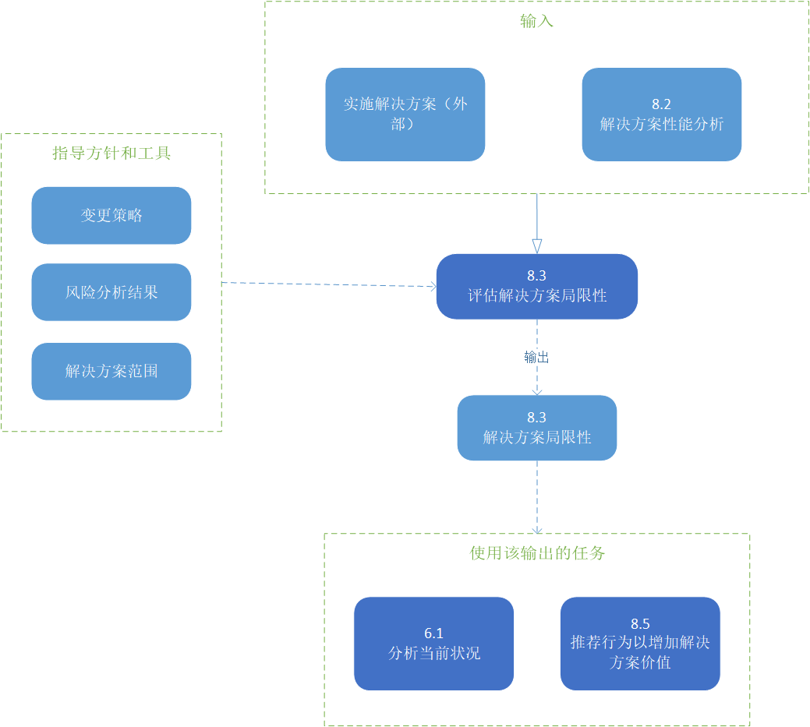
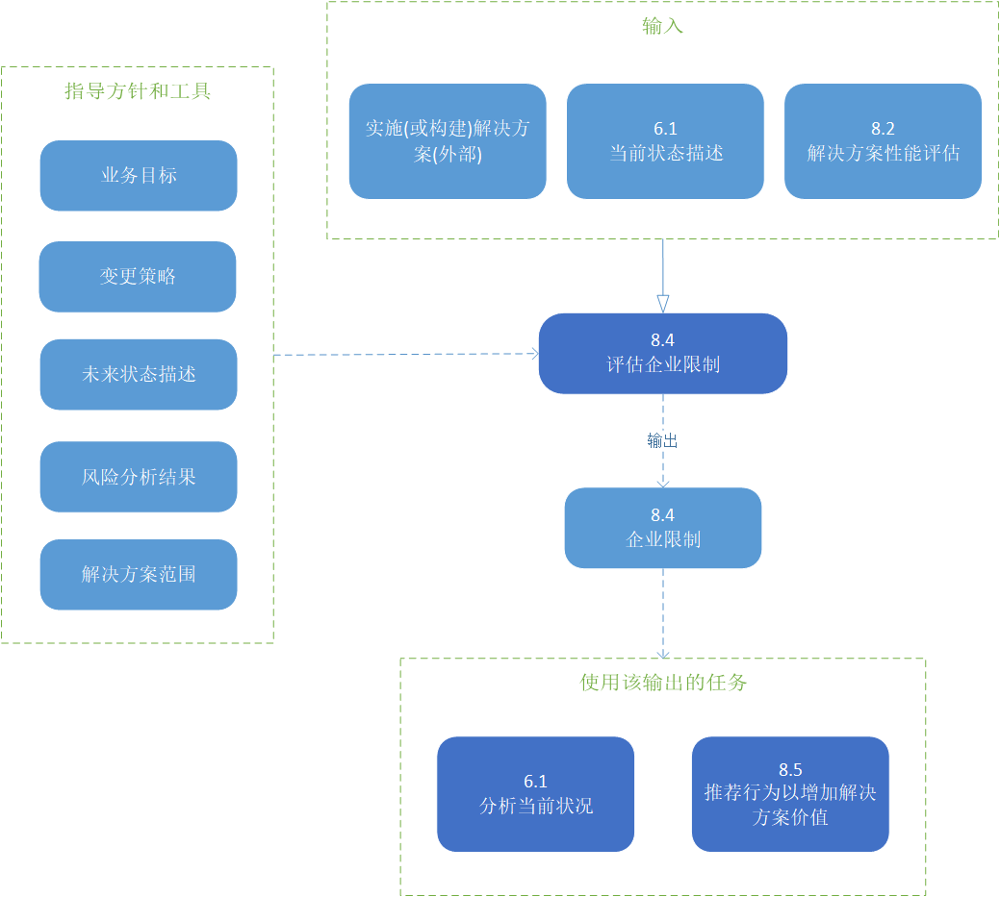
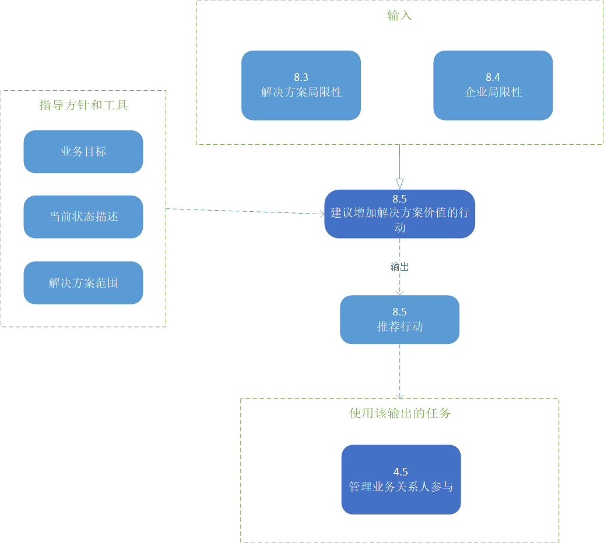

# 解决方案评估

解决方案评估知识领域描述了商业分析人员执行的任务，以评估企业使用的解决方案的性能和交付的价值，并建议消除阻碍充分实现价值的障碍或约束。

虽然在战略分析(第99页)或需求分析和设计定义(第133页)中执行的活动可能有一些相似之处，解决方案评估知识领域和其他知识领域之间的一个重要区别是实际解决方案的存在。它可能只是一个部分解决方案，但是解决方案或解决方案组件已经实现并以某种形式运行。支持利益实现的解决方案评估任务可能发生在启动更改之前，同时评估当前值，或者在实现解决方案之后。

解决方案评估任务可以在不同的开发阶段对解决方案组件执行：

* **原型或概念证明**：能够证明价值的可行但有限的解决方案版本。
* **试点或测试版本**：解决方案的有限实现或版本，用于解决问题，并在完全发布解决方案之前了解它实际交付的价值。
* **操作版本**：用于实现业务目标、执行过程或实现期望结果的部分或完整解决方案的完整版本。

解决方案评估描述分析交付的实际价值的任务，识别可能阻碍价值实现的限制，并提出提高解决方案价值的建议。它可以包括任何绩效评估、测试和实验的组合，也可以结合客观和主观的价值评估。解决方案评估通常关注于企业的一个组件，而不是整个企业。

下图展示了业务分析活动从交付潜在价值到实际价值的过程中的价值范围。

> 图片 8.0.1：商业分析价值层次
> 

解决方案评估知识领域包括以下任务：

* **测量解决方案性能**：确定评估解决方案性能的最合适的方法，包括它如何与企业目标和目标相一致，并执行评估。
* **分析性能度量**：检查关于解决方案性能的信息，以了解它交付给企业和涉众的价值，并确定它是否满足当前的业务需求。
* **评估解决方案限制**：调查解决方案范围内可能妨碍其满足当前业务需求的问题。
* **评估企业局限性**：调查解决方案范围之外的问题，这些问题可能阻碍企业实现解决方案能够提供的全部价值。
* **建议增加解决方案价值的行动**：识别和定义企业可以采取的行动，以增加解决方案可交付的价值。

# 解决方案评估的核心概念模型

业务分析核心概念模型™(BACCM™)描述了六个核心概念之间的关系。下表描述了解决方案评估上下文中每个核心概念的用法和应用。

> 表 8.0.1：解决方案评估的核心概念模型
> |核心概念|在解决方案评估期间，商业分析师…|
> |----|----|
> |**变更**：根据需要而转变的行为。|向解决方案或企业推荐变更，以实现解决方案的潜在价值。|
> |**需要**：需要解决的问题或机会。|评估解决方案或解决方案组件如何满足需求。|
> |**解决方案**：在特定环境中满足一种或多种需求的特定方法。|评估解决方案的性能，检查它是否交付了潜在的价值，并分析为什么价值可能无法由解决方案或解决方案组件实现。|
> |**业务关系人**：与变更、需要或解决方案有关系的团体或个人。|从业务关系人那里获取有关解决方案性能和价值交付的信息。|
> |**价值**：在一个环境中某物对业务关系人的价值、重要性或有用性。|确定解决方案是否交付了潜在的价值，并检查为什么没有实现这些价值。|
> |**上下文**：环境影响、被影响，并提供对变化的理解。|在确定解决方案性能度量时考虑上下文，以及上下文中可能禁止实现价值的任何限制。|

> 图片 8.0.2：解决方案评估输入/输出图解
> 

## 8.1 测量解决方案效果

### 8.1.1 目的

测量解决方案性能的目的是定义性能度量，并使用收集的数据来评估解决方案的有效性及其带来的价值。

### 8.1.2 描述

性能度量确定新部署或现有解决方案的价值。所使用的度量取决于解决方案本身、环境以及组织如何定义价值。当解决方案没有内置的性能度量时，商业分析师与业务关系人一起确定并收集最能反映解决方案性能的度量。可以通过与企业度量、项目目标和目标、过程性能目标或软件应用程序测试相结合的关键性能指标(KPIs)来评估性能。

### 8.1.3 输入

* **业务目标**：企业想要达到的可衡量的结果。提供可用于评估解决方案性能的基准。
* **实施解决方案（外部）**：以某种形式存在的解决方案(或解决方案的组成部分)。它可能是一个运行的解决方案，一个原型，或一个试点或测试解决方案。

> 图片 8.1.1：测量解决方案性能评估输入/输出图解
> 

### 8.1.5 元素

#### .1 定义解决方案性能评估

在度量解决方案性能时，商业分析人员确定当前度量是否存在，或者是否有捕获它们的方法。商业分析师确保任何现有的性能度量是准确的、相关的，并引出业务关系人确定的任何额外的性能度量。

业务目标、目标和业务流程是度量的常见来源。绩效衡量可能受到第三方(如解决方案供应商、政府机构或其他监管组织)的影响或施加。在选择引出方法时，要考虑测量的类型和性质。解决方案性能度量可以是定量的、定性的，或者两者兼而有之，这取决于所度量的价值。

* **定量测量**：是数值的、可数的或有限的，通常涉及数量、数量或速率。
* **定性测量**：是主观的，可以包括态度、感知和任何其他主观反应。客户、用户和其他参与解决方案操作的人都知道解决方案满足需求的程度。

#### .2 验证性能的措施

验证性能度量有助于确保对解决方案性能的评估是有用的。商业分析师与业务关系人一起验证性能度量和任何影响标准。特定的性能度量应该与上下文中存在的影响解决方案的任何更高级别的度量保持一致。关于使用哪些度量来评估解决方案性能的决定通常由发起人决定，但可能由任何具有决策权力的业务关系人做出。

#### .3 收集性能的措施

在定义性能度量时，商业分析师可能会使用基本的统计抽样概念。

在收集性能度量时，商业分析人员考虑：

* **总量或样本大小**：选择适合该倡议的总量或样本量。太小的样本量可能会扭曲结果，导致不准确的结论。更大的样本量可能更可取，但可能不实际。
* **频率和时间**：测量的频率和计时可能对结果有影响。
* **通用性**：最近的测量比以前的数据更有代表性。

使用定性测量，商业分析人员可以促进讨论，以估计解决方案实现的价值。了解解决方案的操作和使用的业务关系人根据他们所感知的事实和合理假设达成了共识。

### 8.1.5 指导和工具

* **变更策略**：为实现潜在价值而使用或正在使用的变更策略。
* **未来状态描述**：建议的企业新、删除或修改组件的边界，以及从未来状态中预期的潜在价值。
* **解决方案范围**：要度量和评估的解决方案边界。

### 8.1.6 技术

* **验收和评估标准**：用于定义可接受的解决方案性能。
* **基准和市场分析**：用于定义措施及其可接受的水平。
* **业务用例**：用于为建议的解决方案定义业务目标和性能度量。
* **数据挖掘**：用于收集和分析与解决方案性能有关的大量数据。
* **决策分析**：用于帮助业务关系人决定合适的方法来衡量解决方案的性能和可接受的性能水平。
* **焦点小组**：用于提供对解决方案性能的主观评估、见解和印象。
* **指标和关键绩效指标（KPIs）**：测量解决方案的性能。
* **非功能性需求分析**：用于定义解决方案的预期特征。
* **观察**：用于提供对解决方案性能的看法的反馈，或调和矛盾的结果。
* **原型**：用于模拟一个新的解决方案，以便确定和收集性能度量。
* **调查和问卷调查**：用于收集关于解决方案性能的意见和态度。当需要对大型或不同群体进行民意调查时，调查和问卷是有效的。
* **用例和场景**：用于定义解决方案的预期结果。
* **供应商评估**：用于评估供应商的哪些性能度量应该包括在解决方案的性能评估中。

### 8.1.7 业务关系人

* **客户**：可能被咨询以提供解决方案性能的反馈。
* **领域主题专家**：一个熟悉领域的人，可以咨询他以提供潜在的度量。
* **终端用户**：有助于解决方案在解决方案性能方面实现的实际价值。公司可能会征询他们的意见，就工作量和工作满意度等方面提供评论和反馈。
* **项目经理**：负责管理解决方案测量的进度和任务。对于已经在运行的解决方案，可能不需要此角色。
* **发起人**：负责批准用于确定解决方案性能的措施。也可以提供绩效预期。
* **监管者**：一个外部的或内部的小组，可以规定或规定必须纳入解决方案性能度量的约束和指导方针。

### 8.1.8 输出

* **解决方案性能评估**：提供有关解决方案执行情况或可能执行情况的信息的度量。

## 8.2 分析性能措施

### 8.2.1 目的

分析性能测量的目的是提供一个解决方案的性能与它带来的价值的关系的洞察。

### 8.2.2 描述

任务“测量解决方案性能”(第166页)中收集的测量通常需要解释和综合，以得出意义并采取行动。性能度量本身很少会引发关于解决方案价值的决策。

### 8.2.3 输入

* **潜在价值**：描述通过实现建议的未来状态可以实现的值。它可以作为一个基准来评估解决方案的性能。
* **解决方案性能度量**：度量并提供有关解决方案执行情况或可能执行情况的信息。

> 图片 8.2.1：分析性能度量评估输入/输出图解
> 

### 8.2.4 元素

#### .1 解决方案性能与期望值

商业分析师检查以前收集的度量，以评估他们帮助业务关系人理解解决方案价值的能力。一个解决方案可能是高性能的，比如一个高效的在线事务处理系统，但是它所贡献的价值低于预期(或者与它过去所贡献的价值相比)。另一方面，性能较低但具有潜在价值的解决方案(例如效率低下的核心流程)可以通过增强来提高其性能水平。如果度量不足以帮助业务关系人确定解决方案价值，商业分析人员要么收集更多度量，要么将缺乏度量视为解决方案风险。

#### .2 风险

性能度量可能揭示解决方案性能和企业的新风险。这些风险与其他风险一样被识别和管理。

#### .3 趋势

在分析性能数据时，商业分析师考虑收集数据的时间段，以防止异常和倾斜趋势。在足够长的时间内，足够大的样本容量将提供解决方案性能的准确描述，从而做出决策，并防止不完整的数据带来的错误信号。任何明显的和重复的趋势，如在特定时间内明显增加的错误或当体积增加时处理速度的变化，都是值得注意的。

#### .4 准确性

绩效衡量的准确性对其分析的有效性至关重要。商业分析师测试和分析性能度量所收集的数据，以确保其准确性。为了被认为是准确和可靠的，性能测量的结果应该是可重复和可重复的。

#### .5 性能的差异

在分析解决方案性能时，预期性能和实际性能之间的差异表示了考虑的差异。为了确定解决方案中重大差异的根本原因，可能需要进行根本原因分析。在任务“提高解决方案价值的建议行动”中提出了如何提高性能和减少差异的建议
(p.182)。

### 8.2.5 指导和工具

* **变更策略**：为实现潜在价值而使用或正在使用的更改策略。
* **未来状态描述**：建议的企业的新、修改或删除组件的边界，以及从未来状态预期的潜在价值。
* **风险分析结果**：总体风险水平和修改单个风险的计划方法。
* **解决方案范围**：要度量和评估的解决方案边界。

### 8.2.6 技术

* **验收和评估标准**：用于通过验收标准定义可接受的解决方案性能。与这些标准的差异程度将指导对绩效的分析。
* **基准和市场分析**：在评估风险、趋势和差异时，用于观察使用类似解决方案的其他组织的结果。
* **数据挖掘**：用于收集有关性能、趋势、常见问题和预期性能级别差异的数据，并理解数据中的模式和含义。
* **访谈**：用于确定一个解决方案的期望价值及其从个人或小团队的角度所感知到的性能。
* **指标和关键性能指标（KPIs）**：用于分析解决方案的性能，特别是在判断解决方案对实现目标的贡献如何时。
* **观察**：如果收集的数据不能提供明确的结论，用于观察正在运行的解决方案。
* **风险分析及管理**：用于识别、分析、制定计划以修改风险，并在持续的基础上管理风险。
* **根本原因分析**：用于确定性能差异的潜在原因。
* **调查或问卷调查**：用于确定解决方案的预期价值及其可感知的性能。

### 8.2.7 业务关系人

* **领域主题专家**：能够识别风险，并为分析解决方案性能提供数据洞察。
* **项目经理**：在项目中，负责全面的风险管理，并可能参与新的或变更的解决方案的风险分析。
* **发起人**：能够识别风险，提供对数据和解决方案的潜在价值的洞察。他们将决定预期与实际解决方案性能的重要性。

### 8.2.8 输出

* **解决方案性能分析**：分析结果的测量收集和建议，以解决性能差距和利用机会，提高价值。

## 8.3 评估解决方案局限性

### 8.3.1 目的

评估解决方案限制的目的是确定解决方案的内部因素，这些因素限制了价值的充分实现。

### 8.3.2 描述

评估解决方案限制可以确定性能不佳和无效的解决方案和解决方案组件的根本原因。

“评估解决方案局限性”与“评估企业局限性”任务密切相关(第177页)。这些任务可以同时执行。如果解决方案没有满足其潜在价值，业务分析人员将确定哪些因素(包括解决方案的内部和外部因素)的价值有限。此任务的重点是对解决方案内部因素的评估。

这种评估可以在解决方案生命周期的任何时刻执行。它可能发生在解决方案组件的开发过程中，可能发生在完全实现之前的完整解决方案上，也可能发生在当前在组织内工作的现有解决方案上。无论何时，评估活动都是类似的，涉及相同的考虑因素。

### 8.3.3 输入

* **实施解决方案（外部）**：存在的解决方案。该解决方案可能在运行中使用，也可能不在运行中使用;它可能是一个原型。为了进行评估，必须以某种形式使用这个解。
* **解决方案性能分析**：分析收集的测量结果和建议，以解决性能差距和杠杆机会，提高价值。

> 图片 8.3.1：评估解决方案局限性输入/输出图解
> 

### 8.3.4 元素

#### .1 识别内部解决方案组件依赖关系

解决方案通常有内部依赖关系，这些依赖关系将整个解决方案的性能限制为最低效组件的性能。任务中执行解决方案或其组件的总体性能评估测量解决方案的性能(第166页)并分析性能度量(p.170)。商业分析人员识别依赖于其他解决方案组件的解决方案组件，然后确定这些依赖项或其他组件是否限制了解决方案的性能和价值实现。

#### .2 调查解决方案问题

当确定解决方案持续或重复产生无效输出时，就进行问题分析，以确定问题的来源。

商业分析人员通过检查实例来确定解决方案或解决方案组件中的问题，这些实例中的解决方案的输出低于可接受的质量水平，或者潜在的价值没有被实现。问题可能是由于无法满足既定的目标、目标或需求，或者可能是未能实现在任务定义变更策略(第124页)或建议行动以增加解决方案价值(第182页)期间计划的利益。

#### .3 影响评估

商业分析师审查已确定的问题，以评估它们对组织的运行或解决方案交付其潜在价值的能力可能产生的影响。这需要确定问题的严重性、问题再次发生的概率、对业务操作的影响以及业务吸收影响的能力。商业分析人员确定哪些问题必须解决，哪些问题可以通过其他活动或方法缓解，以及哪些问题可以接受。

其他活动或方法可能包括额外的质量控制措施、新的或调整的业务流程，或对预期结果的异常的额外支持。

除了识别问题之外，商业分析人员还评估解决方案的风险和解决方案的潜在限制。此风险评估是特定于解决方案及其局限性的。

### 8.3.5 指导和工具

* **变更策略**：为实现潜在价值而使用或正在使用的变更策略。
* **风险分析结果**：总体风险水平和修改单个风险的计划方法。
* **解决方案范围**：要度量和评估的解决方案边界。

### 8.3.6 技术

* **验收和评估标准**：用于指示验收标准满足或预期由解决方案满足的水平，并识别解决方案未满足的任何标准。
* **基准和市场分析**：用于评估其他组织是否正在经历同样的解决方案挑战，如果可能的话，确定他们是如何解决的。
* **业务规则分析**：用于说明当前业务规则和实现更改的潜在价值所需的更改。
* **数据挖掘**：用于识别约束解决方案性能的因素。
* **决策分析**：用于说明当前的业务决策和实现变更的潜在价值所需的变更。
* **访谈**：用于帮助执行问题分析。
* **项目跟踪**：用于记录和管理与解决方案为什么不能满足潜在价值相关的业务关系人问题。
* **经验教训**：用于确定从解决方案的初始、定义和构建中可以学到什么，从而潜在地影响其交付价值的能力。
* **风险分析及管理**：用于识别、分析和管理与解决方案及其潜在限制相关的风险，这些风险可能会阻碍潜在价值的实现。
* **根本原因分析**：用于识别和理解导致解决方案无法交付其潜在价值的因素组合及其潜在原因。
* **调查和问卷调查**：用于帮助执行问题分析。

### 8.3.7 业务关系人

* **客户**：最终会受到解决方案的影响，因此对其价值有重要的看法。可以咨询客户以提供评论和反馈。
* **领域主题专家**：提供解决方案应如何执行的输入，并确定对价值实现的潜在限制。
* **终端用户**：使用解决方案，或者是解决方案的一个组件，因此有助于解决方案在解决方案性能方面实现的实际价值。可以咨询最终用户，就工作量和工作满意度等方面提供评论和反馈。
* **监管者**：一个人，他的组织需要就解决方案的计划和潜在价值进行咨询，因为该组织可能会限制解决方案，限制实际价值实现的程度，或者限制实际价值实现的时间。
* **发起人**：负责批准解决方案的潜在价值，为开发、实施和支持解决方案提供资源，并指导企业资源使用解决方案。发起人还负责批准潜在价值的变更。
* **测试者**：负责发现施工和实施过程中出现的解决问题；不常用于评估变更之外的现有解决方案。

### 8.3.8 输出

* **解决方案局限性**：对解决方案当前限制的描述，包括约束和缺陷。

## 8.4 评估企业局限性

### 8.4.1 目的

评估企业局限性的目的是确定解决方案的外部因素如何限制价值实现。

### 8.4.2 描述

解决方案可以跨企业中的各种组织运行，因此有许多交互和相互依赖。解决方案也可能取决于企业外部的环境因素。企业限制可能包括文化、操作、技术组件、业务关系人利益或报告结构等因素。

评估企业局限性找出根本原因，并描述企业因素如何限制价值实现。

这种评估可以在解决方案生命周期的任何时刻执行。它可能发生在解决方案组件的开发过程中，也可能发生在完全实现之前的完整解决方案中。它也可能发生在组织中当前工作的现有解决方案上。不管时机如何，评估活动都是相似的，并且需要相同的技能。

### 8.4.3 输入

* **当前状态描述**：解决方案的当前内部环境，包括环境、文化和影响解决方案局限性的内部因素。
* **实施(或构建)解决方案(外部)**：存在的解决方案。该解决方案可能在运行中使用，也可能不在运行中使用；它可能是一个原型。为了进行评估，必须以某种形式使用这个解。
* **解决方案性能评估**：分析结果的测量收集和建议，以解决性能差距和杠杆机会，提高价值。

> 图片 8.4.1：评估企业局限性输入/输出图解
> 

### 8.4.4 元素

#### .1 企业文化评估

企业文化被定义为企业成员所共有的根深蒂固的信仰、价值观和规范。虽然这些信念和价值观可能不是直接可见的，但它们驱动着企业采取的行动。

商业分析师进行文化评估：

* 确定业务关系人是否理解解决方案存在的原因。
* 确定业务关系人是否认为解决方案是有益的，是否支持变更。
* 确定为了更好地实现解决方案的价值，是否以及需要什么文化变化。

企业文化评估评估企业文化接受解决方案的程度。如果需要进行文化调整以支持解决方案，则评估用于判断企业适应这些文化变化的能力和意愿。

商业分析师还评估内部和外部的利益相关者：

* 衡量对解决方案的理解和接受程度。
* 评估对解决方案的价值和益处的看法。
* 确定需要哪些交流活动来确保对解决方案的了解和理解。

#### .2 业务关系人影响分析

业务关系人影响分析提供了解决方案如何影响特定涉众组的深入见解。

在进行业务关系人影响分析时，商业分析师考虑：

* **功能**：业务关系人使用解决方案的过程，其中包括业务关系人向过程提供的输入，业务关系人如何使用解决方案来执行过程，以及业务关系人从过程中接收到什么输出。
* **位置**：与解决方案交互的业务关系人的地理位置。如果业务关系人位于不同的位置，可能会影响他们对解决方案的使用和实现解决方案价值的能力。
* **涉及**：业务关系人对解决方案的问题、风险和总体关注。这可能包括解决方案的使用、解决方案价值的感知，以及解决方案对业务关系人执行必要功能的能力的影响。

#### .3 组织结构变化

在某些情况下，商业分析师会评估解决方案对组织结构的影响。

业务关系人之间的正式和非正式关系可以支持或阻止解决方案的使用和采用变更的能力。报告结构可能过于复杂，也可能过于简单，使解决方案无法有效执行。评估组织层次结构是否支持解决方案是一项关键活动。有时候，组织中的非正式关系，无论是联盟、友谊还是矩阵报告，都会影响解决方案交付潜在价值的能力。除了正式结构之外，商业分析人员还考虑这些非正式关系。

#### .4 运营考核

执行操作评估是为了确定企业是否能够适应或有效地使用解决方案。这将确定企业中哪些流程和工具已充分配置以从解决方案中受益，以及是否有足够和适当的资产支持它。

在进行操作评估时，商业分析人员考虑：

* 政策和程序；
* 支持其他功能的功能和过程；
* 技能和培训需求；
* 人力资源管理实践；
* 风险承受能力和管理方法；
* 支持解决方案的工具和技术；

### 8.4.5 指导和工具

* **业务目标**：在测量和确定解决方案性能时考虑。
* **变更策略**：为实现潜在价值而使用或正在使用的变更策略。
* **未来状态描述**：建议的企业新、删除或修改组件的边界，以及从未来状态预期的潜在价值。
* **风险分析结果**：总体风险水平和修改单个风险的计划方法。
* **解决方案范围**：要度量和评估的解决方案边界。

### 8.4.6 技术

* **基准和市场分析**：用于识别现有解决方案和企业交互。
* **头脑风暴**：用于识别组织的差距或利益相关者的关注点。
* **数据挖掘**：用于识别约束解决方案性能的因素。
* **决策分析**：用于在不确定的情况下协助作出最佳决策，并可用于评估作出关于功能、技术或程序差距的决策。
* **文档分析**：用于了解组织的文化、运营和结构
* **采访**：用于识别组织的差距或利益相关者的关注点。
* **项目跟踪**：用于确保问题不被忽视或丢失，通过评估确定的问题得到解决。
* **经验教训**：用于分析以前的计划和企业与解决方案的交互。
* **观察**：用于见证企业和解决方案的交互，以识别影响。
* **组织模型**：用于确保识别可能需要处理的组织结构所需的任何更改。
* **流程分析**：用于识别提高绩效的可能机会。
* **流程模型**：用于说明为实现解决方案的潜在价值而必须进行的当前业务流程和/或更改。
* **风险分析和管理**：用于考虑技术领域的风险(如果所选的技术资源提供所需的功能)、财务领域的风险(如果成本能够超过使变更可回收的水平)和业务领域的风险(如果组织能够做出必要的变更以从解决方案中获得潜在的价值)。
* **角色和权限矩阵**：用于确定业务关系人的角色和关联权限，以及最终用户的稳定性。
* **根本原因分析**：用于确定潜在原因是否可能与企业限制有关。
* **调查和问卷调查**：用于识别组织的差距或业务关系人的关注点。
* **SWOT分析**：用于演示一个变化将如何帮助组织最大化优势和最小化弱点，并评估为响应已识别的问题而开发的策略。
* **研讨会**：用于识别组织的差距或业务关系人的关注点。

### 8.4.7 业务关系人

* **客户**：直接购买或消费解决方案的人在使用解决方案时可能与组织进行交互。
* **主题领域专家**：提供组织如何与解决方案交互的输入，并识别潜在的限制。
* **终端用户**：使用解决方案或作为解决方案组成部分的人。用户可以是客户，也可以是在组织内工作的人。
* **监管者**：一个或多个确保遵守法律、法规或规则的政府或专业实体；可能对组织评估有独特的输入，因为相关的法规必须包含在需求中。在计划或实施变更之前(或作为变更的结果)，可能存在必须遵守的法律和法规。
* **发起人**：授权并确保为解决方案交付提供资金，并支持解决组织评估中确定的问题的行动。

### 8.4.8 输出

* **企业局限性**：对企业当前局限性的描述，包括解决方案的性能如何影响企业。

## 8.5 建议增加解决方案价值的行动

### 8.5.1 目的

提高解决方案价值的建议行动的目的是了解造成潜在价值和实际价值之间差异的因素，并建议采取行动来调整它们。

### 8.5.2 描述

解决方案评估知识领域中的各种任务有助于测量、分析和确定不可接受的解决方案性能的原因。任务“提高解决方案价值的建议行动”(第182页)侧重于理解已执行评估的总和，并确定改善解决方案绩效和提高价值实现的替代方案和行动。

建议通常确定一个解决方案应该如何被替换、取消或增强。他们还可以考虑解决方案对利益相关者的长期影响和贡献。它们可能包括调整组织以实现最大解决方案性能和价值实现的建议。

### 8.5.3 输入

* **企业局限性**：对企业当前局限性的描述，包括解决方案的性能如何影响企业。
* **解决方案局限性**：对解决方案当前限制的描述，包括约束和缺陷。

> 图片 8.5.1：建议增加解决方案价值的行动输入/输出图解
> 

### 8.5.4 元素

#### .1 调整解决方案性能测量

在某些情况下，解决方案的性能被认为是可接受的，但可能不支持业务目标和目标的实现。可能需要进行分析，以确定和定义更适当的措施。

#### .2 推荐

虽然建议通常描述提高解决方案性能的方法，但情况并非总是如此。根据性能低于预期的原因，不采取行动、调整解决方案外部的因素或重新设置对解决方案的期望可能是合理的。

商业分析师可能会提出的一些常见建议示例包括：

* **什么都不做**：当更改的值相对于进行更改所需的工作量较低时，或者当更改的风险大大超过保持当前状态的风险时，通常建议使用。在现有资源或分配的时间框架内，也可能不可能做出更改。
* **组织改变**：是一个管理与解决方案相关的变更的态度、感知和参与的过程。组织变更管理通常是指在组织级别上管理变更的过程和工具集。商业分析人员可能会帮助开发对组织结构或人员的更改建议，因为工作功能可能会随着工作的自动化而发生重大变化。业务关系人可以获得新的信息，操作解决方案可能需要新的技能。与组织变革相关的可能建议包括：
  * 自动化或简化人们执行的工作。相对简单的任务是自动化的首选。此外，可以审查和分析工作活动和业务规则，以确定重新设计、职责变更和外包的机会。
  * 改善信息的获取。变革可以为工作人员和决策者提供更多的信息和更高质量的信息。
* **降低接口复杂度**：每当在系统之间或人与人之间传输工作时，都需要接口。降低它们的复杂性可以提高理解。
* **消除冗余**：不同的业务关系人群体可能有共同的需求，这些需求可以用单一的解决方案来满足，从而降低了实现的成本。
* **防止浪费**：避免浪费的目的是完全去除那些不能增加价值的活动，并尽量减少那些不能直接对最终产品做出贡献的活动。
* **确定额外的功能**：解决方案选项可以向组织提供超出需求中确定的能力的功能。在许多情况下，这些能力对组织没有直接的价值，但有潜力提供未来的价值，因为如果需要，解决方案可能支持这些能力的快速开发或实现(例如，软件应用程序可能具有组织期望在未来使用的特性)。
* **退休的解决方案**：可能有必要考虑替换解决方案或解决方案组件。这可能是因为技术已经到了生命的尽头，服务正在被内包或外包，或者解决方案没有实现创建它的目标。
* 其他一些可能影响关于替换或退出解决方案的决定的因素包括：
  * **持续成本与初始投资**：随着时间的推移，现有解决方案的成本通常会增加，而替代方案的前期投资成本较高，但维护成本较低。
  * **机会成本**：代表通过采取不同的行动方案可以实现的潜在价值。
  * **必需品**：大多数解决方案组件的寿命有限(由于过时、不断变化的市场条件和其他原因)。在生命周期的某个点之后，维护现有组件将变得不切实际或不可能。
  * **沉没成本**：描述已经投入到一个计划中的资金和努力。沉没成本的心理影响可能使业务关系人难以客观地评估替换或消除的理由，因为他们可能不愿意“浪费”已经投入的努力或资金。由于这种投资无法收回，在考虑未来的行动时，它实际上是无关紧要的。决策应该基于未来需要的投资和可以获得的未来收益。

### 8.5.5 指导和工具

* **业务目标**：在评估、测量和确定解决方案性能时考虑。
* **当前状态描述**：提供需要在其中完成工作的上下文。它可以用来评估替代方案，并更好地理解可交付的潜在增值。它还可以帮助强调替代方案可能无法发现的意外后果。
* **解决方案范围**：要度量和评估的解决方案边界。

### 8.5.6 技术