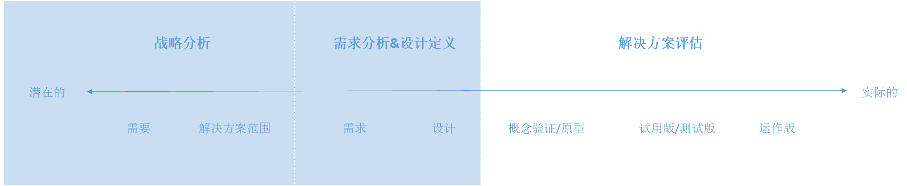
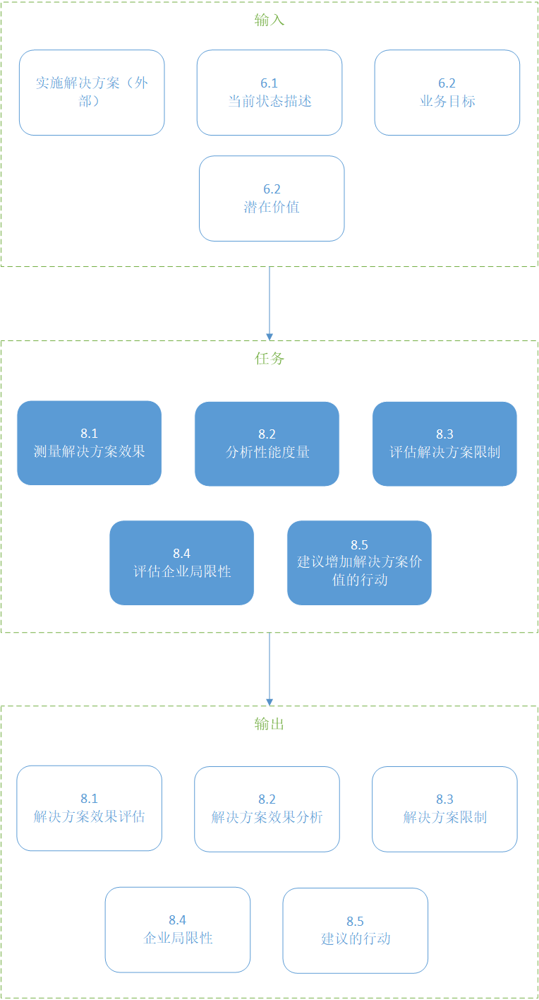
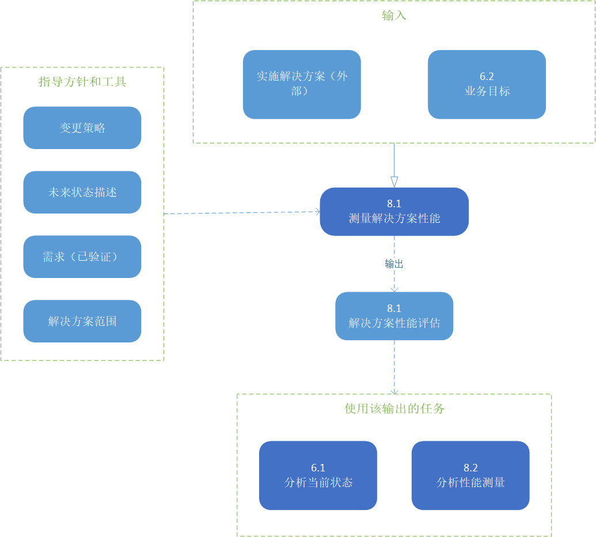
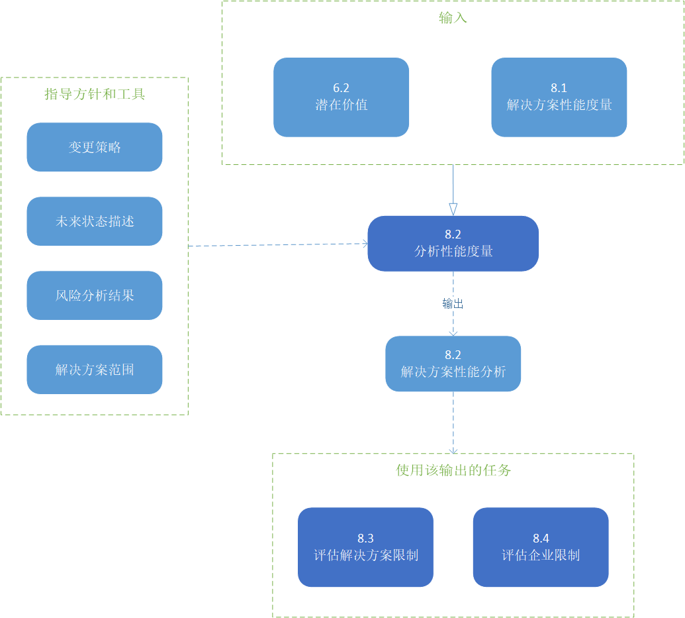

# 解决方案评估

解决方案评估知识领域描述了商业分析人员执行的任务，以评估企业使用的解决方案的性能和交付的价值，并建议消除阻碍充分实现价值的障碍或约束。

虽然在战略分析(第99页)或需求分析和设计定义(第133页)中执行的活动可能有一些相似之处，解决方案评估知识领域和其他知识领域之间的一个重要区别是实际解决方案的存在。它可能只是一个部分解决方案，但是解决方案或解决方案组件已经实现并以某种形式运行。支持利益实现的解决方案评估任务可能发生在启动更改之前，同时评估当前值，或者在实现解决方案之后。

解决方案评估任务可以在不同的开发阶段对解决方案组件执行：

* **原型或概念证明**：能够证明价值的可行但有限的解决方案版本。
* **试点或测试版本**：解决方案的有限实现或版本，用于解决问题，并在完全发布解决方案之前了解它实际交付的价值。
* **操作版本**：用于实现业务目标、执行过程或实现期望结果的部分或完整解决方案的完整版本。

解决方案评估描述分析交付的实际价值的任务，识别可能阻碍价值实现的限制，并提出提高解决方案价值的建议。它可以包括任何绩效评估、测试和实验的组合，也可以结合客观和主观的价值评估。解决方案评估通常关注于企业的一个组件，而不是整个企业。

下图展示了业务分析活动从交付潜在价值到实际价值的过程中的价值范围。

> 图片 8.0.1：商业分析价值层次
> 

解决方案评估知识领域包括以下任务：

* **测量解决方案性能**：确定评估解决方案性能的最合适的方法，包括它如何与企业目标和目标相一致，并执行评估。
* **分析性能度量**：检查关于解决方案性能的信息，以了解它交付给企业和涉众的价值，并确定它是否满足当前的业务需求。
* **评估解决方案限制**：调查解决方案范围内可能妨碍其满足当前业务需求的问题。
* **评估企业局限性**：调查解决方案范围之外的问题，这些问题可能阻碍企业实现解决方案能够提供的全部价值。
* **建议增加解决方案价值的行动**：识别和定义企业可以采取的行动，以增加解决方案可交付的价值。

# 解决方案评估的核心概念模型

业务分析核心概念模型™(BACCM™)描述了六个核心概念之间的关系。下表描述了解决方案评估上下文中每个核心概念的用法和应用。

> 表 8.0.1：解决方案评估的核心概念模型
> |核心概念|在解决方案评估期间，商业分析师…|
> |----|----|
> |**变更**：根据需要而转变的行为。|向解决方案或企业推荐变更，以实现解决方案的潜在价值。|
> |**需要**：需要解决的问题或机会。|评估解决方案或解决方案组件如何满足需求。|
> |**解决方案**：在特定环境中满足一种或多种需求的特定方法。|评估解决方案的性能，检查它是否交付了潜在的价值，并分析为什么价值可能无法由解决方案或解决方案组件实现。|
> |**业务关系人**：与变更、需要或解决方案有关系的团体或个人。|从业务关系人那里获取有关解决方案性能和价值交付的信息。|
> |**价值**：在一个环境中某物对业务关系人的价值、重要性或有用性。|确定解决方案是否交付了潜在的价值，并检查为什么没有实现这些价值。|
> |**上下文**：环境影响、被影响，并提供对变化的理解。|在确定解决方案性能度量时考虑上下文，以及上下文中可能禁止实现价值的任何限制。|

> 图片 8.0.2：解决方案评估输入/输出图解
> 

## 8.1 测量解决方案效果

### 8.1.1 目的

测量解决方案性能的目的是定义性能度量，并使用收集的数据来评估解决方案的有效性及其带来的价值。

### 8.1.2 描述

性能度量确定新部署或现有解决方案的价值。所使用的度量取决于解决方案本身、环境以及组织如何定义价值。当解决方案没有内置的性能度量时，商业分析师与业务关系人一起确定并收集最能反映解决方案性能的度量。可以通过与企业度量、项目目标和目标、过程性能目标或软件应用程序测试相结合的关键性能指标(KPIs)来评估性能。

### 8.1.3 输入

* **业务目标**：企业想要达到的可衡量的结果。提供可用于评估解决方案性能的基准。
* **实施解决方案（外部）**：以某种形式存在的解决方案(或解决方案的组成部分)。它可能是一个运行的解决方案，一个原型，或一个试点或测试解决方案。

> 图片 8.1.1：测量解决方案性能评估输入/输出图解
> 

### 8.1.5 元素

#### .1 定义解决方案性能评估

在度量解决方案性能时，商业分析人员确定当前度量是否存在，或者是否有捕获它们的方法。商业分析师确保任何现有的性能度量是准确的、相关的，并引出业务关系人确定的任何额外的性能度量。

业务目标、目标和业务流程是度量的常见来源。绩效衡量可能受到第三方(如解决方案供应商、政府机构或其他监管组织)的影响或施加。在选择引出方法时，要考虑测量的类型和性质。解决方案性能度量可以是定量的、定性的，或者两者兼而有之，这取决于所度量的价值。

* **定量测量**：是数值的、可数的或有限的，通常涉及数量、数量或速率。
* **定性测量**：是主观的，可以包括态度、感知和任何其他主观反应。客户、用户和其他参与解决方案操作的人都知道解决方案满足需求的程度。

#### .2 验证性能的措施

验证性能度量有助于确保对解决方案性能的评估是有用的。商业分析师与业务关系人一起验证性能度量和任何影响标准。特定的性能度量应该与上下文中存在的影响解决方案的任何更高级别的度量保持一致。关于使用哪些度量来评估解决方案性能的决定通常由发起人决定，但可能由任何具有决策权力的业务关系人做出。

#### .3 收集性能的措施

在定义性能度量时，商业分析师可能会使用基本的统计抽样概念。

在收集性能度量时，商业分析人员考虑：

* **总量或样本大小**：选择适合该倡议的总量或样本量。太小的样本量可能会扭曲结果，导致不准确的结论。更大的样本量可能更可取，但可能不实际。
* **频率和时间**：测量的频率和计时可能对结果有影响。
* **通用性**：最近的测量比以前的数据更有代表性。

使用定性测量，商业分析人员可以促进讨论，以估计解决方案实现的价值。了解解决方案的操作和使用的业务关系人根据他们所感知的事实和合理假设达成了共识。

### 8.1.5 指导和工具

* **变更策略**：为实现潜在价值而使用或正在使用的变更策略。
* **未来状态描述**：建议的企业新、删除或修改组件的边界，以及从未来状态中预期的潜在价值。
* **解决方案范围**：要度量和评估的解决方案边界。

### 8.1.6 技术

* **验收和评估标准**：用于定义可接受的解决方案性能。
* **基准和市场分析**：用于定义措施及其可接受的水平。
* **业务用例**：用于为建议的解决方案定义业务目标和性能度量。
* **数据挖掘**：用于收集和分析与解决方案性能有关的大量数据。
* **决策分析**：用于帮助业务关系人决定合适的方法来衡量解决方案的性能和可接受的性能水平。
* **焦点小组**：用于提供对解决方案性能的主观评估、见解和印象。
* **指标和关键绩效指标（KPIs）**：测量解决方案的性能。
* **非功能性需求分析**：用于定义解决方案的预期特征。
* **观察**：用于提供对解决方案性能的看法的反馈，或调和矛盾的结果。
* **原型**：用于模拟一个新的解决方案，以便确定和收集性能度量。
* **调查和问卷调查**：用于收集关于解决方案性能的意见和态度。当需要对大型或不同群体进行民意调查时，调查和问卷是有效的。
* **用例和场景**：用于定义解决方案的预期结果。
* **供应商评估**：用于评估供应商的哪些性能度量应该包括在解决方案的性能评估中。

### 8.1.7 业务关系人

* **客户**：可能被咨询以提供解决方案性能的反馈。
* **领域主题专家**：一个熟悉领域的人，可以咨询他以提供潜在的度量。
* **终端用户**：有助于解决方案在解决方案性能方面实现的实际价值。公司可能会征询他们的意见，就工作量和工作满意度等方面提供评论和反馈。
* **项目经理**：负责管理解决方案测量的进度和任务。对于已经在运行的解决方案，可能不需要此角色。
* **发起人**：负责批准用于确定解决方案性能的措施。也可以提供绩效预期。
* **监管者**：一个外部的或内部的小组，可以规定或规定必须纳入解决方案性能度量的约束和指导方针。

### 8.1.8 输出

* **解决方案性能评估**：提供有关解决方案执行情况或可能执行情况的信息的度量。

## 8.2 分析性能措施

### 8.2.1 目的

分析性能测量的目的是提供一个解决方案的性能与它带来的价值的关系的洞察。

### 8.2.2 描述

任务“测量解决方案性能”(第166页)中收集的测量通常需要解释和综合，以得出意义并采取行动。性能度量本身很少会引发关于解决方案价值的决策。

### 8.2.3 输入

* **潜在价值**：描述通过实现建议的未来状态可以实现的值。它可以作为一个基准来评估解决方案的性能。
* **解决方案性能度量**：度量并提供有关解决方案执行情况或可能执行情况的信息。

> 图片 8.2.1：分析性能度量评估输入/输出图解
> 

### 8.2.4 元素

#### .1 解决方案性能与期望值

商业分析师检查以前收集的度量，以评估他们帮助业务关系人理解解决方案价值的能力。一个解决方案可能是高性能的，比如一个高效的在线事务处理系统，但是它所贡献的价值低于预期(或者与它过去所贡献的价值相比)。另一方面，性能较低但具有潜在价值的解决方案(例如效率低下的核心流程)可以通过增强来提高其性能水平。如果度量不足以帮助业务关系人确定解决方案价值，商业分析人员要么收集更多度量，要么将缺乏度量视为解决方案风险。

#### .2 风险

性能度量可能揭示解决方案性能和企业的新风险。这些风险与其他风险一样被识别和管理。

#### .3 趋势

在分析性能数据时，商业分析师考虑收集数据的时间段，以防止异常和倾斜趋势。在足够长的时间内，足够大的样本容量将提供解决方案性能的准确描述，从而做出决策，并防止不完整的数据带来的错误信号。任何明显的和重复的趋势，如在特定时间内明显增加的错误或当体积增加时处理速度的变化，都是值得注意的。

#### .4 准确性

绩效衡量的准确性对其分析的有效性至关重要。商业分析师测试和分析性能度量所收集的数据，以确保其准确性。为了被认为是准确和可靠的，性能测量的结果应该是可重复和可重复的。

#### .5 性能的差异

在分析解决方案性能时，预期性能和实际性能之间的差异表示了考虑的差异。为了确定解决方案中重大差异的根本原因，可能需要进行根本原因分析。在任务“提高解决方案价值的建议行动”中提出了如何提高性能和减少差异的建议
(p.182)。

### 8.2.5 指导和工具

* **变更策略**：为实现潜在价值而使用或正在使用的更改策略。
* **未来状态描述**：建议的企业的新、修改或删除组件的边界，以及从未来状态预期的潜在价值。
* **风险分析结果**：总体风险水平和修改单个风险的计划方法。
* **解决方案范围**：要度量和评估的解决方案边界。

### 8.2.6 技术

* **验收和评估标准**：用于通过验收标准定义可接受的解决方案性能。与这些标准的差异程度将指导对绩效的分析。
* **基准和市场分析**：在评估风险、趋势和差异时，用于观察使用类似解决方案的其他组织的结果。
* **数据挖掘**：用于收集有关性能、趋势、常见问题和预期性能级别差异的数据，并理解数据中的模式和含义。
* **访谈**：用于确定一个解决方案的期望价值及其从个人或小团队的角度所感知到的性能。
* **指标和关键性能指标（KPIs）**：用于分析解决方案的性能，特别是在判断解决方案对实现目标的贡献如何时。
* **观察**：如果收集的数据不能提供明确的结论，用于观察正在运行的解决方案。
* **风险分析及管理**：用于识别、分析、制定计划以修改风险，并在持续的基础上管理风险。
* **根本原因分析**：用于确定性能差异的潜在原因。
* **调查或问卷调查**：用于确定解决方案的预期价值及其可感知的性能。

### 8.2.7 业务关系人

* **领域主题专家**：能够识别风险，并为分析解决方案性能提供数据洞察。
* **项目经理**：在项目中，负责全面的风险管理，并可能参与新的或变更的解决方案的风险分析。
* **发起人**：能够识别风险，提供对数据和解决方案的潜在价值的洞察。他们将决定预期与实际解决方案性能的重要性。

### 8.2.8 输出

* **解决方案性能分析**：分析结果的测量收集和建议，以解决性能差距和利用机会，提高价值。