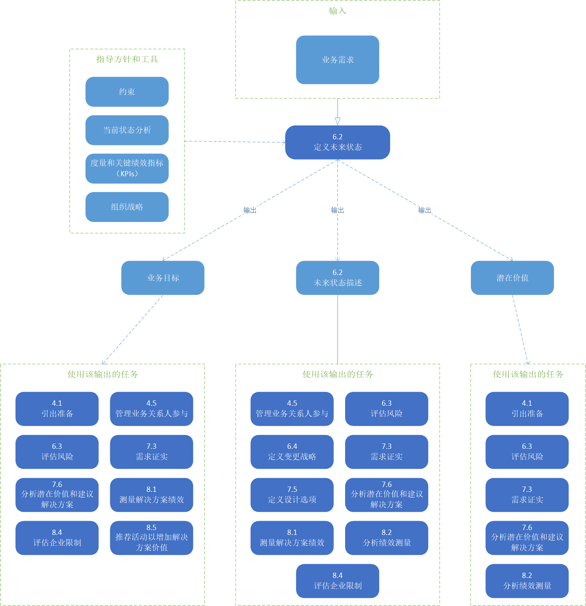

# 战略分析

战略定义了最有效的方法应用企业的能力，以达到一套期望的目标和对象。战略可能存在于整个企业、一个部门、部分或者区域、也可能存在于一个产品、项目或迭代。

战略分析领域知识描述了商业分析工作必须与业务关系人合作执行，以确定战略的需要或战术重要性（业务需求），使企业满足这种需要，并将由此产生的策略与更高层次和更低层次的策略结合起来。

战略分析着重于定义解决商业需要所需的未来和转换状态，以及所需的工作由解决方案空间的需要和范围来共同确定。它还该了商业分析中的战略思考，以及可能的解决方案的探索和想象，这些可能使企业为业务关系人创造更大的价值，并/或为自己捕获更大的价值。

战略分析为需求分析和设计定义的给定变更提供上下文。当业务需要确定时，应该执行战略分析。这给予业务关系人决定是否满足该需要。战略分析是一项持续进行的活动，它评估需要的任何改变，在其上下文中，任何表明需要调整策略变更的新信息。

下图展示了商业分析活动从交付潜在价值到实际价值的过程中的价值范围。

> 图片 6.0.1：商业分析价值层次
> 

在执行战略分析的时候，商业分析师必须要考虑他们正在工作的环节，以及可能的结果范围的可预测性。当变更有一个可预测的结果时，未来的状态和可能改变的状态可以被清楚的定义，并且可以计划出一个清晰的战略。当变更的结果难以预测，那么战略可能需要更多的关注减轻风险，测试假设，变更方向直到战略成功的达成业务目标或者直到方案结束，才能确定。这些任务可以以任何顺序执行，尽管他们通常是同时执行的，因为战略必须根据实际可实现的情况来制定。

战略可以在战略规划、产品愿景、业务用例、产品路线图或其它工作中获取。

战略分析知识领域包括以下任务：

* **分析当前状态**：理解业务需求以及它与当前企业功能的关系。为变更设置极限和环境。
* **定义未来状态**：定义当业务需求已经得到满足和定义时，会展示出的目标和对象，企业的哪些部分需要改变，以达到这些目标和目的。
* **评估风险**：理解围绕变更的不确定性，考虑这些不确定性可能对通过变更交付价值的能力产生的影响，并在适当的地方建议应对风险的行动。
* **定义变更策略**：执行当前状态和未来状态的差距分析，评估达到未来状态的选项，建议达到未来状态的最高值的方法，包括过程中可能需要的任何转变状态。

# 战略分析核心概念模型

商业分析核心概念模型™(BACCM™)描述了六个核心概念之间的关系。下表描述了每个核心概念在战略北京下的使用和应用分析。

> 表 6.0.1：战略分析中的核心概念模型
> |核心概念|在战略分析中，商业分析师……|
> |----|----|
> |**变更**：根据需要而转变的行为。|定义未来状态，并开发一个变更策略来实现未来状态。|
> |**需要**：需要解决的问题或机会。|确定当前状态中的需要，并对需要进行优先排序，以确定期望的未来状态。|
> |**解决方案**：在特定环境中满足一种或多种需要的特定方法。|将解决方案的范围定义为开发变更策略的一部分。|
> |**业务关系人**：与变更、需要或解决方案有关系的团体或个人。|与业务关系人合作，以了解业务需要，并开发满足这些需要的变更策略和未来状态。|
> |**价值**：在一个环境中某物对业务关系人的价值、重要性或有用性。|检查解决方案的潜在价值，以确定变更是否合理。|
> |**上下文**：环境影响、被影响，并提供对变化的理解。|在开发变更策略时考虑企业的环境。|

> 图片 6.0.1：战略分析输入/输出图解
> 

## 6.1 当前状态分析

### 6.1.1 目的

当前状态分析的目的是为了理解为什么企业需要变更起运营方式中的某些方面，以及为什么会直接或间接地受到变更的影响。

### 6.1.2 描述

任何变更的出发点都是理解为什么需要变更。潜在的变化是由不改变当前状态就无法解决的问题或机会触发的。商业分析师的工作是帮助业务管理人实现变更，通过探索和明确驱动变更的业务需要。如果没有清楚地理解业务需要，就不可能开发出一致的策略，并且由此产生的变更方案几乎肯定是由混合着冲突的业务关系人要求而驱动的。

变更总是发生在构成企业当前状态的现有业务关系人、流程、技术和策略的上下文中。商业分析师在业务需要的上下文中检查当前状态，以了解什么可能受提出的变更影响，以及什么会被这些变更影响。对当前状态进行了足够详细的探讨，以验证更改和/或变更战略的需要。在变更之前了解企业的当前状态是必要的，以确定需要更改什么以达到期望的未来状态，以及如何评估变更的效果。

当前状态的范围描述了环境的重要现有特征。当前状态范围的边界是由与需要相关的企业及其环境的组件决定的。当前状态可以在不同的层次上进行描述，范围从整个企业到解决方案的小组件。创建当前状态的模型可能需要整个企业或企业外部的协作。对于较小的工作，范围可能只是企业的一小部分。

在开发和实现变更时，企业的当前状态很少是静态的。内部和外部的影响因素，以及其他组织变化，可以影响当前状态，从而迫使在期望的未来状态、变更策略或需求和设计中进行变更。

### 6.1.3 输入

* **引出结果**：用于确认和理解当前状态。
* **需要**：企业或组织面临的问题或机会，通常会启动商业分析工作以更好的理解这些需要。

> 图片 6.1.1：分析当前状态输入/输出图解
> 

### 6.1.4 元素

#### .1 业务需要

业务需要是企业面临的具有战略重要性的问题和机遇。组织中遇到的问题，如客户投诉、收入损失或新的市场机会，通常会触发对业务需要的评估。

业务需要可以在企业的许多不同层次上确定:

* **从上到下**：一个需要实现的战略目标。
* **从下至上**：流程、功能或系统的当前状态的问题。
* **从中层管理**：管理者需要额外的信息来做出合理的决定，或者必须执行额外的职能来满足业务目标。
* **从外部驱动**：客户需求或市场中的商业竞争。

业务需要的定义通常是任何业务分析工作中最关键的一步。解决方案必须满足业务需要才被认为是成功的。定义需要的方式决定了将考虑哪些替代方案，将咨询哪些业务关系人，以及将评估哪些解决方案方法。业务需要总是从企业的角度表达，而不是从任何特定业务关系人的角度。

业务需要通常与假定的解决方案一起确定或表示。商业分析师应该对通常隐藏在问题的陈述中的假定和约束保有质疑，以确保解决正确的问题，并考虑尽可能广泛的可选解决方案。

一组业务需要的解决方案，必须有潜力为企业或其他业务关系人产生利益，或避免可能发生的损失。商业分析师可能考虑的因素包括：

* 问题在组织内造成的不利影响，并量化这些影响（例如，潜在的收入损失、效率低下、顾客不满意、员工士气低落）。
* 任何潜在解决方案的预期收益(例如，增加收入、降低成本、增加市场份额)，
* 问题能多快得到解决，机会能多快被抓住，什么都不做的代价是什么。
* 问题的根本原因。

业务需要将推动对当前状态的整体分析。尽管在进一步开发变更策略之前，没有必要完全详细地描述当前状态的所有方面，但这种探索通常会发现问题的更深层次的潜在原因或触发调查的机会(然后成为额外的业务需求)。

#### .2 组织结构和文化

组织结构定义了在企业中工作的人员之间的正式关系。虽然沟通渠道和关系并不受这种结构限制，但他们严重的受它影响，报告可以帮助或限制潜在的变化。

组织文化是组织成员所共有的信念、价值观和规范。这些信念驱动着一个组织所采取的行动。商业分析师进行文化评估：

* 确定是否需要变更文化以更好的实现目标。
* 确定业务关系人是否理解企业当前状态的基本远离，及其传递的价值。
* 确定业务关系人是否认为当前状态是令人满意的，或者是否需要变更。

#### .3 功能和流程

能力和过程描述了企业执行的活动。它们还包括企业拥有的知识，所提供的产品和服务，所支持的功能，以及所使用的决策方法。核心能力或流程描述了企业区别于其它企业的基本功能。它们是通过绩效指标来衡量的，这些指标可以用来评估变化带来的好处。

商业分析师可能使用：

* 企业的核心能力视角，在寻找创新的解决方案时，将现有能力结合起来，产生新的结果。基于功能的视图在这种情况下是有用的，因为功能通常组织在与其他功能相关的功能层次结构中，从而更容易识别任何差距。
* 在寻找改进当前活动性能的方法时，以过程为中心的企业视图。基于流程的视图在这种情况下很有用，因为流程是在整个企业中以端到端方式组织的，以向客户交付价值，这使得确保更改确实提高性能变得更容易。

#### .4 技术和基础设施

企业使用的信息系统支持人们执行流程、决策以及与供应商和客户的交互。基础设施根据物理组件和功能描述企业环境。基础设施可以包括计算机硬件、电厂机械设备和后勤支持等组件，以及它们的操作和维护。

#### .5 政策

策略定义了企业不同层次的决策范围。它们通常处理的是常规操作，而不是战略变化。它们确保正确地做出决策，在允许和适当的行为和行动方面为员工提供指导，支持管理，并确定何时和如何获得新资源。确定相关政策可以塑造解决方案空间的范围，可能会限制可采取的行动类型。

#### .6 业务架构

当前状态的任何部分都不应与其他部分完全隔离进行评估。商业分析师必须了解当前状态的所有这些元素是如何组合在一起的，以及相互支持，以便提出有效的变更建议。现有的业务结构通常满足各种业务分类和业务关系人需求。如果这些需要没有被确认，或者不被提议的过渡或未来的状态所满足，变更可能会导致价值的损失。

#### .7 内在资产

商业分析师确认当前状态中使用的企业资产。资源可以是有形的，也可以是无形的，比如财务资源、专利、声誉和品牌。

#### .8 外部影响者

对企业有外部影响，这些影响不参与变更，但是对当前状态提供约束、依赖或驱动。

外部影响来源包括：

* **产业结构**：每个产业都有不同的创造价值方式。如果一个提议的变更设计进入一个新行业，就会产生特别重要的影响。
* **竞争对手**：一个行业内企业的竞争者的性质和强度可能是显著的。新的竞争者的加入也可能改变行业的性质或增加竞争。
* **客户**：现有和潜在客户群体的规模和性质可以提供谈判能力和价格敏感性等影响。另外，可以满足客户需要的新替代方案的出现，可以驱动企业交付更大的价值。
* **供应商**：供应商的种类和差异可能是一个影响者，正如供应商对其客户的权力。
* **政策和监管环境**：法律和法规对行业往往会产生当前和潜在的影响。
* **技术**：最新和预期的技术革新所带来的对生产力潜力的提高，可能会影响需要。
* **宏观经济学因素**：现有和预期的宏观经济环境中存在的限制和机会(例如，贸易、失业或通货膨胀)可能会影响需求。

根据企业是盈利性企业、非盈利性企业还是政府机构，其中一些来源可能使用不同的术语。例如，一个国家没有客户;它有公民。

### 6.1.5 指导和工具

* **商业分析方法**：指导商业分析师如何在当前状态下进行分析。
* **企业限制**：用于理解企业中存在的挑战。
* **组织战略**：组织会有一组目标和对象，指导操作，简历方向，并提供未来状态的愿景。这可以含蓄或者明确的陈述。
* **解决方案限制**：用于理解当前状态下现有方案的挑战。
* **解决方案绩效目标**：度量企业或解决方案的当前性能，并作为设定未来状态目标和度量改进的基线。
* **解决方案绩效指标**：描述现有解决方案的实际性能。
* **业务关系人分析结果**：来自整个组织的业务关系人将有助于对当前状态的理解和分析。

### 6.1.6 技术

* **基准和市场分析**：提供对当前状态中哪些地方有改进机会的理解。可能有用的具体框架包括：五种力量模型分析，PEST分析、STEEP分析、CATWOE模型等。
* **业务能力分析**：根据价值和风险确定差距和优先级。
* **商业模式图**：提供企业满足其客户的价值主张的理解，交付该价值的关键因素，以及由此产生的成本和收入流。有助于理解任何变化的背景，并识别可能产生最重大影响的问题和机会。
* **业务用例**：用于捕获关于业务需要和机会的信息。
* **概念模型**：用于捕获业务领域中的关键术语和概念，并定义它们之间的关系。
* **数据挖掘**：用于获取企业的绩效信息。
* **文档分析**：分析任何关于当前状态的现有文档，包括(但不限于)解决方案实施过程中创建的文档、培训手册、问题报告、竞争对手信息、供应商协议、已发布的行业基准、已发布的技术趋势和性能指标。
* **财务分析**：用于了解当前状态的盈利能力和交付变更的财务能力。
* **焦点小组**：征求客户或最终用户对当前状态的反馈。
* **功能分解**：分解当前状态下的复杂系统或关系。
* **访谈**：促进与业务关系人的对话，以了解当前状态和从当前状态发展而来的任何需求。
* **项目跟踪**：跟踪和管理发现的关于当前状态的问题。
* **经验教训**：支持对过去计划中的失败和改进机会的评估，这可能会驱动流程改进的业务需要。
* **指标和关键绩效指标（KPIs）**：评估企业当前状态的绩效。
* **思维导图**：用于探索当前状态的相关方面，更好地理解影响业务需要的相关因素。
* **观察**：可能为洞察当前状态中先前未被业务关系人识别的需要提供机会。
* **组织建模**：描述当前状态组织中存在的角色、职责和报告结构。
* **过程分析**：识别改进当前状态的机会。
* **流程建模**：描述如何在当前解决方案中进行工作。
* **风险分析和管理**：识别当前状态的风险。
* **根本原因分析**：提供对当前状态下任何问题的根本原因的理解，以便进一步澄清需求。
* **范围建模**：帮助定义当前状态描述的边界。
* **调查或问卷**：有助于从大量、不同或完全不同的业务关系人群体中获得对当前状态的理解。
* **SWOT分析**：评估企业现有状态下的优势、劣势、机会和威胁。
* **供应商分析**：确定当前状态中的任何供应商是否充分满足承诺，或者是否需要进行任何变更。
* **研讨会**：让业务关系人共同描述当前状态和他们的需要。

### 6.1.7 业务关系人

* **客户**：利用现有的解决方案，并且可能有关于当前解决方案的问题的输入。
* **领域主题专家**：在当前状态下的某些方面有经验。
* **终端用户**：直接使用解决方案，并可能对当前解决方案的问题进行输入。
* **实施主题专家**：在当前状态下的某系方面有经验。
* **运营支持**：直接参与支持组织的运作，并提供关于他们支持现有解决方案运作的能力的信息，以及任何已知问题。
* **项目经理**：使用当前状态的信息作为计划的输入。
* **监管者**：可以以业务策略、业务规则、程序或角色职责的形式解释适用于当前状态的相关法规。监管机构可能对业务评估有独特的意见，因为可能需要遵守新的法律法规。
* **主办者**：可能有关于现有解决方案绩效的上下文。
* **供应商**：可能是当前状态的外部影响者。
* **测试人员**：能够提供关于任何现有解决方案的问题的信息。

### 6.1.8 输出

* **当前状态描述**：企业的范围、能力、资源、性能、文化、依赖关系、基础设施、外部影响以及这些元素之间的重要关系的上下文。
* **业务需求**：基于对当前状态的理解而定义的问题、机会或约束。

## 6.2 定义未来状态

### 6.2.1 目的

定义未来状态的目的是确定满足业务需要的必要条件集。

### 6.2.2 描述

所有有目的的改变都必须包括成功的定义。商业分析师的工作是确保企业的未来状态得到良好的定义，它用现有的资源是可以实现的，并且关键业务关系人对结果有共同的共识。与当前状态分析一样，未来状态的分析的目的，不是创建对于直接支持实现结果的细节化的一个全面的描述。未来状态将在以下详细级别定义:

* 允许竞争策略来实现被识别和评估的未来状态。
* 为满足业务需要的结果提供清晰的定义。
* 详细说明解决方案空间的范围。
* 允许评估与未来状态相关的值。
* 使关键业务关系人达成共识。

未来状态描述可以包括关于提议的未来状态的任何上下文。它描述了企业中新的、删除的和修改的组件。它可以包括组织本身边界的变化，例如进入一个新的市场或执行合并或收购。未来状态也可以是对组织现有组件的简单更改，例如更改流程中的一个步骤或从现有应用程序中删除某个功能。企业的任何组成部分都可能需要更改，包括(但不限于)：

* 业务流程
* 条件
* 功能
* 桌面工具
* 业务范围
* 组织的位置
* 组织的结构
* 数据与资料
* 员工技能
* 应用系统
* 知识和技能
* 技术基础设施
* 训练

描述可以包括可视化模型和文本，以清楚地显示范围边界和细节。识别和描述实体之间的相关关系。描述未来状态所需的努力取决于变化的性质。变更的预期结果可能包括特定的度量标准或松散定义的结果。描述未来状态允许业务关系人了解解决方案可以实现的潜在价值，它可以作为关于变更战略的决策过程的一部分。在变化导致可预测的结果和可预测的价值交付的环境中，以及存在大量可能增加价值的变化的环境中，未来状态分析的目的是收集足够的信息，以便在潜在的选项中做出最佳的可能选择。在很难预测变更所实现的价值的情况下，未来的状态可以通过确定适当的性能度量(为业务价值生成一组商定的度量)来定义，并且变更策略将支持对多个选项的探索。

### 6.2.3 输入

* **业务需求**：未来状态要解决的问题、机会或约束。

> 图片 6.2.1：确定未来状态输入/输出图解
> 

### 6.2.4 元素

#### .1 业务目标和目的

为了指导变更策略的开发和确定潜在的价值，可以从业务目的或目标来描述未来的状态。业务目标和目的描述了组织寻求实现的目的。目标和目的可以与组织想要完成的变化或它想要维护的当前条件有关。

目标是组织寻求建立和维护的长期的、持续的和定性的状态或条件的陈述。商业目标的例子包括：

* 创造新的能力，如新产品或服务，解决竞争劣势，或创造新的竞争优势。
* 通过增加销售或降低成本来提高收入。
* 提高客户满意度。
* 提高员工满意度。
* 遵守新规定。
* 改善安全设施。
* 减少交付产品或服务的时间。

高层次的目标可以被分解，将总体战略分解为可能导致预期结果的领域，例如增加客户满意度、卓越的运营和/或业务增长。例如，目标可能是将“增加高收入客户数量”进一步细化为“6个月内增加30-45岁年龄段高收入的客户数量30%”。

当目标被分析时，它们会被转换成更描述性、更细粒度和更具体的目标，并与能够客观评估目标是否已经实现的措施相联系。可测量的目标使团队知道是否满足了需求，以及变更是否有效。定义可测量的目标对于完成变更通常是至关重要的，并且可能是变更业务用例的关键组成部分。评估目标的一个常见测试是确保它们是SMART：

* **S**pecific（明确）：描述具有可观察结果的事物。
* **M**easurable（可测量）：跟踪和测量结果。
* **A**chievable（可达成）：测试工作的可行性。
* **R**elevant（相关）：与企业的愿景、任务和目标保持一致。
* **T**ime-bounded（时限性）：定义与需要一致的时间框架。

#### .2 解决方案空间范围

必须对考虑满足业务目标的解决方案的范围做出决策。解决方案空间的范围定义了在调查可能的解决方案时将考虑哪些类型的选项，包括对组织结构或文化、能力和流程、技术和基础设施、政策、产品或服务的更改，甚至创建或改变与当前在扩展企业范围之外的组织的关系。这些领域中的解决方案通常需要来自商业分析和交付团队的专门知识。对此的分析可能发生在企业的不同级别上，解决方案空间的范围不一定与变更的大小相关。即使是一个很小的更改也可能需要查看企业级业务目标，以确保一致性。

如果多个未来状态可以满足业务需求、目标和目标，那么有必要确定将考虑哪些状态。该决策通常基于交付给业务关系人的价值，并要求了解可能的变更策略。决策的关键考虑取决于企业的总体目标，但将涉及对每个选项的定量和定性价值的理解，实现每个未来状态所需的时间，以及企业的机会成本。

#### .3 约束

约束描述当前状态的各个方面，计划的未来状态的某些方面可能不会被解决方案改变，或设计中的强制性元素。它们必须经过仔细检查，以确保它们是准确和合理的。

限制条件可能反映下列任何一种情况：

* 预算限制。
* 时间限制。
* 技术。
* 基础设施。
* 政策。
* 限制可用资源的数量。
* 基于团队和业务关系人技能的限制。
* 要求某些业务关系人不受解决方案实施的影响。
* 遵守法规。
* 任何其他限制。

#### .4 组织结构与文化

企业中存在的正式和非正式工作关系可能需要更改以促进期望的未来状态。对报告线的更改可以鼓励团队更紧密地合作，并促进目标和目标的一致。组织结构和文化的元素可能需要改变以支持未来的状态。描述未来状态的组件可以洞察潜在的冲突、影响和限制。

#### .5 功能和流程

确定新的活动类型或活动执行方式的变化，以实现未来的状态。为了交付新的产品或服务、遵守新的法规或提高企业的绩效，将需要新的或变更的能力和过程。

#### .6 技术和基础结构

如果当前的技术和基础设施不足以满足业务需要，商业分析师将确定所需的未来状态所需的更改。

现有技术可能对解决方案的设计施加技术限制。这些可能包括开发语言、硬件和软件平台，以及必须使用的应用软件。技术约束也可以描述诸如资源利用率、消息大小和时间、软件大小、文件、记录和数据元素的最大数量和大小等限制。技术约束包括必须遵循的任何IT体系结构标准。

#### .7 政策

如果当前策略不足以满足业务需要，商业分析师将确定所需的未来状态所需的更改。

政策是解决方案或解决方案空间上约束的常见来源。业务策略可能会规定，给定特定级别的批准，哪些解决方案可以实现，获得批准的过程，以及提议的解决方案为了获得资金必须满足的必要标准。在某些情况下，对现有策略的更改可能会打开其他不被考虑的替代解决方案。

#### .8 业务架构

任何未来状态的元素必须有效地相互支持，并且都有助于实现业务目标和目的。此外，它们应该作为一个整体集成到企业的整体期望的未来状态中，并支持该未来状态。

#### .9 内部资产

对资源的分析可能表明需要增加现有资源或需要提高能力，或需要开发新的资源。在分析资源时，商业分析师检查维护当前状态和实现更改策略所需的资源，并确定哪些资源可以用作期望的未来状态的一部分。在对变革战略的可能解决办法进行可行性分析时，将考虑对现有和所需资源的评估。

#### .10 确定假设

多数战略都是基于一系列的假设，这些假设将决定战略是否能够成功，特别是在高度不确定的环境中操作时。通常很难或不可能证明新功能的交付将满足业务需求，即使在似乎合理地假定新功能将具有预期效果的情况下也是如此。这些假设必须被识别并被清楚地理解，这样，如果这些假设后来被证明是无效的，就可以做出适当的决定。可以在不确定的环境中构建变更策略，以便尽可能早地测试这些假设，以支持计划的重定向或终止。

#### .11 潜在价值

仅仅满足业务目标并不能证明向未来状态的过渡是正确的;必须评估潜在的价值，以确定它是否足以证明更改的合理性。

在定义未来状态时，商业分析人员确定解决方案的潜在价值。未来状态的潜在价值是考虑运营成本后的解决方案的净收益。改变必须为企业带来比不采取行动更大的价值。然而，对于一些业务关系人，甚至对整个企业来说，未来状态可能代表着当前状态的价值下降。例如，为了让企业继续运营，可能需要处理新的法规或增加的竞争，但仍然可能降低所获得的整体价值。

在确定未来状态时，商业分析人员考虑潜在价值的增加或减少：

* 在评估外部影响时显示的外部机会。
* 新合作伙伴的未知优势。
* 新技术或知识。
* 市场竞争对手的潜在损失。
* 强制采用变更组件。

业务分析人员确定价值潜在变化的具体机会，以及计划变更的单个组件的这些变化增加的可能性。商业分析人员通过整合所有机会来估计总的潜在价值。

潜在价值，包括预期收益和成本的细节，以及如果不进行更改的话可能的结果，是为更改制定业务案例的关键组成部分。将潜在价值的描述与当前实现的实际价值的度量相关联，使业务关系人能够理解价值的预期变化。在大多数情况下，未来的状态无法解决所有的改进机会。任何未处理的机会可能在解决方案实施后仍然有效，应该在其他变化中注意到，以便将来进行分析。

除了未来状态的潜在价值外，该分析还应考虑达到未来状态的可接受投资水平。虽然实际的投资将取决于改变策略，但这些信息指导了可能策略的选择。

### 6.2.5 指导和工具

* **当前状态分析**：提供需要在其中完成工作的上下文。它经常被用作未来状态的起点。
* **指标和关键绩效指标(KPIs)**：关键绩效指标和指标将用于确定是否已经达到预期的未来状态。
* **组织战略**：描述企业或组织为达到其期望的未来状态所采取的路径、方法或方法。这可以含蓄地或明确地陈述。

### 6.2.6 技术

* **接受和评估标准**：用于确定什么可能使未来状态可接受和/或如何评估选项。
* **平衡记分卡**：用来设定衡量未来状态的目标。
* **基准和市场分析**：用于对未来国家的商业目标做出决定。
* **头脑风暴**：用于为未来的状态共同提出想法。
* **业务能力分析**：用于根据价值和风险对能力差距进行优先排序。
* **业务用例**：用于捕获变更活动的预期结果。
* **业务模型画布**：用于规划企业的战略，通过规划所需的基础设施、目标客户基础、财务成本结构和收入流，以满足客户在未来期望状态下的价值主张。
* **决策分析**：用于比较不同的未来状态选项，并了解哪个是最好的选择。
* **决策建模**：用于建模关于未来状态选项的复杂决策。
* **财务分析**：用于估计一个提议的未来状态可能带来的潜在财务回报。
* **功能分解**：用于分解未来状态中的复杂系统，以便更好地理解。
* **访谈**：用于与业务关系人交谈，以了解他们希望的未来状态，他们希望解决的需求，以及他们希望满足的业务目标。
* **经验教训**：用于确定将处理哪些改进机会，以及如何改进当前状态。
* **指标和关键绩效指标(KPIs)**：用于确定组织何时成功地实现了业务目标。
* **思维导图**：用来发展未来状态的想法，并理解它们之间的关系。
* **组织模型**：用于描述未来状态组织中存在的角色、职责和报告结构。
* **过程建模**：用于描述在未来的状态下如何进行工作。
* **原型**：用于建模未来的状态选项，也可以帮助确定潜在的价值。
* **范围建模**：用于定义企业未来状态的边界。
* **调查或问卷调查**：用于理解业务关系人想要的未来状态，他们想要处理的需求，以及他们想要满足的商业目标。
* **SWOT分析**：用来评估未来国家可能利用或减轻的优势、弱点、机会和威胁。
* **供应商评估**：用于评估供应商解决方案选项提供的潜在价值。
* **研讨会**：用于与业务关系人合作描述未来状态。

### 6.2.7 业务关系人

* **客户**：可能是目标购买者或处于未来状态的消费者，他们可能准备好也可能没有能力使用新状态。
* **领域主题专家**：提供对当前状态和潜在的未来状态的洞察。
* **终端用户**：期望使用或成为实现未来状态的解决方案的组件。
* **实施领域专家**：提供有关实现未来状态的可行性的信息。
* **运营支持**：直接参与支持企业的运营，并提供有关其支持未来状态的运营能力的信息。
* **项目经理**：可能有关于什么是合理的和可管理的期望未来状态的输入。
* **监管者**：确保法律、法规或规则在期望的未来状态中得到遵守。在未来的状态描述中，必须以业务政策、业务规则、流程或角色职责的形式对相关法规进行解释。
* **主办者**：帮助确定需要处理哪些业务，并设置未来状态将实现的业务目标。授权并确保资金以支持迈向未来状态。
* **供应者**：如果它们支持更改的交付或交付未来状态操作的任何部分，则可以帮助定义未来状态。
* **测试者**：负责确保能够充分测试预期的未来状态，并帮助为目标设置适当的质量级别。

### 6.2.8 输出

* **业务目标**：企业希望追求的方向，以实现未来的状态。
* **未来状态描述**：未来状态描述包括提议的企业新增、删除和修改组件的边界，以及从未来状态中预期的潜在价值。描述可能包括期望的未来功能、策略、资源、依赖关系、基础设施、外部影响以及每个元素之间的关系。
* **潜在价值**：通过实现建议的未来状态可以实现的价值。

## 6.3 评估风险

### 6.3.1 目的

评估风险的目的是了解在向未来状态转换或一单进入未来状态期间，内部和外部力量对企业造成的不良后果。了解这些力量的潜在影响可以用来对行动方针提出建议。

### 6.3.2 描述

风险评估包括分析和管理风险。风险可能与当前状态、期望的未来状态、更改本身、变更战略或企业正在执行的任何任务相关。

风险分析如下:

* 风险发生时可能产生的后果。
* 这些后果的影响。
* 风险可能性。
* 可能发生风险的时间范围。

风险集合被用作选择或协调变更战略的输入。风险评估可以包括选择接受风险，如果修改风险所需的努力或风险水平超过可能的损失。如果了解了风险并进行了变更，那么就可以管理风险，以最小化它们对价值的总体影响。

许多方法包括将“积极风险”作为管理机会的一种方式。尽管在BABOK®指南中对风险的正式定义并不排除这种用法，但“机会”被视为需求(并进行相应的管理)，而风险被用于可能产生负面结果的不确定事件。

### 6.3.3 输入

* **业务目标**：描述实现未来状态所需的预期方向，可用于识别和讨论潜在风险。
* **引出结果（已确认）**：理解不同的业务关系人认为什么是实现预期未来状态的风险。
* **影响**：影响未来理想状态实现的企业内部因素(内部)和企业外部因素(外部)。
* **潜在价值**：通过实现建议的未来状态来描述要实现的价值，为风险评估提供了一个基准。
* **需求（已优先级排序）**：根据它们的优先级，需求将影响作为解决方案实现的一部分来定义和理解的风险。

> 图片 6.3.1：评估风险输入/输出图解
> 

### 6.3.4 元素

#### .1 未知事件

在评估风险时，它发生的可能性以及发生后的影响都是不确定的。商业分析师和业务关系人合作，根据当前的了解评估风险。即使不可能知道某一特定变化策略将产生的所有后果，仍然有可能估计发生的未知或不确定事件或条件的影响。商业分析师考虑来自类似情况的其他历史上下文来评估风险。从过去的变更中获得的经验教训和业务关系人的专家判断可以帮助商业分析人员指导团队确定当前变更的风险影响和可能性。

#### .2 约束、假设和依赖

可以对约束、假设和依赖项进行风险分析，有时应该将它们作为风险本身进行管理。如果约束、假设或依赖关系与变更的某个方面相关，则可以通过识别由于约束、假设或依赖关系可能发生的事件或条件和后果，将其重新声明为风险。

#### .3 对价值的负面影响

风险表示为增加对价值产生负面影响的可能性或严重程度的条件。商业分析师清楚地识别和表达每种风险，并估计其可能性和影响，以确定风险级别。商业分析人员从聚集的风险集估计总的风险级别，指出被评估的风险的总体潜在影响。在某些情况下，总体风险水平可以用财务术语或时间、工作量或其他度量来量化。

#### .4 风险容忍能力

业务关系人或企业愿意承担多少不确定性以换取潜在价值被称为风险容忍度。

一般来说，描述对待风险的态度有三种宽泛的方式：

* **风险预防**：不愿意接受太多的不确定性；人们可能倾向于避免风险过高的行动，或者投资更多(因此接受较低的潜在价值)以降低风险。
* **中立**：一定程度的风险是可以接受的，只要行动过程不会导致损失，即使风险发生了。
* **追求风险**：愿意接受甚至承担更多风险以换取更高的潜在价值。

个人或组织可能在不同的时间表现出不同的风险容忍度。如果对风险的容忍度较低，则可能在规避、转移或缓解战略方面作出更多努力。如果对风险的容忍度高，就有可能接受更多的风险。通常情况下，无论风险容忍度如何，都要处理最高级别的风险。

#### .5 建议

在风险分析的基础上，商业分析师提出了行动方案。商业分析师与业务关系人一起工作，以了解总体风险级别和他们对风险的容忍度。

该建议通常可分为以下几类：

* 追求改变带来的好处而不顾风险。
* 在投资降低风险(可能性和/或影响)的同时，追求变化的好处。
* 想办法增加改变带来的好处，而不是风险。
* 找出管理和优化机会的方法。
* 不追求改变带来的好处。

如果变更有风险，则应确定业务关系人以监控风险和风险事件发生时的后果。风险可能会改变企业的当前状态，并需要修改变更策略。在这种情况下，可以在风险发生之前制定行动计划。

### 6.3.5 指导和工具

* **商业分析方法**：指导商业分析师如何分析风险。
* **业务策略**：定义必须作出决策的限制。它们可能要求或管理风险管理的各个方面。
* **变更策略**：提供从当前状态过渡到未来状态并实现预期业务结果的计划。必须对这种方法进行评估，以了解与变更相关的风险。
* **当前状态描述**：提供需要在其中完成工作的上下文。它可以用来确定与当前状态相关的风险。
* **未来状态描述**：确定与未来状态相关的风险。
* **确定风险**：可以作为更彻底的风险评估的起点。这些可能来自于风险分析结果、启发式活动、以前的业务分析经验，或基于专家意见。
* **业务关系人参与方法**：了解业务关系人和业务关系群体有助于识别和评估内部和外部力量的潜在影响。

### 6.3.6 技术

* **头脑风暴**：用于协同识别潜在风险进行评估。
* **业务实例**：用于捕获与可选变更策略相关的风险。
* **决策分析**：用来评估问题。
* **文档分析**：用于分析现有文档的潜在风险、约束、假设和依赖关系。
* **财务分析**：用于理解风险对解决方案财务价值的潜在影响。
* **访谈**：用来理解业务关系人认为什么可能是风险以及这些风险的各种因素。
* **经验教训**：用作过去可能存在风险的问题的基础。
* **根本原因分析**：用于识别和处理造成风险的根本问题。
* **调查和问卷调查**：用来理解业务关系人认为什么可能是风险以及这些风险的各种因素。
* **研讨会**：用来理解业务关系人认为什么可能是风险以及这些风险的各种因素。

### 6.3.7 业务关系人

* **领域主题专家**：根据其专业领域所需的准备知识，为风险评估提供输入。
* **实施主题专家**：根据其专业领域所需的准备知识，为风险评估提供输入。
* **运营支持**：支持企业的运营，并能识别可能的风险及其影响。
* **项目经理**：帮助评估风险，主要负责管理和减轻项目的风险。
* **监管者**：识别与遵守法律、法规或规则相关的任何风险。
* **主办者**：需要将风险理解为授权和资金变更的一部分。
* **供应商**：使用供应商可能会有风险。
* **测试者**：从验证或验证的角度识别变更策略中的风险。

### 6.3.8 输出

风险分析结果：了解与实现未来状态相关的风险，以及用于预防这些风险、减少风险影响或降低风险发生的可能性的缓解策略。

