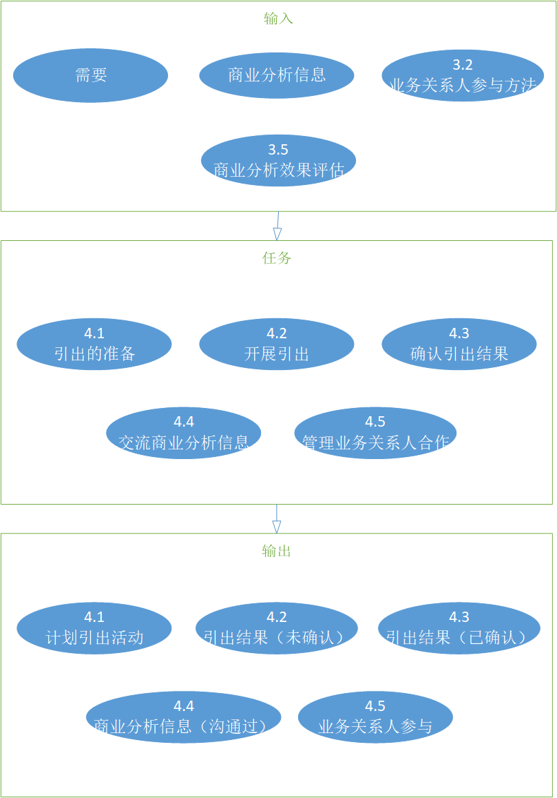
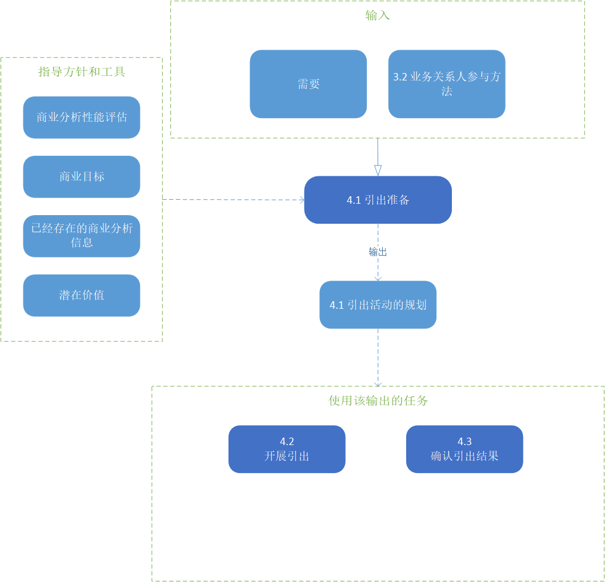
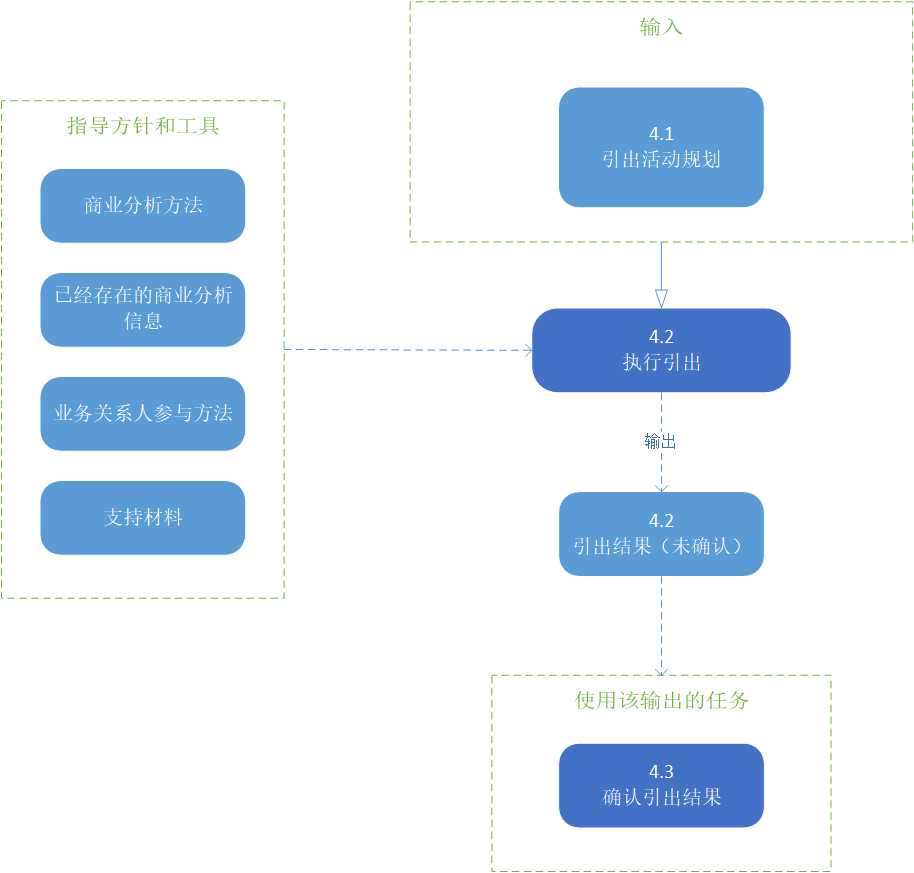
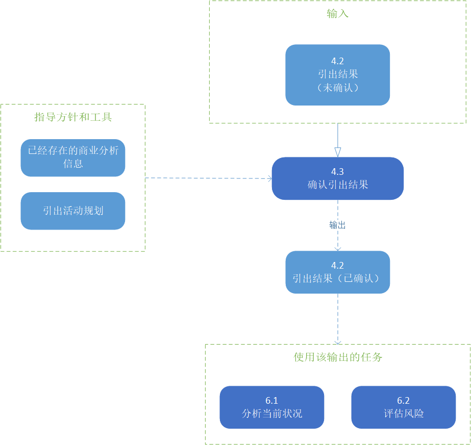
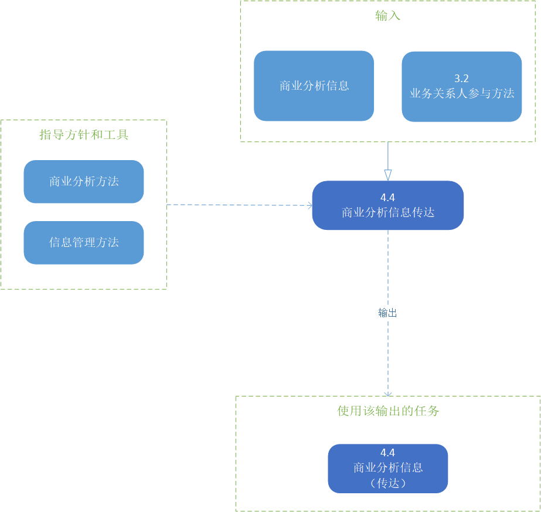
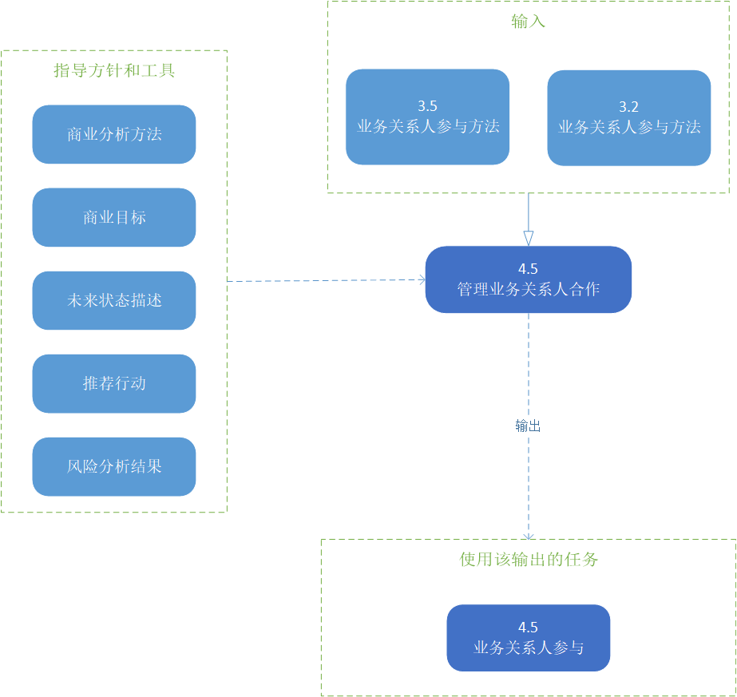

# 需求导出及协同合作

引出和写作知识领域描述了商业分析师从业务关系人处获取信息和确认结果的任务。它同样描述了整合商业分析信息之后与业务关系人沟通的方法。

引出是从业务关系人或其他来源提取或接受信息。它是发现需求和设计信息的主要路劲，它涉及直接与业务关系人的沟通，研究主题，试验或简单的获得信息。协作是两个或多个人共同为了同一个目标而一起工作的行为。引出和协作知识领域描述了商业分析师如何识别所有类型的商业分析信息并就相互理解达成一致。在商业分析中引出和写作工作从来就不是一个“阶段”，相反，只要商业分析工作还在进行，它就在一直进行。

引出和写作可以是有计划的，也可以是计划外的，或者两者都有。有计划的活动例如研讨会、实验，和/或提前有组织有安排的调查。计划外的活动发生在没有提醒的时刻，例如最后一刻或者“恰巧”发生的合作或对话。来源于计划外活动的商业分析信息可能需要通过计划活动进行更深入的探索。

引出商业分析信息不是独立的活动。在执行任何任务（包括与业务关系人的交互）以及在商业分析师在执行独立的分析工作时，都会获取信息。引出可能会引发对细节的额外启发，以填补细节空白或增加细节理解。

引出和写作只是领域由以下的任务组成：

* **引出准备**：包括确保业务关系人拥有他们需要提供的信息，并了解他们将要执行的活动的性质。它同样需要设定一套关于活动成果的共同期望。准备工作还包括确定研究来源或准备进行实验，以查看流程的更改是否真的会带来改进。
* **执行引出**：描述书为理解业务关系人的需求而执行的工作，并确定可能满足这些需求的潜在方案。这可能涉及与业务关系人的直接互动，进行研究或进行实验。
* **确认引出结果**：包含确保业务关系人对理解引出的结果有相同的理解，所引出的信息被正确的记录下来，商业分析师拥有从引出活动中找到的信息。这项任务还包括将收到的信息与其他信息进行比较，以寻找不一致或差距。
* **传达商业分析信息**：在业务关系人需要时向他们提供所需的信息。这些信息使用正确的术语和概念，以有用的形式进行呈现。
* **管理业务关系人合作**：描述如何与业务关系人合作，使他们能够参与到整个商业分析过程中，并确保商业分析师能够交付业务关系人所需的结果。

## 引出和协同的核心概念模型

商业分析核心概念模型(BACCM™)描述了六个核心概念之间的关系。

下表描述了在引出和协作环节中每个核心概念的使用和应用。

> 表4.0.1：引出和协作的核心概念模型
> |核心概念|在引出和协作中，商业分析...|
> |----|----|
> |**改变**：根据需要而改变的行为。|使用各种引出技术来充分识别变更的特征，包括业务关系人对变更的关注。|
> |**需要**：需要解决的问题或机会。|引出、确认和交流需邱和支持商业分析的信息。由于引出是持续的和增量的，所以对需求的理解也会随着时间推移而发展。|
> |**解决方案**：在特定环境中满足一种或多种需求的特定方法。|引出、确认并交流所提议的解决方案的必要或期望的特征。|
> |**业务关系人**：与改变、需求或解决方案有关系的团体或个人。|管理与参与商业分析工作有关的业务关系人的协作。在变更过程中，所有业务关系人可能在不同的时间扮演不同的角色。|
> |**价值**：在某个上下文中某物对业务关系人的价值，重要性或有用性。|与业务关系人合作，评估通过引导得到的信息的相对价值，并应用各种技术来确认和交流该价值。|
> |**背景**：环境影响、被影响，并提供对变化的理解。|应用各种引出技术来识别关于可能影响变更的上下文的商业分析信息。|

> 图片 4.0.1：引出和协同输入/输出图解
> 

## 4.1 引出准备

### 4.1.1 目的

为引出做准备的目的是为了理解引出活动的范围，选择合适的技术，并计划(或获得)适当的支持材料和资源。

### 4.1.2 描述

商业分析师通过定义活动的期望结果，考虑所涉及的业务关系人和计划目标，来为引出做准备。这包括评估哪些工作交付产物需要用到引出结果，决定什么技术是最适合产出这些结果的，建立引出的组织工作，定义所需的支持材料，以及了解在引出活动中促进合作的环境。

### 4.1.3 输入

* **需要**：根据引出活动的范围和目的指导准备工作。引出可以用来发现需求，但是为了开始，必须存在某些需求——即使它还没有被完全的引导出或者被理解。
* **业务关系人参与方法**：理解业务关系人的沟通和合作需求帮助计划和准备恰当和有效的引出活动。

> 图片 4.1.1：引出准备的输入/输出图解
> 

### 4.1.4 元素

#### .1 理解引出的范围

为了确定在引出活动中发现的商业分析信息的类型和可能使用的技术，商业分析师需要考虑：

* 业务领域；
* 整体的企业文化和环境；
* 业务关系人的位置；
* 参与其中的业务关系人和他们的团队动态；
* 引导活动将得到的预期输出；
* 商业分析从业者的技能；
* 其他计划补充本次活动的引出活动；
* 战略或解决方案方法；
* 未来解决方案的范围；
* 可能合适特定的引出活动的商业分析信息来源；

理解引出活动的范围允许商业分析师在活动偏离预期范围时做出响应。这也允许他们识别在合适的时候人员和材料是不可用的，和什么时候活动完成。

#### .2 选择引出技术

在多数案例中，多种技术会在引出活动中用到。所使用的技术依据消费和时间的预算，商业分析信息源的类型和他们的访问，组织的文化，直接的输出。商业分析师还可能考虑业务关系人的需求、可用性和位置（在一起的或分散的）。对于引出活动的成功，选择正确的技术和保障每种技术都正确的使用是非常重要的。当选择引出技术时，商业分析师需要考虑：

* 类似方案中常用的技术；
* 专门符合情况的技术；
* 准备、执行和完成每项技术所需的任务；

因为变化的动态和情况，商业分析师可能需要通过合并更适当的技术来调整初始的选择。对于各种可用技术的透彻理解有助于商业分析师适应不断变化的环境。

#### .3 设置组织工作

组织工作应该在引出活动之前已经计划。为每个引出活动的组织工作包括：

* 活动目标；
* 参与者及其角色；
* 预定的资源，包括人员、房间和工具；
* 位置；
* 沟通渠道；
* 技术；
* 业务关系人使用的语言（口头和书面）。

如果有其他业务关系人参与，组织工作可能涉及创建议程。

#### .4 安全的支持材料

商业分析师确定执行引出活动所需的信息源。进行引出可能需要大量的信息，包括人员、系统、历史数据、材料和文档。文档可以包括已经存在的系统文档、相关的企业规则、组织政策、法规和合同。支持材料也可以是分析工作的输出，例如分析模型的草稿版本（见指定和模型需求（第136页））。商业分析师获取或开发所需要的的材料和工具。如果要使用新的工具、设备或技术，可能需要额外的实验引出计划。

#### .5 业务关系人准备

商业分析师可能需要对业务关系人进行教育，关于引出技术如何工作或者什么信息是需要的。向活动未包含的业务关系人解释引出技术是有帮助的，可以帮助他们理解信息引出的有效性和相关性。业务关系人在引出活动中可能没什么反应或者不赞同，如果他们觉得这与他们个人的目标不一致，不理解目的，或者对过程感到困惑。在准备引出时，商业分析师需要确保所有的必要业务关系人都买账。

商业分析师还可以要求业务关系人在引出活动之前审核支持材料，一遍使引出活动尽可能有效。可以提前提供议程，以支持业务关系人以必要的思想框架和信息准备活动。

对商业分析师来说，通过研究或探索进行引出可能是一个单独的活动，不需要其他业务关系人的准备。

### 4.1.5 准则和工具

* **商业分析方法**：设置用于指导商业分析工作的总体策略。这包含一般方法，业务关系人的类型以及他们如何参与，业务关系人列表，工作时间，预期的格式和引出结果的细节水平，以及确定的挑战和不确定性。
* **商业目标**：描述实现未来状态所需的预期方向。他们可以用来计划和准备引出事件，并开发支持材料。
* **现有商业分析信息**：可以更好的理解引出活动的目标，并帮助准备引出。
* **潜在价值**：描述实现了计划的未来状态所要实现的价值。并且可以用来塑造引出事件。

### 4.1.6 技术

* **头脑风暴**：用于协作确定和达成关于应该参考哪些商业分析信息源以及哪些引出技术可能最有效的共识。
* **数据挖掘**：用于识别需要进一步研究的信息和模式。
* **文档分析**：用于确定和评估支持材料的候选来源。
* **估值**：用于估计引出所需的时间和结果以及相关成本。
* **访谈**：用于确定涉及对计划的引出工作，并可用于寻求做特定决定的权力。
* **思维导图**：用于协作确定和达成关于应该参考哪些商业分析信息源以及哪些引出技术可能最有效的共识。
* **风险分析和管理**：用于识别、评估和管理可能干扰诱导或影响引出结果的质量和有效性的条件或情况。应调整征求计划，以避免、转移或减轻最严重的风险。
* **业务关系人列表，地图，或角色模型**：用于确定在引出准备时谁需要被咨询，谁应该参加到事件中来，以及每个业务关系人的合适的角色。

### 4.1.7 业务关系人

* **领域主题专家**：提供支持材料和指导关于其他来源的商业分析信息咨询。也可以帮助安排研究，实验和促进引出活动。
* **项目经理**：确保引出活动有合适的人员和资源进行执行。
* **主办者**：有权批准或拒绝一个计划的引出活动，并授权和要求特定利益相关方的参与。

### 4.1.8 输出

* **引出活动计划**：用于每个引出活动。它包含组织工作，引出活动的范围，选择技术，支持材料。

## 4.2 执行引出

### 4.2.1 目的

执行引出是为了拟定，探索和确定和变更有关的信息。

### 4.2.2 描述

有三种常见的引出类型：

* **合作**：涉及与业务关系人的直接互动，并依赖于他们的经验，专业知识和判断。
* **调查**：包括系统地从参与变更的涉众不直接知道的材料和来源中调查和学习信息。业务关系人可能会参与调查。调查可以包括对历史数据的分析，以确定趋势或过去的结果。
* **实验**：包括确定没有通过某种测试就无法知道的信息。一些信息无法从人或者文档中得到，因为他们是未知的。实验可以帮助发现这类信息。实验包括观察研究、概念证明和原型。

在同一个引出任务范围中，可能会用到一个或多个引出技术来产生期望的结果。

业务关系人通过以下内容进行引出的合作：

* 在引出活动中参与并互动；
* 对文档、系统、模型和接口进行研究、学习和提供反馈。

### 4.2.3 输入

* **引出活动规划**：包括规划引出活动和技术，活动组织工作（例如：日期，时间，地点，资源，议程），引出活动的范围，和背景信息的可以来源。

> 图片 4.2.1：执行引出输入/输出图解
>  

### 4.2.4 元素

#### .1 指导引出活动

理解商业分析信息的建议表现形式，哪些是在规定中定义的，帮助确保引出活动专注于在期望的详细程度上产生预期的信息。这适用于在整个变更活动中的每个引出活动的实例，有可能根据活动的不同而不同。为了帮助知道和促进期望的结果，商业分析师需要考虑：

* 引出活动的目标和议程；
* 改变的范围；
* 活动将产生何种形式的输出；
* 活动结果将支持哪些其他表现；
* 输出是如何整合到已知信息中的；
* 谁提供信息；
* 谁使用信息；
* 信息如何被使用；

在计划引出活动时，大多数都要考虑到（查看引出准备），在执行引出活动的时候，它们对于引出活动保持在轨道上并且完成它的目标来说都是重要的。例如：业务关系人可能会有超出活动或改变范围的讨论，商业分析师需要在确认下一步时认识到这点；要么承认并继续，要么用不同的方式引导对话。

#### .2 捕获引出的结果

引出通常是反复进行的，并根据引出活动的范围以并行或顺序的方式在一系列的讨论中进行。如果引出活动是计划外的，那么结果将被捕获并整合到合适的计划结果中。

捕获引出结果有助于确保在引出活动中产生的信息被记录下来以供之后的参考和使用。

### 4.2.5 指导和工具

* **商业分析方法**：影响每个引出活动的执行方式，因为它确定基于该方法将需要的输出类型。
* **存在的商业分析信息**：可以知道引出过程中所提出的问题，以及可以从不同业务关系人中提取信息的方法。
* **业务关系人参与方法**：提供合作和交流方法，这会在引出中产生影响。
* **支持材料**：包括任何在引出前为商业分析师和参与者准备的材料，以及任何信息、工具或设备在引出期间使用。

### 4.2.6 技术

* **基准化分析和市场分析**：通过特定的流程、系统、产品、服务或结构与某些外部基线（如行业协会提供的类似组织或基线）进行比较，用作商业分析信息的来源。市场分析是用来确定顾客想要什么和竞争对手提供什么。
* **头脑风暴**：用于在段时间内从一群业务关系人中产生许多想法，并对这些想法进行组织和排序。
* **商业规则分析**：用于识别管理组织中的决策以及定义、约束或支持组织操作的规则。
* **协作游戏**：用于更好的理解问题或激发创造性解决方案。
* **概念模型**：用于识别重要的关键术语和想法，并定义他们质检的关系。
* **数据挖掘**：用于识别相关信息和模式。
* **数据模型**：用于理解引出工作中的实体关系。
* **文档分析**：用于审核现有系统、合同、商业程序和政策、标准和法规。
* **焦点小组**：用于识别和理解来自一个群体的想法和态度。
* **交互分析**：用于理解两个实体的交互，和交互的特征。例如两个系统、两个组织或两个人员或角色）。
* **访谈**：用于想业务关系人提出问题，以发现需求，确定问题或发现机会。
* **思维导图**：用于在段时间内从一群业务关系人中产生许多的想发，并对这些想法进行组织和排序。
* **观察**：用于了解工作目前是如何完成的，可能是在不同的地点和不同的环境下。
* **流程分析**：用于理解当前流程以及确定流程中的机会以改进。
* **流程模型**：用于在引出活动中抽象出流程。
* **原型设计**：通过创建需求或设计模型的迭代过程，用于引出和验证业务关系人的需求。
* **调查和调查问卷**：用于引出商业分析信息，包含客户、产品、工作实践和态度，以结构化的方式在较短的时间内从一群人中获取。
* **研讨会**：用于引出商业分析信息，包括客户、产品、工作实践和态度，从一群人中以协作和方便的方式获取。

### 4.2.7 业务关系人

* **客户**：提供有价值的商业分析信息。
* **领域主题专家**：具备某些方面的专业知识，并能提供所需的商业分析信息。经常指导和协助商业分析师确定适当的研究来源，并可能帮助安排研究、实验和促进启发。
* **终端用户**：现有的和未来的解决方案的用户，他们应该参与进引出工作中。
* **实施主题专家**：设计和实施解决方案，提供专业知识，并通过询问，澄清问题和提供替代方案，来参加引出活动。
* **发起人**：批准和确保参与征集所需的业务关系人的参与。
* **任何业务关系人**：在参与到引出活动中，有相关的知识或经验。

### 4.2.8 输出

* **引出结果（未确认）**：格式化捕捉特定于引出活动的信息。

## 4.3 确认引出结果

### 4.3.1 目的

确认引出结果的目的是检查在引出会议中手机的信息的准确性和与其他信息的一致性。

### 4.3.2 描述

在资源确认使用这些信息之前，对所引出的信息进行确认，以确定任何问题并解决它们。这种审查可能会发现错误、遗漏、冲突和歧义。

引出结果可以与他们的来源以及其他引出结果做比较，以确保一致性。与业务关系人的合作可能是必要的，以确保正确的捕获他们的输入信息，并确保他们同意没有利益的结果。如果信息不正确，商业分析师将确定哪些信息是正确的，这可能需要更多的判断。基于未确认的引出结果将资源投入商业分析活动中可能意味着业务关系人的期望没有得到满足。如果结果不一致，可能需要进行额外的引出来解决差异。

与在分析过程中的审核相比，确认引出结果是一种不那么严格和正式的审核。

### 4.3.3 输入

* **引出结果（未确认）**：以特定的引发活动的格式捕获数据。

> 图片 4.3.1：确认引出结果
>  

### 4.3.4 元素

#### .1 比较引出结果和来源

任务执行引出（）描述了得到引出结果的来源，包括文档和业务关系人的知识。商业分析师应该主持随后的会议，让业务关系人纠正引出的结果。业务关系人也可以独立的确认引出结果。

#### .2 比较引出结果和其他引出结果

商业分析师通过比较多个引出活动收集的结果，以确认信息是一致并准确表示的。在进行比较时，商业分析师识别结果的差异，并与业务关系人协作解决它们。对比还可以与历史数据，以确认更近期的引出结果。

当商业分析师开发规范和模型时，常常会发现引出结果之间的差异。这些模型可能在引出活动时开发，以提高合作。

### 4.3.5 指导和工具

* **引出活动规划**：用于指导要比较哪些可选来源和那些引出结果。
* **已存在的商业分析信息**：用于确认引出活动的结果，或开发额外的问题以引出更详细的信息。

### 4.3.6 技术

* **文档分析**：用于根据源信息和现有其他文档抽出结果。
* **访谈**：用于确认商业分析信息和其他已存在的文档确认引出结果。
* **复盘**：用于确认一系列的引出结果。这种复盘可以是非正式的活正式的，取决于有没有正式、有用和相关信息的风险。
* **研讨会**：用于使用任何级别的正式形式对引出结果的草案进行审核。预先确定的议程、脚本或场景测试可用于遍历引出结果，并要求参与者提供反馈并记录下来。

### 4.3.7 业务关系人

* **领域主题专家**：对所引出的商业分析信息、变更或解决方案具有丰富知识、经验或专业知识的人员，可以帮助确认引出结果是否正确，并可以帮助确定引出结果中的纰漏、不一致和冲突。他们还可以确认已经获得的正确的商业分析信息。
* **任何业务关系人**：所有类型的业务关系人可能都需要参与到确认征求结果中。

### 4.3.8 输出

* **引出结果（已确认）**：商业分析师和其他业务关系人一致同意的汇总输出，正确的反映了捕获的信息，并确认它作为进一步工作的输入是相关的和有用的。

## 4.4 传达商业分析信息

### 4.4.1 目的

传达商业分析信息的目的是为了确保业务关系人对商业分析信息有相同的理解。

### 4.4.2 描述

商业分析师需要给业务关系人传达合适的信息在合适的时间以符合它们需求的格式。考虑用适合听众的语言、语气和风格来表达信息。

商业分析信息的传达是双向的是反复的。它包含确定接收人、内容、目的、上下文和期待的输出。任务计划业务关系人的参与评估了沟通需求和计划的预期的信息。

交流信息不只是简单地把信息传递出去然后假定它已经被接受和理解了。商业分析师参与到业务股黯然中，以确保他们理解信息并获得一致性意见。商业分析师对任何分歧采取行动。如果业务关系人没有接收或理解信息，交付信息的方法可能需要改变。对于相同的信息，可能需要多种形式的沟通方式。

### 4.4.3 输入

* **商业分析信息**：任何细节认出任何种类的信息都被用于商业分析工作的输入或输出。当发现需要将信息传递给其他业务关系人时，商业分析信息成为任务的一个输入。
* **业务关系人参与方法**：描述业务关系人的组，角色，和商业分析信息沟通的一般需求。

> 图片 4.4.1：传达商业分析信息输入/输出图解
>  

### 4.4.4 元素

#### .1 确定沟通的目标和格式

商业分析信息包可能为一些原因准备，包括但不限于，以下：

* 和业务关系人沟通需求和设计。
* 早期的质量评估和计划。
* 评估可能的备选方案。
* 正式的审核和评估。
* 解决方案设计的输入。
* 遵守合同和监管义务。
* 维护以便复用。

开发一个包的首要目标是清晰的传递信息，以及可以为持续的变更活动提供可用格式。为了帮助决定如何呈现需求，商业分析师需要回答以下的问题：

* 谁是信息包的观众？
* 每一种类型的业务关系人将从沟通中理解和需要什么？
* 每个业务关系人倾向的沟通或学习的风格是什么？
* 沟通的重要性信息是什么？
* 包装的形式和格式，以及包装中包含的信息是否适合不同类型的观众？
* 这个包如何支持其他活动？
* 是否需要遵守任何法规或合同约束？

可能的包裹形式包括：

* **格式文档**：这往往基于组织中的模板，可能包含文本、模型或图表。它提供了一个稳定、易于使用、长期的信息收集。
* **非格式文档**：可能包含文本、图表或模型，在改变中使用的但不是组织流程中的格式。
* **业务陈述**：交付适合理解变更目标、解决方案功能或支持决策制定的高级概述。

考虑如何以最好的方式组合和呈现材料，一遍向一个或多个业务关系人群体传达一个有凝聚力和有效的信息。包裹可以存储于不同的线上或线下仓库，包含文档或工具。

#### .2 传达商业分析包裹

传达商业分析信息包裹的目的是为了提供变更中合适等级的详细信息给业务关系人，以便他们能理解其中包含的信息。业务关系人被给到机会审核包裹，询问有关信息的问题，和提出他们任何的担心。

选择合适的沟通平台同样很重要。一般沟通平台包括：

* **群组沟通**：用于和一组相关的业务关系人在同事沟通包裹。它允许立即讨论信息和相关问题。
* **独立沟通**：用于每次和单个业务关系人传递信息包。它可以用于获得个人对信息的理解，当群组设置是不可行时最后产出或产生最好的结果。
* **电子邮件或其他非语言方式**：用于当信息成熟度高，需要很少或不需要口头解释来支持时用于沟通信息包。

### 4.4.5 准则和工具

* **商业分析方法**：描述如何传播各个种类的信息而不是什么信息需要传播。它描述了所需的细节程度和形式，沟通的频率，以及沟通如何收到业务关系人梳理和地理分布的影响。
* **信息管理方法**：帮助决定商业分析信息如何打包和传达给业务关系人。

### 4.4.6 技术

* **访谈**：用于独立和业务关系人传达信息。
* **复盘**：用于提供给业务关系人机会，传达反馈、调整需求的请求，理解所需的响应和行动，并同意或提供批准。复盘可以用于组或个人的合作中。
* **研讨会**：用于提供给业务关系人机会传达反馈、理解所需的调整、响应和行动。他们也可以帮助获得一致看法和提供批准。一般在小组沟通中使用。

### 4.4.7 业务关系人

* **终端用户**：需要频繁的与之沟通，以便了解相关的商业分析信息。
* **客户**：需要频繁的与之沟通，以便了解相关的商业分析信息。
* **领域主题专家**：需要理解商业分析信息，在整个变更方案中确认和验证这一部分。
* **执行主题专家**：需要了解和理解商业分析信息，尤其是用于执行目的的需求和设计。
* **测试者**：需要了解和理解商业分析信息，尤其是用于测试目的的需求和设计。
* **任何业务关系人**：所有类型的业务关系人都可能需要在变更方案中的某个点进行沟通。

### 4.4.8 输出

* **商业分析信息（传达）**：当目标业务关系人理解了商业分析信息的内容和影响时，商业分析信息被认为是传达了的。

## 4.5 管理业务关系人合作

### 4.5.1 目的

管理业务关系人合作是为了鼓励业务关系人为了同一个目标工作。

### 4.5.2 描述

商业分析工作为商业分析工作产品的业务关系人群组之间提供了许多协作机会。业务关系人在工作产出的批准上具有不同程度的影响和全力，也是需要、约束和假设的重要来源。随着商业分析工作的进行，商业分析师确认业务关系人，确认他们的角色，并与之沟通以确保正确的业务关系人在正确的时间以适当的角色参与。

管理业务关系人合作是一项持续活动。尽管管理业务关系人合作在业务关系人确定和分析后就开始了，新业务关系人可能会在方案中的任何一个节点被确认。当新业务关系人被确定，他们在方案中的角色，影响，和关系会被分析。每个业务关系人的角色，责任，影响，态度和权力在全程都可能会改变。

变化或者它的可见性的影响越显著，越多的注意力应该被放在管理业务关系人的合作商。商业分析师管理业务关系人合作需要利用积极的反应，并减轻或避免消极的反应。商业分析师需要经常的监控和评估每个业务关系人对决定的态度，这可能会影响他们参与商业分析活动。

与业务关系人的不好的关系会对商业分析有很多不利的影响，包括：

* 未能提供有质量的信息。
* 对挫折和障碍有强烈的消极反应。
* 反对改变。
* 缺乏对商业分析工作的支持和参与。
* 不理会商业分析信息。

这些影响可以通过与业务关系人简历强有力的、积极地、基于信任的关系来部分改善。商业分析师积极管理与业务关系人的关系：

* 为商业分析师提供服务，包括赏析分析任务和其他活动支持的输入。
* 以来商业分析师提供服务，包括商业分析任务的输出。
* 参与到商业分析任务的执行。

### 4.5.3 输入

* **业务关系人参与方法**：描述期望的业务关系人的参与度以及他们可能需要如何管理。
* **商业分析效果评估**：提供关于正在执行的商业分析任务的有效性的关键信息，包括那些关于业务关系人的任务。

> 图片 4.5.1：管理业务关系人合作输入/输出图解
>  

### 4.5.4 元素

#### .1 达成资源投入承诺

业务关系人参与到商业分析活动中可能需要时间和资源承诺。商业分析师和业务关系人尽可能在方案中尽可能早的确定并统一这些承诺。承诺的具体细节可以正式或者非正式的沟通，只要承诺的期望和预期结果有明确的理解。

可能就承诺的条款和条件进行对话和磋商。有效的磋商、沟通、和解决冲突技能对有效的业务关系人管理很重要。

#### .2 监控业务关系人参与

商业分析师监控业务关系人的参与和效果以确保：

* 正确的主题专家（SMEs）和其他业务关系人在有效地参与。
* 业务关系人的态度和兴趣是保持不变或有提高。
* 及时的确认引出的结果。
* 协议和承诺得到维持。

商业分析师持续监管以下的风险：

* 业务关系人被转移到其他工作上。
* 引导活动没有提供所需质量的商业分析信息。
* 延迟的审批。

#### .3 合作

如果商业分析师鼓励信息、想法和创新的自由流动，业务关系人会更可能支持变更如果商业分析师与他们合作。真正的业务关系人参与要求所有相关的业务关系人感到他们的声音被听到了，他们的意见很重要，他们的贡献得到认可。合作包括有规律的、频繁的和双向的沟通。合作的关系帮助保持信息的自由流动当阻碍和挫折发生时，并促进共同努力解决问题和实现预期的结果。

### 4.5.5 准则和技术

* **商业分析方法**：描述执行计划的商业分析活动所需的每个业务关系人小组的写作性质和级别。
* **商业目标**：描述实现未来状态所需的预期方向。他们可以将不同的业务关系人集中在期望的业务产出的共同愿景上。
* **未来状态描述**：定义期望的未来状态，解释它能传递的期望的价值，这可以让不同的业务关系人关注在同一个目标上。
* **推荐行动**：沟通什么能够提高解决方案的价值，可以帮助刺激支持和让业务关系人关注在同一个目标上。
* **风险分析结果**：业务关系人相关的风险需要处理，以确保业务关系人协作活动的成功。

### 4.5.6 技术

* **协作游戏**：通过暂时让参与者在一个安全又有趣的环境中，他们可以根据给定主题分享他们的知识和经验，识别隐藏的假设，并以在正常互动中不会发送的方式探索这些知识，从而刺激团队工作和合作。
* **经验教训**：用于理解业务关系人的满意或者不满，提供给他们机会帮助改善工作关系。
* **风险分析和管理**：用于确定和管理业务关系人参加、参与和参与度的风险。
* **业务关系人列表，地图或者角色模型**：用于确定谁可以参与到商业分析工作，显示业务关系人之间的非正式关系，了解不同类型的商业分析信息应该咨询哪些业务关系人。

### 4.5.7 业务关系人

* **所有业务关系人**：在变更期间可能参加协作的所有类型的业务关系人。

### 4.5.8 输出

* **业务关系人参与**：业务关系人愿意参与到商业分析活动中，并在必要的时候和商业分析师进行互动。